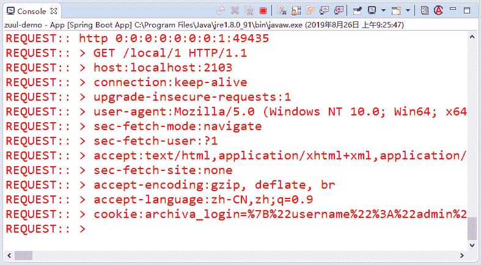

# Spring Cloud Zuul 请求响应信息输出

> 原文：[`c.biancheng.net/view/5424.html`](http://c.biancheng.net/view/5424.html)

系统在生产环境出现问题时，排查问题最好的方式就是查看日志了，日志的记录尽量详细，这样你才能快速定位问题。

下面带大家学习如何在 Zuul 中输出请求响应的信息来辅助我们解决一些问题。

熟悉 Zuul 的朋友都知道，Zuul 中有 4 种类型过滤器，每种都有特定的使用场景，要想记录响应数据，那么必须是在请求路由到了具体的服务之后，返回了才有数据，这种需求就适合用 post 过滤器来实现了。代码如下所示。

```

HttpServletRequest req = (HttpServletRequest) RequestContext.getCurrentContext().getRequest();
System.err.println("REQUEST:: " + req.getScheme() + " " + req.getRemoteAddr() + ":" + req.getRemotePort());
StringBuilder params = new StringBuilder("?");
// 获取 URL 参数
Enumeration<String> names = req.getParameterNames();
if (req.getMethod().equals("GET")) {
    while (names.hasMoreElements()) {
        String name = (String) names.nextElement();
        params.append(name);
        params.append("=");
        params.append(req.getParameter(name));
        params.append("&");
    }
}
if (params.length() > 0) {
    params.delete(params.length() - 1, params.length());
}
System.err.println(
        "REQUEST:: > " + req.getMethod() + " " + req.getRequestURI() + params + " " + req.getProtocol());
Enumeration<String> headers = req.getHeaderNames();
while (headers.hasMoreElements()) {
    String name = (String) headers.nextElement();
    String value = req.getHeader(name);
    System.err.println("REQUEST:: > " + name + ":" + value);
}
final RequestContext ctx = RequestContext.getCurrentContext();
// 获取请求体参数
if (!ctx.isChunkedRequestBody()) {
    ServletInputStream inp = null;
    try {
        inp = ctx.getRequest().getInputStream();
        String body = null;
        if (inp != null) {
            body = IOUtils.toString(inp);
            System.err.println("REQUEST:: > " + body);
        }
    } catch (IOException e) {
        e.printStackTrace();
    }
}
```

输出效果如图 1 所示。


图 1  控制器输出效果获取响应内容的第一种方式，代码如下所示。

```

try {
    Object zuulResponse = RequestContext.getCurrentContext().get("zuulResponse");
    if (zuulResponse != null) {
        RibbonHttpResponse resp = (RibbonHttpResponse) zuulResponse;
        String body = IOUtils.toString(resp.getBody());
        System.err.println("RESPONSE:: > " + body);
        resp.close();
        RequestContext.getCurrentContext().setResponseBody(body);
    }
} catch (IOException e) {
    e.printStackTrace();
}
```

获取响应内容的第二种方式，代码如下所示。

```

public static void main(String[] args) {
    InputStream stream = RequestContext.getCurrentContext().getResponseDataStream();
    try {
        if (stream != null) {
            String body = IOUtils.toString(stream);
            System.err.println("RESPONSE:: > " + body);
            RequestContext.getCurrentContext().setResponseBody(body);
        }

    } catch (IOException e) {
        e.printStackTrace();
    }
}
```

为什么上面两种方式可以取到响应内容？

在 RibbonRoutingFilter 或者 SimpleHostRoutingFilter 中可以看到下面一段代码，代码如下所示。

```

public Object run() {
    RequestContext context = RequestContext.getCurrentContext();
    this.helper.addIgnoredHeaders();
    try {
        RibbonCommandContext commandContext = buildCommandContext(context);
        ClientHttpResponse response = forward(commandContext);
        setResponse(response);
        return response;
    } catch (ZuulException ex) {
        throw new ZuulRuntimeException(ex);
    } catch (Exception ex) {
        throw new ZuulRuntimeException(ex);
    }
}
```

forward() 方法对服务调用，拿到响应结果，通过 setResponse() 方法进行响应的设置，代码如下所示。

```

protected void setResponse(ClientHttpResponse resp) throws ClientException, IOException {
    RequestContext.getCurrentContext().set("zuulResponse", resp);
    this.helper.setResponse(resp.getStatusCode().value(), resp.getBody() == null ? null : resp.getBody(),
            resp.getHeaders());
}
```

上面第一行代码就可以解释我们的第一种获取的方法，这里直接把响应内容加到了 RequestContext 中。

第二种方式的解释就在 helper.setResponse 的逻辑里面了，代码如下所示。

```

public void setResponse(int status, InputStream entity, MultiValueMap<String, String> headers) throws IOException {
    RequestContext context = RequestContext.getCurrentContext();
    context.setResponseStatusCode(status);
    if (entity != null) {
        context.setResponseDataStream(entity);
    }
    // .....
}
```