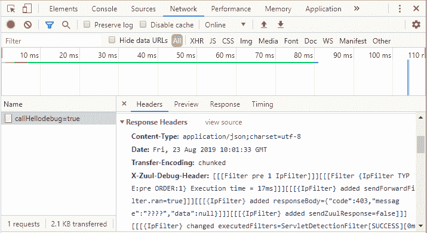

# Spring Cloud 实现 Zuul 自带的 Debug 功能

> 原文：[`c.biancheng.net/view/5425.html`](http://c.biancheng.net/view/5425.html)

Zuul 中自带了一个 DebugFilter，一开始笔者也没明白这个 DebugFilter 有什么用，看名称很容易理解，它是用来调试的，可是你看它的源码几乎没什么逻辑，就 set 了两个值而已，代码如下所示。

```

@Override
public Object run() {
    RequestContext ctx = RequestContext.getCurrentContext();
    ctx.setDebugRouting(true);
    ctx.setDebugRequest(true);
    return null;
}
```

要想让这个过滤器执行就得研究一下它的 shouldFilter() 方法，代码如下所示。

```

@Override
public boolean shouldFilter() {
    HttpServletRequest request = RequestContext.getCurrentContext().getRequest();
    if ("true".equals(request.getParameter(DEBUG_PARAMETER.get()))) {
        return true;
    }
    return ROUTING_DEBUG.get();
}
```

只要满足两个条件中的任何一个就可以开启这个过滤器。

第一个条件是请求参数中带了“某个参数 =true”就可以开启，这个参数名是通过下面的代码获取的，代码如下所示。

private static final DynamicStringProperty DEBUG_PARAMETER = DynamicPropertyFactory.getInstance()
            .getStringProperty(ZuulConstants.ZUUL_DEBUG_PARAMETER, "debug");

DynamicStringProperty 是 Netflix 的配置管理框架 Archaius 提供的 API，可以从配置中心获取配置，由于 Netflix 没有开源 Archaius 的服务端，所以这边用的就是默认值 debug，如果大家想动态去获取这个值的话可以用携程开源的 Apollo 来对接 Archaius，教程后面会给大家讲解。

可以在请求地址后面追加“debug=true”来开启这个过滤器，参数名称 debug 也可以在配置文件中进行覆盖，用 zuul.debug.parameter 指定，否则就是从 Archaius 中获取，没有对接 Archaius 那就是默认值 debug。

第二个条件的代码，具体代码如下所示。

private static final DynamicBooleanProperty ROUTING_DEBUG = DynamicPropertyFactory
            .getInstance().getBooleanProperty(ZuulConstants.ZUUL_DEBUG_REQUEST, false);

它是通过配置 zuul.debug.request 来决定的，可以在配置文件中配置“zuul.debug.request=true”开启 DebugFilter 过滤器。

DebugFilter 过滤器开启后，并没什么效果，在 run 方法中只是设置了 DebugRouting 和 DebugRequest 两个值为 true，于是继续看源码，发现在很多地方都有这样一段代码，比如 com.netflix.zuul.FilterProcessor.runFilters(String) 中，代码如下所示。

if (RequestContext.getCurrentContext().debugRouting()) {
    Debug.addRoutingDebug("Invoking {" + sType + "} type filters");
}

当 debugRouting 为 true 的时候就会添加一些 Debug 信息到 RequestContext 中。现在明白了 DebugFilter 中为什么要设置 DebugRouting 和 DebugRequest 两个值为 true。

到了这步后还是有些疑惑，一般我们调试信息的话肯定是用日志输出来的，日志级别就是 Debug，但这个 Debug 信息只是累加起来存储到 RequestContext 中，没有对使用者展示。

在 org.springframework.cloud.netflix.zuul.filters.post.SendResponseFilter.addResponseHeaders() 这段代码中我们看到了希望。具体代码如下所示。

```

private void addResponseHeaders() {
    RequestContext context = RequestContext.getCurrentContext();
    HttpServletResponse servletResponse = context.getResponse();
    if (this.zuulProperties.isIncludeDebugHeader()) {
        @SuppressWarnings("unchecked")
        List<String> rd = (List<String>) context.get(ROUTING_DEBUG_KEY);
        if (rd != null) {
            StringBuilder debugHeader = new StringBuilder();
            for (String it : rd) {
                debugHeader.append("[[[" + it + "]]]");
            }
            servletResponse.addHeader(X_ZUUL_DEBUG_HEADER, debugHeader.toString());
        }
    }
}
```

核心代码在于 this.zuulProperties.isIncludeDebugHeader()，只有满足这个条件才会把 RequestContext 中的调试信息作为响应头输出，在配置文件中增加下面的配置即可：

zuul.include-debug-header=true

最后在请求的响应头中可以看到调试内容，如图 1 所示。


图 1  调试内容