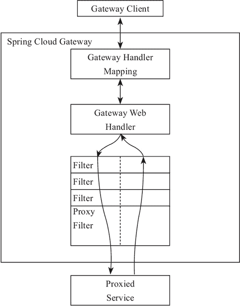

# Spring Cloud Gateway 核心概念和工作原理

> 原文：[`c.biancheng.net/view/5434.html`](http://c.biancheng.net/view/5434.html)

Spring Cloud Gateway 是 Spring 官方基于 Spring 5.0、Spring Boot 2.0 和 Project Reactor 等技术开发的网关，Spring Cloud Gateway 旨在为微服务架构提供一种简单有效的、统一的 API 路由管理方式。

Spring Cloud Gateway 作为 Spring Cloud 生态系中的网关，其目标是替代 Netflix Zuul，它不仅提供统一的路由方式，并且基于 Filter 链的方式提供了网关基本的功能，例如：安全、监控/埋点和限流等。

Spring Cloud Gateway 依赖 Spring Boot 和 Spring WebFlux，基于 Netty 运行。它不能在传统的 servlet 容器中工作，也不能构建成 war 包。

在 Spring Cloud Gateway 中有如下几个核心概念需要我们了解：

#### 1）Route

Route 是网关的基础元素，由 ID、目标 URI、断言、过滤器组成。当请求到达网关时，由 Gateway Handler Mapping 通过断言进行路由匹配（Mapping），当断言为真时，匹配到路由。

#### 2）Predicate

Predicate 是 Java 8 中提供的一个函数。输入类型是 Spring Framework ServerWebExchange。它允许开发人员匹配来自 HTTP 的请求，例如请求头或者请求参数。简单来说它就是匹配条件。

#### 3）Filter

Filter 是 Gateway 中的过滤器，可以在请求发出前后进行一些业务上的处理。

## Spring Cloud Gateway 工作原理

Spring Cloud Gateway 的工作原理跟 Zuul 的差不多，最大的区别就是 Gateway 的 Filter 只有 pre 和 post 两种。下面我们简单了解一下 Gateway 的工作原理图，如图 1 所示。

图 1  Spring Cloud Gateway 工作原理
客户端向 Spring Cloud Gateway 发出请求，如果请求与网关程序定义的路由匹配，则该请求就会被发送到网关 Web 处理程序，此时处理程序运行特定的请求过滤器链。

过滤器之间用虚线分开的原因是过滤器可能会在发送代理请求的前后执行逻辑。所有 pre 过滤器逻辑先执行，然后执行代理请求；代理请求完成后，执行 post 过滤器逻辑。