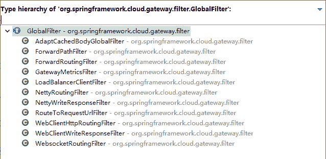

# Spring Cloud Gateway 全局过滤器（GlobalFilter）

> 原文：[`c.biancheng.net/view/5441.html`](http://c.biancheng.net/view/5441.html)

全局过滤器作用于所有的路由，不需要单独配置，我们可以用它来实现很多统一化处理的业务需求，比如权限认证、IP 访问限制等。

接口定义类 org.springframework.cloud.gateway.filter.GlobalFilter，具体代码如下所示。

public interface GlobalFilter {
    Mono<Void> filter(ServerWebExchange exchange, GatewayFilterChain chain);
}

Spring Cloud Gateway 自带的 GlobalFilter 实现类有很多，如图 1 所示。


图 1  框架自带全局过滤器
有转发、路由、负载等相关的 GlobalFilter，感兴趣的朋友可以去看下源码自行了解。我们如何通过定义 GlobalFilter 来实现我们的业务逻辑？

这里给出一个官方文档上的案例，代码如下所示。

```

@Configuration
public class ExampleConfiguration {
    private Logger log = LoggerFactory.getLogger(ExampleConfiguration.class);

    @Bean
    @Order(-1)
    public GlobalFilter a() {
        return (exchange, chain) -> {
            log.info("first pre filter");
            return chain.filter(exchange).then(Mono.fromRunnable(() -> {
                log.info("third post filter");
            }));
        };
    }

    @Bean
    @Order(0)
    public GlobalFilter b() {
        return (exchange, chain) -> {
            log.info("second pre filter");
            return chain.filter(exchange).then(Mono.fromRunnable(() -> {
                log.info("second post filter");
            }));
        };
    }

    @Bean
    @Order(1)
    public GlobalFilter c() {
        return (exchange, chain) -> {
            log.info("third pre filter");
            return chain.filter(exchange).then(Mono.fromRunnable(() -> {
                log.info("first post filter");
            }));
        };
    }
}
```

上面定义了 3 个 GlobalFilter，通过 @Order 来指定执行的顺序，数字越小，优先级越高。下面就是输出的日志，从日志就可以看出执行的顺序，如下所示。

2019-8-26 16:08:52.406  INFO 55062 --- [ioEventLoop-4-1] c.c.gateway.config.ExampleConfiguration  : first pre filter
2019-8-26 16:08:52.406  INFO 55062 --- [ioEventLoop-4-1] c.c.gateway.config.ExampleConfiguration  : second pre filter
2019-8-26 16:08:52.407  INFO 55062 --- [ioEventLoop-4-1] c.c.gateway.config.ExampleConfiguration  : third pre filter
2019-8-26 16:08:52.437  INFO 55062 --- [ctor-http-nio-7] c.c.gateway.config.ExampleConfiguration  : first post filter
2019-8-26 16:08:52.438  INFO 55062 --- [ctor-http-nio-7] c.c.gateway.config.ExampleConfiguration  : second post filter
2019-8-26 16:08:52.438  INFO 55062 --- [ctor-http-nio-7] c.c.gateway.config.ExampleConfiguration  : third post filter

当 GlobalFilter 的逻辑比较多时，笔者还是推荐大家单独写一个 GlobalFilter 来处理，比如我们要实现对 IP 的访问限制，即不在 IP 白名单中就不能调用的需求。

单独定义只需要实现 GlobalFilter、Ordered 两个接口就可以了，具体代码如下所示。

```

@Component
public class IPCheckFilter implements GlobalFilter, Ordered {

    @Override
    public int getOrder() {
        return 0;
    }

    @Override
    public Mono<Void> filter(ServerWebExchange exchange, GatewayFilterChain chain) {
        HttpHeaders headers = exchange.getRequest().getHeaders();
        // 此处写得非常绝对, 只作演示用, 实际中需要采取配置的方式
        if (getIp(headers).equals("127.0.0.1")) {
            ServerHttpResponse response = exchange.getResponse();
            ResponseData data = new ResponseData();
            data.setCode(401);
            data.setMessage("非法请求");
            byte[] datas = JsonUtils.toJson(data).getBytes(StandardCharsets.UTF_8);
            DataBuffer buffer = response.bufferFactory().wrap(datas);
            response.setStatusCode(HttpStatus.UNAUTHORIZED);
            response.getHeaders().add("Content-Type", "application/json;charset=UTF-8");
            return response.writeWith(Mono.just(buffer));
        }
        return chain.filter(exchange);
    }

    // 这里从请求头中获取用户的实际 IP,根据 Nginx 转发的请求头获取
    private String getIp(HttpHeaders headers) {
        return "127.0.0.1";
    }
}
```

过滤的使用虽然比较简单，但作用很大，可以处理很多需求，上面讲的 IP 认证拦截只是冰山一角，更多的功能需要我们自己基于过滤器去实现。