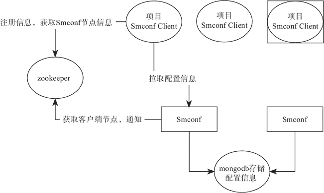

# Smconf（分布式配置管理框架）概述

> 原文：[`c.biancheng.net/view/5451.html`](http://c.biancheng.net/view/5451.html)

Smconf 专注于分布式环境下的配置的统一管理。采用 Java+Zookeeper+Mongodb+Spring Boot 开发。目前只支持 Java，其他的使用语言需要通过调用 REST API 来实现。

每个技术人都有一个开源的梦想，那就是自己也能开发出一个让很多人使用的框架。其实分享使用不是重点，重点是自己写的架构本身，你对它的各个方面都了如指掌，可以很方便添加新功能，比如加上一些适应公司内部需求的功能。

笔者之所以抛弃了 Spring Cloud Config，一方面在于它的配置刷新这块不是很方便，需要集成消息总线加上 WebHook 才能完成。另一个原因就是一些特殊的需求实现起来没那么方便，比如推送配置到指定的节点。

Smconf 目前支持的功能如下：

*   提供配置的统一管理。
*   多个环境（生产环境为 prod，线上测试环境为 online，线下测试环境为 test，开发环境为 dev）。
*   Web 后台配置管理。
*   配置修改后实时同步到使用的客户端。
*   无缝集成 Spring 和 Spring Boot 项目。
*   非 Spring 项目中也可以使用。
*   Web 后台支持不同账号管理不同环境的配置。
*   支持水平扩容、负载，部署多个 Server、Client 自动发现。
*   支持配置更新回调接口做扩展。
*   支持手动触发推送配置到指定的节点。
*   修改配置可以选择推送的节点，可用于做灰度发布测试。
*   配置的历史修改记录。

## Smconf 工作原理

如图 1 所示为 Smconf 的整个架构规划，Smconf 同样也分为服务端和客户端两个部分，服务端负责配置信息的管理，客户端负责拉取配置信息及上传配置信息。

图 1  Smconf 架构图

#### 1\. 基本概念

在正式介绍 Smconf 的工作原理之前，我们先来看几个基本概念。

*   环境：在 Smconf 中总共分了 4 个环境，分别是生产环境（prod）、线上测试环境（online）、线下测试环境（test）、开发环境（dev），Smconf Client 会根据不同的环境加载不同的配置。
*   系统：这里的系统就是指服务的名称，能够直观反映这个配置是哪个服务在使用。
*   配置文件：一个系统中有多个配置文件，可以将同类的配置放到一个文件中，也可以只用一个配置文件，配置文件需要定义一个实体类。
*   配置 key：一个配置文件中有多个配置项，实体类的字段名称就是配置的 key，字段的值就是配置的 value。

#### 2\. 客户端讲解

客户端在启动的时候会将自身的信息注册到 Zookeeper 中，为每一个配置文件注册一个节点，添加 watcher 监听，同时获取 Server 的节点信息，然后连接 Smconf Server 初始化配置数据或者拉取最新的配置到本地。

配置信息只有在配置中心不存在时才会初始化配置，如存在，则拉取配置中心的配置覆盖本地的配置，当然也可以通过配置项来执行是否拉取远程配置。

在 Smconf 中每个配置都必须存在于某一个配置文件中，拉取的配置信息会注册到配置文件的实体类中，配置类是受 Spring 管理的，可以直接注入使用。

#### 3\. 服务端讲解

接着来看服务端，配置信息是存储在 Mongodb 中的，Mongodb 可以做副本集，不存在单点问题。可以启动多个 Smconf Server，并且不需要做负载均衡，在启动的时候它会将自身的信息注册到 Zookeeper 中。

当配置发生修改的时候，通过触发 Zookeeper 的 watcher 事件来通知 Smconf Client 配置有修改，需要重新加载配置。

Smconf 提供了友好的 Web 页面对配置信息进行管理，通过不同的账号、不同的权限控制，确保配置不被随便修改。