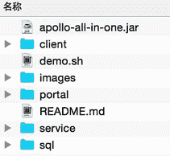

# Apollo 本地部署详细步骤

> 原文：[`c.biancheng.net/view/5467.html`](http://c.biancheng.net/view/5467.html)

为了让大家更快地上手了解 Apollo 配置中心，官方准备了一个快速启动的安装包，能够在几分钟内完成本地环境部署，启动 Apollo 配置中心。

本地部署只适用于开发环境，生产环境需要采用分布式部署，教程后面会为大家讲解怎么进行分布式部署。

#### 1\. 环境准备

Apollo 采用 Java 语言开发，部署环境必须安装了 Java，版本要求：Java 1.8+。Apollo 的数据都存储的 Mysql 中，部署环境也需要安装 Mysql 数据库，版本要求：5.6.5+。

快速启动的脚本是 shell 编写的，要有 bash 环境，在 Linux/Mac 下无影响。如果用户是 Windows 环境，需要安装 Git Bash（[`git-for-windows.github.io/`](https://git-for-windows.github.io/)）。

#### 2\. 下载快速启动安装包

快速启动安装包下载地址：[`github.com/nobodyiam/apollo-build-scripts`](https://github.com/nobodyiam/apollo-build-scripts)。下载之后进行解压，目录结构如图 1 所示：

图 1  Apollo 快速体验安装包目录

#### 3\. 初始化数据库

Apollo 服务端一共需要两个数据库：ApolloPortalDB 和 ApolloConfigDB。数据库、表的创建和样例数据的 sql 文件都在快速启动安装包的 sql 目录中，只需要导入数据库即可。

#### 4\. 修改数据库连接信息

数据库连接信息在 demo.sh 中，我们需要把对应的数据库连接信息修改成我们自己安装的地址，这样 Apollo 才能正常启动。

#apollo config db info
apollo_config_db_url=jdbc:mysql://localhost:3306/ApolloConfigDB?characterEncoding=utf8
apollo_config_db_username=用户名
apollo_config_db_password=密码(如果没有密码, 留空即可)

# apollo portal db info
apollo_portal_db_url=jdbc:mysql://localhost:3306/ApolloPortalDB?characterEncoding=utf8
apollo_portal_db_username=用户名
apollo_portal_db_password=密码(如果没有密码, 留空即可)

#### 5\. 启动 Apollo 配置中心

执行启动脚本：

./demo.sh start

demo.sh 脚本会在本地启动 3 个服务，分别使用 8070、8080、8090 端口，请确保这 3 个端口当前没有被使用。

当看到如下输出后，就说明 Apollo 启动成功了。

==== starting service ====
Service logging file is ./service/apollo-service.log
Started [10768]
Waiting for config service startup.......
Config service started. You may visit http://localhost:8080 for service status now!
Waiting for admin service startup....
Admin service started
==== starting portal ====
Portal logging file is ./portal/apollo-portal.log
Started [10846]
Waiting for portal startup......
Portal started. You can visit http://localhost:8070 now!

启动成功之后打开 http://localhost：8070，访问 Web 管理页面。账号：apollo，密码：admin。