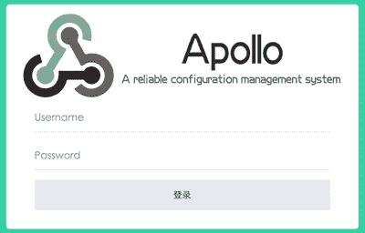
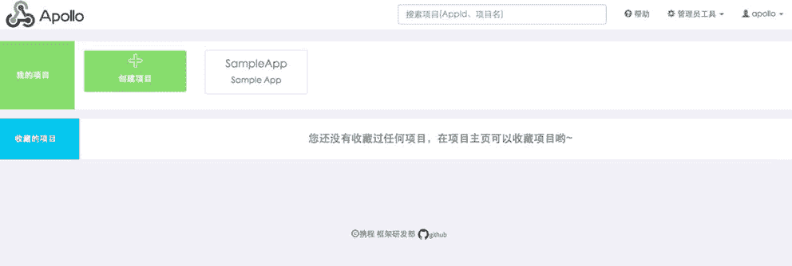
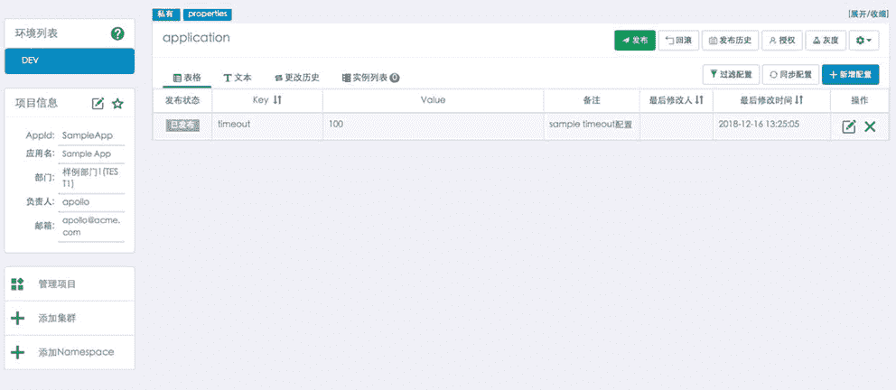
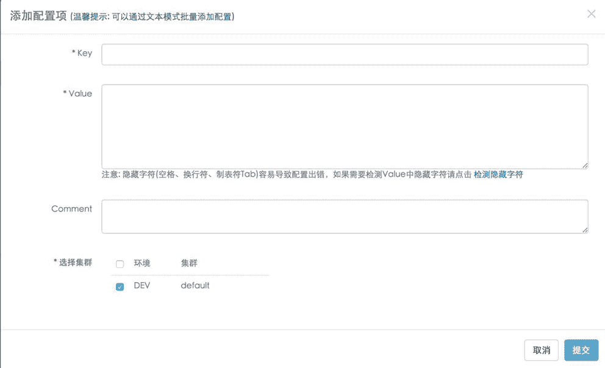
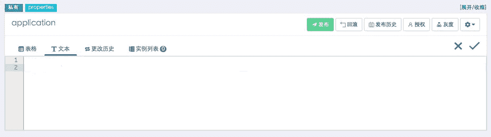

# Apollo Portal 管理后台的使用

> 原文：[`c.biancheng.net/view/5470.html`](http://c.biancheng.net/view/5470.html)

打开 Portal 地址，首先看到的是登录页面，默认的账号是 apollo，密码是 admin。输入之后点击登录即可跳转到首页，如图 1 所示。

图 1  登录页面
首页会展示当前登录用户管理的所有项目列表，还有收藏、搜索等功能，如图 2 所示。

图 2  Apollo 首页
点击 SampleApp 可以跳转到项目的主页面，如图 3 所示。

图 3  项目主页面
点击新增配置按钮可以添加单条配置，如图 4 所示。

图 4  单条配置添加
批量添加可以使用文本模式进行添加，如图 5 所示。

图 5  批量添加模式
添加后不会马上生效，需要点击发布按钮确认发布的配置信息后才会同步到客户端。还有很多操作大家可以自己尝试，比如添加项、添加命名空间、灰度发布等。