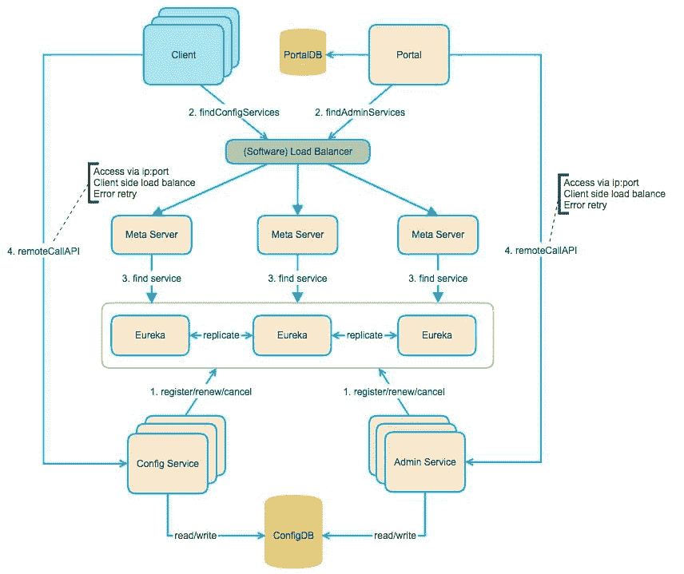

# Apollo 架构设计介绍

> 原文：[`c.biancheng.net/view/5476.html`](http://c.biancheng.net/view/5476.html)

Apollo 架构设计流程如图 1 所示，具体内容介绍如下。
图 1  Apollo 架构设计

#### 1）Config Service

*   服务于 Client（项目中的 Apollo 客户端）对配置的操作，提供配置的查询接口。
*   提供配置更新推送接口（基于 Http long polling）。

#### 2）Admin Service

服务于后台 Portal（Web 管理端），提供配置管理接口。

#### 3）Meta Server

*   Meta Server 是对 Eureka 的一个封装，提供了 Http 接口获取 Admin Service 和 Config Service 的服务信息。
*   部署时和 Config Service 是在一个 JVM 进程中的，所以 IP、端口和 Config Service 一致。

#### 4）Eureka

*   用于提供服务注册和发现。
*   Config Service 和 Admin Service 会向 Eureka 注册服务。
*   为了简化部署流程，Eureka 在部署时和 Config Service 是在一个 JVM 进程中，也就是说 Config Service 同时包含了 Eureka 和 Meta Server。

#### 5）Portal

*   后台 Web 界面管理配置。
*   通过 Meta Server 获取 Admin Service 服务列表（IP+Port）进行配置的管理，在客户端内做负载均衡。

#### 6）Client

*   Apollo 提供的客户端，用于项目中对配置的获取、更新。
*   通过 Meta Server 获取 Config Service 服务列表（IP+Port）进行配置的管理，在客户端内做负载均衡。

其中，Apollo 架构设计流程可分为如下几类。

#### 1）Portal 管理配置流程

Portal 连接了 PortalDB，通过域名访问 Meta Server 获取 Admin Service 服务列表，直接对 Admin Service 发起接口调用，Admin Service 会对 ConfigDB 进行数据操作。

#### 2）客户端获取配置流程

Client 通过域名访问 Meta Server 获取 Config Service 服务列表，直接对 Config Service 发起接口调用，Config Service 会对 ConfigDB 进行数据操作。

#### 3）Meta Server 获取服务列表流程

Meta Server 会去 Eureka 中获取对应服务的实例信息，Eureka 中的实例信息是 Admin Service 和 Config Service 自动注册到 Eureka 中并保持心跳。