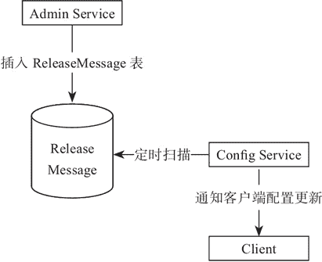

# Apollo 服务端设计原理（源码解析）

> 原文：[`c.biancheng.net/view/5480.html`](http://c.biancheng.net/view/5480.html)

本节主要对 Apollo 服务端设计原理进行解析。

#### 1\. 配置发布后的实时推送设计

配置中心最重要的一个特性就是实时推送，正因为有这个特性，我们才可以依赖配置中心做很多事情。如图 1 所示。


图 1  Apollo 推送设计
图 1 简要描述了配置发布的大致过程。

*   用户在 Portal 中进行配置的编辑和发布。
*   Portal 会调用 Admin Service 提供的接口进行发布操作。
*   Admin Service 收到请求后，发送 ReleaseMessage 给各个 Config Service，通知 Config Service 配置发生变化。
*   Config Service 收到 ReleaseMessage 后，通知对应的客户端，基于 Http 长连接实现。

#### 2\. 发送 ReleaseMessage 的实现方式

ReleaseMessage 消息是通过 Mysql 实现了一个简单的消息队列。之所以没有采用消息中间件，是为了让 Apollo 在部署的时候尽量简单，尽可能减少外部依赖，如图 2 所示。


图 2  配置变化消息发送
图 2 简要描述了发送 ReleaseMessage 的大致过程：

*   Admin Service 在配置发布后会往 ReleaseMessage 表插入一条消息记录。
*   Config Service 会启动一个线程定时扫描 ReleaseMessage 表，来查看是否有新的消息记录。
*   Config Service 发现有新的消息记录，就会通知到所有的消息监听器。
*   消息监听器得到配置发布的信息后，就会通知对应的客户端。

#### 3\. Config Service 通知客户端的实现方式

通知采用基于 Http 长连接实现，主要分为下面几个步骤：

*   客户端会发起一个 Http 请求到 Config Service 的 notifications/v2 接口。
*   notifications/v2 接口通过 Spring DeferredResult 把请求挂起，不会立即返回。
*   如果在 60s 内没有该客户端关心的配置发布，那么会返回 Http 状态码 304 给客户端。
*   如果发现配置有修改，则会调用 DeferredResult 的 setResult 方法，传入有配置变化的 namespace 信息，同时该请求会立即返回。
*   客户端从返回的结果中获取到配置变化的 namespace 后，会立即请求 Config Service 获取该 namespace 的最新配置。

#### 4\. 源码解析实时推送设计

Apollo 推送涉及的代码比较多，本教程就不做详细分析了，笔者把推送这里的代码稍微简化了下，给大家进行讲解，这样理解起来会更容易。

当然，这些代码比较简单，很多细节就不做考虑了，只是为了能够让大家明白 Apollo 推送的核心原理。

发送 ReleaseMessage 的逻辑我们就写一个简单的接口，用队列存储，测试的时候就调用这个接口模拟配置有更新，发送 ReleaseMessage 消息。具体代码如下所示。

```

@RestController
public class NotificationControllerV2 implements ReleaseMessageListener {

    // 模拟配置更新, 向其中插入数据表示有更新
    public static Queue<String> queue = new LinkedBlockingDeque<>();

    @GetMapping("/addMsg")
    public String addMsg() {
        queue.add("xxx");
        return "success";
    }
}
```

消息发送之后，根据前面讲过的 Config Service 会启动一个线程定时扫描 ReleaseMessage 表，查看是否有新的消息记录，然后取通知客户端，在这里我们也会启动一个线程去扫描，具体代码如下所示。

```

@Component
public class ReleaseMessageScanner implements InitializingBean {

    @Autowired
    private NotificationControllerV2 configController;

    @Override
    public void afterPropertiesSet() throws Exception {
        // 定时任务从数据库扫描有没有新的配置发布
        new Thread(() -> {
            for (;;) {
                String result = NotificationControllerV2.queue.poll();
                if (result != null) {
                    ReleaseMessage message = new ReleaseMessage();
                    message.setMessage(result);
                    configController.handleMessage(message);
                }
            }
        }).start();
        ;
    }
}
```

循环读取 NotificationControllerV2 中的队列，如果有消息的话就构造一个 Release-Message 的对象，然后调用 NotificationControllerV2 中的 handleMessage() 方法进行消息的处理。

ReleaseMessage 就一个字段，模拟消息内容，具体代码如下所示。

```

public class ReleaseMessage {
    private String message;

    public void setMessage(String message) {
        this.message = message;
    }

    public String getMessage() {
        return message;
    }
}
```

接下来，我们来看 handleMessage 做了哪些工作。

NotificationControllerV2 实现了 ReleaseMessageListener 接口，ReleaseMessageListener 中定义了 handleMessage() 方法，具体代码如下所示。

public interface ReleaseMessageListener {
    void handleMessage(ReleaseMessage message);
}

handleMessage 就是当配置发生变化的时候，发送通知的消息监听器。消息监听器在得到配置发布的信息后，会通知对应的客户端，具体代码如下所示。

```

@RestController
public class NotificationControllerV2 implements ReleaseMessageListener {

    private final Multimap<String, DeferredResultWrapper> deferredResults = Multimaps
            .synchronizedSetMultimap(HashMultimap.create());

    @Override
    public void handleMessage(ReleaseMessage message) {
        System.err.println("handleMessage:" + message);
        List<DeferredResultWrapper> results = Lists.newArrayList(deferredResults.get("xxxx"));
        for (DeferredResultWrapper deferredResultWrapper : results) {
            List<ApolloConfigNotification> list = new ArrayList<>();
            list.add(new ApolloConfigNotification("application", 1));
            deferredResultWrapper.setResult(list);
        }
    }
}
```

Apollo 的实时推送是基于 Spring DeferredResult 实现的，在 handleMessage() 方法中可以看到是通过 deferredResults 获取 DeferredResult，deferredResults 就是第一行的 Multimap，Key 其实就是消息内容，Value 就是 DeferredResult 的业务包装类 DeferredResultWrapper，我们来看下 DeferredResultWrapper 的代码，代码如下所示。

```

public class DeferredResultWrapper {
    private static final long TIMEOUT = 60 * 1000;// 60 seconds

    private static final ResponseEntity<List<ApolloConfigNotification>> NOT_MODIFIED_RESPONSE_LIST = new ResponseEntity<>(
            HttpStatus.NOT_MODIFIED);

    private DeferredResult<ResponseEntity<List<ApolloConfigNotification>>> result;

    public DeferredResultWrapper() {
        result = new DeferredResult<>(TIMEOUT, NOT_MODIFIED_RESPONSE_LIST);
    }

    public void onTimeout(Runnable timeoutCallback) {
        result.onTimeout(timeoutCallback);
    }

    public void onCompletion(Runnable completionCallback) {
        result.onCompletion(completionCallback);
    }

    public void setResult(ApolloConfigNotification notification) {
        setResult(Lists.newArrayList(notification));
    }

    public void setResult(List<ApolloConfigNotification> notifications) {
        result.setResult(new ResponseEntity<>(notifications, HttpStatus.OK));
    }

    public DeferredResult<ResponseEntity<List<ApolloConfigNotification>>> getResult() {
        return result;
    }
}
```

通过 setResult() 方法设置返回结果给客户端，以上就是当配置发生变化，然后通过消息监听器通知客户端的原理，那么客户端是在什么时候接入的呢？具体代码如下。

```

@RestController
public class NotificationControllerV2 implements ReleaseMessageListener {

    // 模拟配置更新, 向其中插入数据表示有更新
    public static Queue<String> queue = new LinkedBlockingDeque<>();
    private final Multimap<String, DeferredResultWrapper> deferredResults = Multimaps
            .synchronizedSetMultimap(HashMultimap.create());

    @GetMapping("/getConfig")
    public DeferredResult<ResponseEntity<List<ApolloConfigNotification>>> getConfig() {
        DeferredResultWrapper deferredResultWrapper = new DeferredResultWrapper();
        List<ApolloConfigNotification> newNotifications = getApolloConfigNotifications();
        if (!CollectionUtils.isEmpty(newNotifications)) {
            deferredResultWrapper.setResult(newNotifications);
        } else {
            deferredResultWrapper.onTimeout(() -> {
                System.err.println("onTimeout");
            });

            deferredResultWrapper.onCompletion(() -> {
                System.err.println("onCompletion");
            });
            deferredResults.put("xxxx", deferredResultWrapper);
        }
        return deferredResultWrapper.getResult();
    }

    private List<ApolloConfigNotification> getApolloConfigNotifications() {
        List<ApolloConfigNotification> list = new ArrayList<>();
        String result = queue.poll();
        if (result != null) {
            list.add(new ApolloConfigNotification("application", 1));
        }
        return list;
    }
}
```

NotificationControllerV2 中提供了一个 /getConfig 的接口，客户端在启动的时候会调用这个接口，这个时候会执行 getApolloConfigNotifications() 方法去获取有没有配置的变更信息，如果有的话证明配置修改过，直接就通过 deferredResultWrapper.setResult(newNotifications) 返回结果给客户端，客户端收到结果后重新拉取配置的信息覆盖本地的配置。

如果 getApolloConfigNotifications() 方法没有返回配置修改的信息，则证明配置没有发生修改，那就将 DeferredResultWrapper 对象添加到 deferredResults 中，等待后续配置发生变化时消息监听器进行通知。

同时这个请求就会挂起，不会立即返回，挂起是通过 DeferredResultWrapper 中的下面这部分代码实现的，具体代码如下所示。

```

private static final long TIMEOUT = 60 * 1000; // 60 seconds

private static final ResponseEntity<List<ApolloConfigNotification>> NOT_MODIFIED_RESPONSE_LIST = new ResponseEntity<>(
        HttpStatus.NOT_MODIFIED);

private DeferredResult<ResponseEntity<List<ApolloConfigNotification>>> result;

public DeferredResultWrapper() {
  result = new DeferredResult<>(TIMEOUT, NOT_MODIFIED_RESPONSE_LIST);
}
```

在创建 DeferredResult 对象的时候指定了超时的时间和超时后返回的响应码，如果 60s 内没有消息监听器进行通知，那么这个请求就会超时，超时后客户端收到的响应码就是 304。

整个 Config Service 的流程就走完了，接下来我们来看一下客户端是怎么实现的，我们简单地写一个测试类模拟客户端注册，具体代码如下所示。

```

public class ClientTest {
    public static void main(String[] args) {
        reg();
    }

    private static void reg() {
        System.err.println("注册");
        String result = request("http://localhost:8081/getConfig");
        if (result != null) {
            // 配置有更新, 重新拉取配置
            // ......
        }
        // 重新注册
        reg();
    }

    private static String request(String url) {
        HttpURLConnection connection = null;
        BufferedReader reader = null;
        try {
            URL getUrl = new URL(url);
            connection = (HttpURLConnection) getUrl.openConnection();
            connection.setReadTimeout(90000);
            connection.setConnectTimeout(3000);
            connection.setRequestMethod("GET");
            connection.setRequestProperty("Accept-Charset", "utf-8");
            connection.setRequestProperty("Content-Type", "application/json");
            connection.setRequestProperty("Charset", "UTF-8");
            System.out.println(connection.getResponseCode());
            if (200 == connection.getResponseCode()) {
                reader = new BufferedReader(new InputStreamReader(connection.getInputStream(), "UTF-8"));
                StringBuilder result = new StringBuilder();
                String line = null;
                while ((line = reader.readLine()) != null) {
                    result.append(line);
                }
                System.out.println("结果 " + result);
                return result.toString();
            }
        } catch (IOException e) {
            e.printStackTrace();
        } finally {
            if (connection != null) {
                connection.disconnect();
            }
        }
        return null;
    }
}
```

首先启动 /getConfig 接口所在的服务，然后启动客户端，然后客户端就会发起注册请求，如果有修改直接获取到结果，则进行配置的更新操作。如果无修改，请求会挂起，这里客户端设置的读取超时时间是 90s，大于服务端的 60s 超时时间。

每次收到结果后，无论是有修改还是无修改，都必须重新进行注册，通过这样的方式就可以达到配置实时推送的效果。

我们可以调用之前写的 /addMsg 接口来模拟配置发生变化，调用之后客户端就能马上得到返回结果。