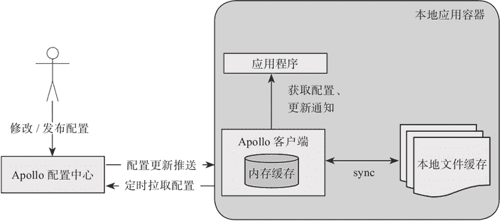
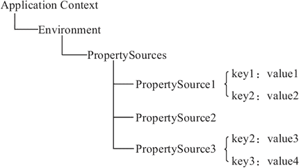
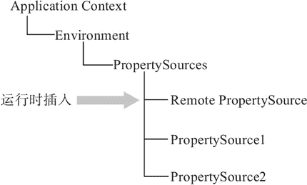

# Apollo 客户端设计原理（源码解析）

> 原文：[`c.biancheng.net/view/5482.html`](http://c.biancheng.net/view/5482.html)

本节主要对 Apollo 客户端设计原理进行解析。

#### 1\. 设计原理

图 1 简要描述了 Apollo 客户端的实现原理。

图 1  客户端设计

*   客户端和服务端保持了一个长连接，编译配置的实时更新推送。
*   定时拉取配置是客户端本地的一个定时任务，默认为每 5 分钟拉取一次，也可以通过在运行时指定 System Property：apollo.refreshInterval 来覆盖，单位是分钟，推送+定时拉取=双保险。
*   客户端从 Apollo 配置中心服务端获取到应用的最新配置后，会保存在内存中。
*   客户端会把从服务端获取到的配置在本地文件系统缓存一份，当服务或者网络不可用时，可以使用本地的配置，也就是我们的本地开发模式 env=Local。

#### 2\. 和 Spring 集成的原理

Apollo 除了支持 API 方式获取配置，也支持和 Spring/Spring Boot 集成，集成后可以直接通过 @Value 获取配置，我们来分析下集成的原理。

Spring 从 3.1 版本开始增加了 ConfigurableEnvironment 和 PropertySource：

*   ConfigurableEnvironment 实现了 Environment 接口，并且包含了多个 Property-Source。
*   PropertySource 可以理解为很多个 Key-Value 的属性配置，在运行时的结构形如图 2 所示。


图 2  Spring 配置结构
需要注意的是，PropertySource 之间是有优先级顺序的，如果有一个 Key 在多个 property source 中都存在，那么位于前面的 property source 优先。

集成的原理就是在应用启动阶段，Apollo 从远端获取配置，然后组装成 PropertySource 并插入到第一个即可，如图 3 所示。


图 3  Spring 配置动态插入

#### 3\. 启动时初始化配置到 Spring

客户端集成 Spring 的代码分析，我们也采取简化的方式进行讲解。

首先我们来分析，在项目启动的时候从 Apollo 拉取配置，是怎么集成到 Spring 中的。创建一个 PropertySourcesProcessor 类，用于初始化配置到 Spring PropertySource 中。具体代码如下所示。

```

@Component
public class PropertySourcesProcessor implements BeanFactoryPostProcessor, EnvironmentAware {
    String APOLLO_PROPERTY_SOURCE_NAME = "ApolloPropertySources";
    private ConfigurableEnvironment environment;
    @Override
    public void postProcessBeanFactory(ConfigurableListableBeanFactory beanFactory) throws BeansException {
        // 启动时初始化配置到 Spring PropertySource
        Config config = new Config();
        ConfigPropertySource configPropertySource = new ConfigPropertySource("ap-plication", config);

        CompositePropertySource composite = new CompositePropertySource(APOLLO_PROPERTY_SOURCE_NAME);
        composite.addPropertySource(configPropertySource);

        environment.getPropertySources().addFirst(composite);
    }

    @Override
    public void setEnvironment(Environment environment) {
        this.environment = (ConfigurableEnvironment) environment;
    }
}
```

实现 EnvironmentAware 接口是为了获取 Environment 对象。实现 BeanFactory-Post-Processor 接口，我们可以在容器实例化 bean 之前读取 bean 的信息并修改它。

Config 在 Apollo 中是一个接口，定义了很多读取配置的方法，比如 getProperty：getIntProperty 等。通过子类去实现这些方法，在这里我们就简化下，直接定义成一个类，提供两个必要的方法，具体代码如下所示。

```

public class Config {

    public String getProperty(String key, String defaultValue) {
        if (key.equals("bianchengName")) {
            return "C 语言中文网";
        }
        return null;
    }

    public Set<String> getPropertyNames() {
        Set<String> names = new HashSet<>();
        names.add("bianchengName");
        return names;
    }
}
```

Config 就是配置类，配置拉取之后会存储在类中，所有配置的读取都必须经过它，我们在这里就平格定义需要读取的 key 为 bianchengName。

然后需要将 Config 封装成 PropertySource 才能插入到 Spring Environment 中。

定义一个 ConfigPropertySource 用于将 Config 封装成 PropertySource，ConfigProperty-Source 继承了 EnumerablePropertySource，EnumerablePropertySource 继承了 PropertySource。具体代码如下所示。

```

public class ConfigPropertySource extends EnumerablePropertySource<Config> {

    private static final String[] EMPTY_ARRAY = new String[0];

    ConfigPropertySource(String name, Config source) {
        super(name, source);
    }

    @Override
    public String[] getPropertyNames() {
        Set<String> propertyNames = this.source.getPropertyNames();
        if (propertyNames.isEmpty()) {
            return EMPTY_ARRAY;
        }
        return propertyNames.toArray(new String[propertyNames.size()]);
    }

    @Override
    public Object getProperty(String name) {
        return this.source.getProperty(name, null);
    }
}
```

需要做的操作还是重写 getPropertyNames 和 getProperty 这两个方法。当调用这两个方法时，返回的就是 Config 中的内容。

最后将 ConfigPropertySource 添加到 CompositePropertySource 中，并且加入到 Confi-gu-rable-Environment 即可。

定义一个接口用来测试有没有效果，具体代码如下所示。

```

@RestController
public class ConfigController {

    @Value("${bianchengName:zhangsan}")
    private String name;
    @GetMapping("/get")
    private String bianchengUrl;

    @GetMapping("/get")
    public String get() {
        return name + bianchengUrl;
    }
}
```

在配置文件中增加对应的配置：

bianchengName=xxx
bianchengUrl=http://c.biancheng.net

在没有增加上面讲的代码之前，访问 /get 接口返回的是 xxxhttp://c.biancheng.net。加上上面讲解的代码之后，返回的内容就变成了猿天地 http://c.biancheng.net。

这是因为我们在 Config 中对应 bianchengName 这个 key 的返回值是猿天地，也间接证明了在启动的时候可以通过这种方式来覆盖本地的值。这就是 Apollo 与 Spring 集成的原理。

#### 4\. 运行中修改配置如何刷新

在这一节中，我们来讲解下在项目运行过程中，配置发生修改之后推送给了客户端，那么这个值如何去更新 Spring 当中的值呢？

原理就是把这些配置都存储起来，当配置发生变化的时候进行修改就可以。Apollo 中定义了一个 SpringValueProcessor 类，用来处理 Spring 中值的修改。下面只贴出一部分代码，如下所示。

```

@Component
public class SpringValueProcessor implements BeanPostProcessor, BeanFactoryAware {

    private PlaceholderHelper placeholderHelper = new PlaceholderHelper();

    private BeanFactory beanFactory;

    public SpringValueRegistry springValueRegistry = new SpringValueRegistry();

    @Override
    public Object postProcessBeforeInitialization(Object bean, String beanName) throws BeansException {
        Class clazz = bean.getClass();
        for (Field field : findAllField(clazz)) {
            processField(bean, beanName, field);
        }
        return bean;
    }

    private void processField(Object bean, String beanName, Field field) {
        // register @Value on field
        Value value = field.getAnnotation(Value.class);
        if (value == null) {
            return;
        }
        Set<String> keys = placeholderHelper.extractPlaceholderKeys(value.value());
        if (keys.isEmpty()) {
            return;
        }

        for (String key : keys) {
            SpringValue springValue = new SpringValue(key, value.value(), bean, beanName, field, false);
            springValueRegistry.register(beanFactory, key, springValue);
        }
    }
}
```

通过实现 BeanPostProcessor 来处理每个 bean 中的值，然后将这个配置信息封装成一个 SpringValue 存储到 springValueRegistry 中。

SpringValue 代码如下所示。

```

public class SpringValue {

    private MethodParameter methodParameter;
    private Field field;
    private Object bean;
    private String beanName;
    private String key;
    private String placeholder;
    private Class<?> targetType;
    private Type genericType;
    private boolean isJson;
}
```

SpringValueRegistry 就是利用 Map 来存储，代码如下所示。

```

public class SpringValueRegistry {
    private final Map<BeanFactory, Multimap<String, SpringValue>> registry = Maps.newConcurrentMap();
    private final Object LOCK = new Object();

    public void register(BeanFactory beanFactory, String key, SpringValue springValue) {
        if (!registry.containsKey(beanFactory)) {
            synchronized (LOCK) {
                if (!registry.containsKey(beanFactory)) {
                    registry.put(beanFactory, LinkedListMultimap.<String, SpringValue>create());
                }
            }
        }
        registry.get(beanFactory).put(key, springValue);
    }

    public Collection<SpringValue> get(BeanFactory beanFactory, String key) {
        Multimap<String, SpringValue> beanFactorySpringValues = registry.get(beanFactory);
        if (beanFactorySpringValues == null) {
            return null;
        }
        return beanFactorySpringValues.get(key);
    }
}
```

写个接口用于模拟配置修改，具体代码如下所示。

```

@RestController
public class ConfigController {

    @Autowired
    private SpringValueProcessor springValueProcessor;
    @Autowired
    private ConfigurableBeanFactory beanFactory;

    @GetMapping("/update")
    public String update(String value) {
        Collection<SpringValue> targetValues = springValueProcessor.springValueRegistry.get(beanFactory,
                "bianchengName");
        for (SpringValue val : targetValues) {
            try {
                val.update(value);
            } catch (IllegalAccessException | InvocationTargetException e) {
                e.printStackTrace();
            }
        }
        return name;
    }
}
```

当我们调用 /update 接口后，在前面的 /get 接口可以看到猿天地的值改成了你传入的那个值，这就是动态修改。

#### 5\. 原理分析总结

至此关于 Apollo 核心原理的分析就结束了，通过阅读 Apollo 的源码，可以学到很多的东西。

*   Apollo 用的是 Mysql。Apollo 是多个库，通过库来区分不同环境下的配置。
*   Apollo 基于 Http 长连接实现推送，还有容灾的定时拉取逻辑。
*   Apollo 也有自己的原生获取值的对象，同时还集成到了 Spring 中，可以兼容老项目的使用方式。
*   Apollo 中可以直接使用注解来进行监听，非常方便。