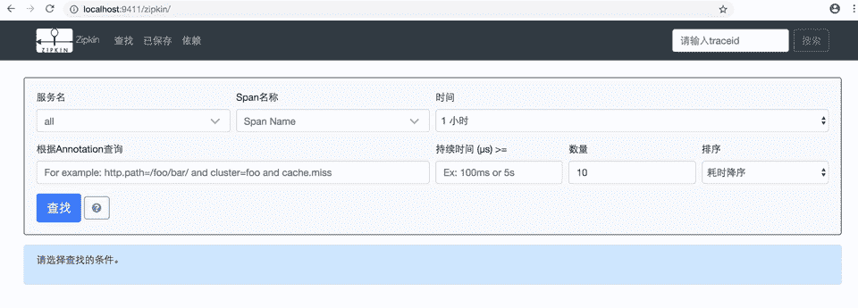
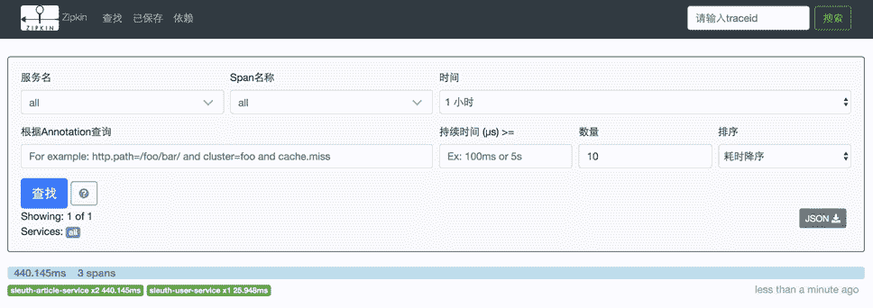
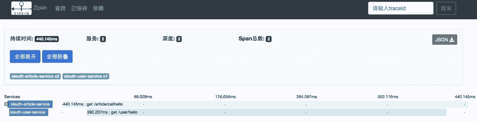
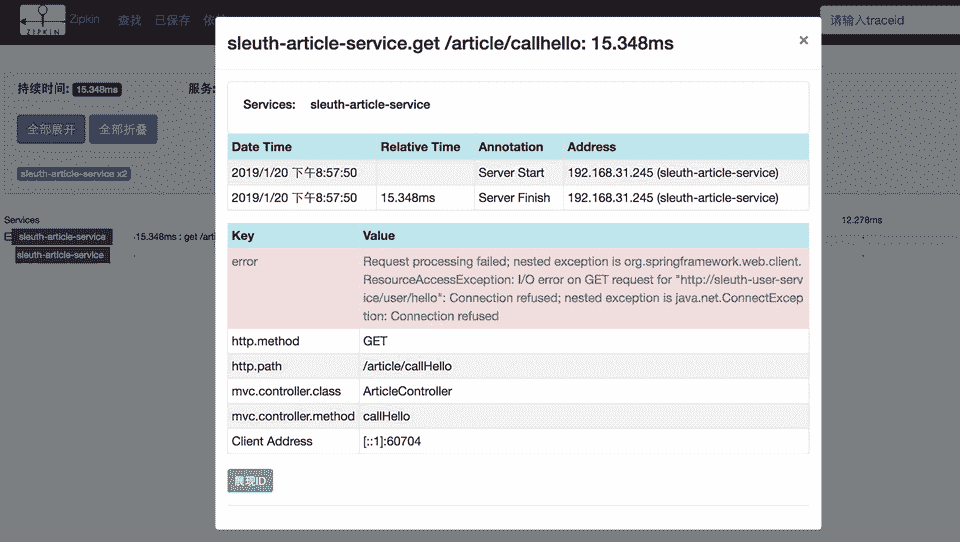
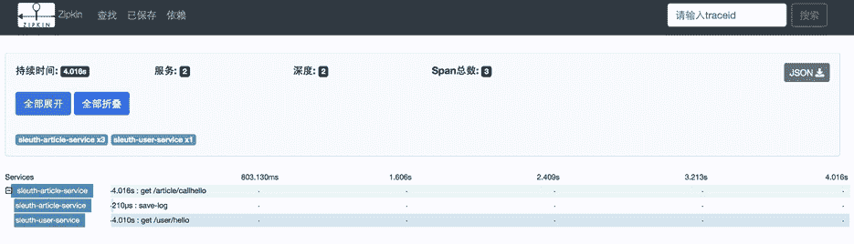
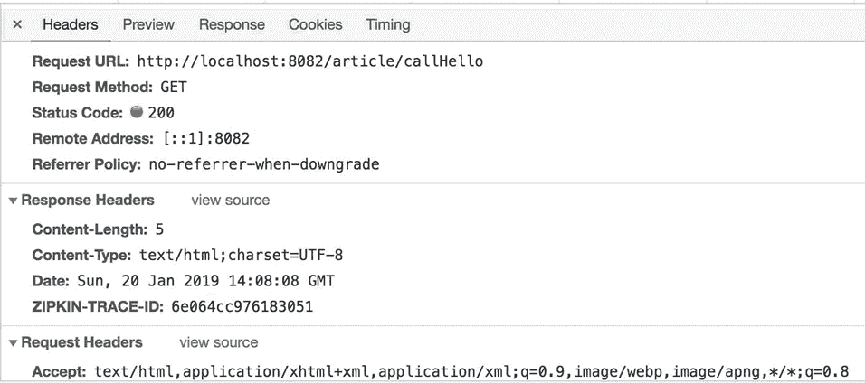
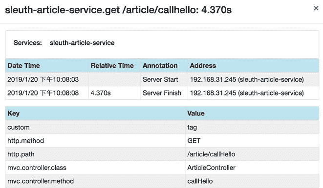

# Spring Cloud 整合 Zipkin 进行服务跟踪

> 原文：[`c.biancheng.net/view/5496.html`](http://c.biancheng.net/view/5496.html)

Zipkin 是 Twitter 的一个开源项目，是一个致力于收集所有服务的监控数据的分布式跟踪系统，它提供了收集数据和查询数据两大接口服务。有了 Zipkin 我们就可以很直观地对调用链进行查看，并且可以很方便地看出服务之间的调用关系以及调用耗费的时间。

## Zipkin 数据收集服务

部署 Zipkin 需要先下载已经编译好了的 jar 包，然后 java–jar 启动即可。

curl -sSL https://zipkin.io/quickstart.sh | bash -s
java -jar zipkin.jar

启动后访问 http://localhost:9411/zipkin/ 就可以看到管理页面了，如图 1 所示。


图 1  Zipkin 后台管理

## 项目集成 Zipkin 发送调用链数据

在前面的教程中，我们只是集成了 Spring Cloud Sleuth，然后将跟踪信息输出到日志中。现在，Zipkin 的服务部署好了，需要将链路跟踪的信息发送给 Zipkin 的收集服务。

需要在项目中添加依赖，具体代码如下所示。

<dependency>
    <groupId>org.springframework.cloud</groupId>
    <artifactId>spring-cloud-starter-zipkin</artifactId>
</dependency>

在属性文件中可以配置 Zipkin 的地址，默认是 http://127.0.0.1:9411，这样才能将跟踪的数据发送到执行的收集服务中。

# 配置 zipKin Server 的地址
spring.zipkin.base-url=http://127.0.0.1:9411

然后我们启动之前的服务、访问接口，就可以看到数据已经能够在 Zipkin 的 Web 页面中了，如图 2 和图 3 所示。


图 2  Zipkin 链路列表

图 3  Zipkin 链路详情
停掉被访问的服务，模拟一下异常情况，通过 Zipkin 的 UI 可以快速发现请求异常的信息，如图 4 所示。


图 4  Zipkin 异常请求
还可以查询异常的详细信息，如图 5 所示。


图 5  Zipkin 链路异常信息详情

## 抽样采集数据

在实际使用中可能调用了 10 次接口，但是 Zipkin 中只有一条数据，这是因为收集信息是有一定比例的，这并不是 bug。Zipkin 中的数据条数与调用接口次数默认比例是 0.1，当然我们也可以通过配置来修改这个比例值：

#zipkin 抽样比例
spring.sleuth.sampler.probability=1.0

之所以有这样的一个配置，是因为在高并发下，如果所有数据都采集，那这个数据量就太大了，采用抽样的做法可以减少一部分数据量，特别是对于 Http 方式去发送采集数据，对性能有很大的影响。

## 异步任务线程池定义

Sleuth 对异步任务也是支持的，我们用 @Async 开启一个异步任务后，Sleuth 会为这个调用新创建一个 Span。

如果你自定义了异步任务的线程池，会导致无法新创建一个 Span，这就需要使用 Sleuth 提供的 LazyTraceExecutor 来包装下。代码如下所示。

```

@Configuration
@EnableAutoConfiguration
public class CustomExecutorConfig extends AsyncConfigurerSupport {

    @Autowired
    BeanFactory beanFactory;

    @Override
    public Executor getAsyncExecutor() {
        ThreadPoolTaskExecutor executor = new ThreadPoolTaskExecutor();
        executor.setCorePoolSize(7);
        executor.setMaxPoolSize(42);
        executor.setQueueCapacity(11);
        executor.setThreadNamePrefix("zhangsan-");
        executor.initialize();
        return new LazyTraceExecutor(this.beanFactory, executor);
    }
}
```

如果直接 return executor 就不会新建 Span，也就不会有 save-log 这个 Span。如图 6 所示。


图 6  Zipkin Span 信息

## TracingFilter

TracingFilter 是负责处理请求和响应的组件，我们可以通过注册自定义的 TracingFilter 实例来实现一些扩展性的需求。下面给大家演示下如何给请求添加自定义的标记以及将请求 ID 添加到响应头返回给客户端。代码如下所示。

```

@Component
@Order(TraceWebServletAutoConfiguration.TRACING_FILTER_ORDER + 1)
class MyFilter extends GenericFilterBean {

    private final Tracer tracer;

    MyFilter(Tracer tracer) {
        this.tracer = tracer;
    }

    @Override
    public void doFilter(ServletRequest request, ServletResponse response, FilterChain chain)
            throws IOException, ServletException {
        Span currentSpan = this.tracer.currentSpan();
        if (currentSpan == null) {
            chain.doFilter(request, response);
            return;
        }
        ((HttpServletResponse) response).addHeader("ZIPKIN-TRACE-ID", currentSpan.context().traceIdString());
        currentSpan.tag("custom", "tag");
        chain.doFilter(request, response);
    }
}
```

我们在响应头中设置了请求 ID，可以通过查看请求的响应信息来验证是否设置成功，如图 7 所示。


图 7  查询请求响应信息
手动创建的标记可以在 Zipkin 中查看，如图 8 所示。


图 8  Zipkin 自定义标记信息
自定义标记是一个非常实用的功能，可以将请求对应的用户信息标记上去，排查问题时非常有帮助。

## 监控本地方法

异步执行和远程调用都会新开启一个 Span，如果我们想监控本地的方法耗时时间，可以采用埋点的方式监控本地方法，也就是开启一个新的 Span。代码如下所示。

```

@Autowired
Tracer tracer;

@Override
public void saveLog2(String log) {
    ScopedSpan span = tracer.startScopedSpan("saveLog2");
    try {
        Thread.sleep(2000);
    } catch (Exception | Error e) {
        span.error(e);
    } finally {
        span.finish();
    }
}
```

通过手动埋点的方式可以创建新的 Span，在 Zipkin 的 UI 中也可以看到这个本地方法执行所消耗的时间，可以看到 savelog2 花费了 2 秒的时间，如图 9 所示。


图 9  Zipkin 手动埋点数据信息
除了使用代码手动创建 Span，还有一种更简单的方式，那就是在方法上加上下面的注解：

@NewSpan(name = "saveLog2")

## 过滤不想跟踪的请求

对于某些请求不想开启跟踪，可以通过配置 HttpSampler 来过滤掉，比如 swagger 这些请求等。代码如下所示。

```

@Bean(name = ServerSampler.NAME)
HttpSampler myHttpSampler(SkipPatternProvider provider) {
    Pattern pattern = provider.skipPattern();
    return new HttpSampler() {

        @Override
        public <Req> Boolean trySample(HttpAdapter<Req, ?> adapter, Req request) {
            String url = adapter.path(request);
            boolean shouldSkip = pattern.matcher(url).matches();
            if (shouldSkip) {
                return false;
            }
            return null;
        }
    };
}
```

核心在 trySample 方法中，只要不想跟踪的 URL 直接返回 false 就可以过滤。规则可以自定，笔者用了 SkipPatternProvider 来过滤，SkipPatternProvider 中的 skipPattern 配置了很多过滤规则。

/api-docs.*|/autoconfig|/configprops|/dump|/health|/info|/metrics.*|
/mappings|/trace|/swagger.*|.*\.png|.*\.css|.*\.js|.*\.html|/favicon.ico|
/hystrix.stream|/application/.*|/actuator.*|/cloudfoundryapplication

## 用 RabbitMq 代替 Http 发送调用链数据

虽然有基于采样的收集方式，但是数据的发送采用 Http 还是对性能有影响。如果 Zipkin 的服务端重启或者挂掉了，那么将丢失部分采集数据。为了解决这些问题，我们将集成 RabbitMq 来发送采集数据，利用消息队列来提高发送性能，保证数据不丢失。

在服务中增加 RabbitMq 的依赖：

<dependency>
    <groupId>org.springframework.amqp</groupId>
    <artifactId>spring-rabbit</artifactId>
</dependency>

然后在属性文件中增加 RabbitMq 的连接配置：

# 修改 zipkin 的数据发送方式为 RabbitMq
spring.zipkin.sender.type=RABBIT
# rabbitmq 配置
spring.rabbitmq.addresses=amqp://192.168.10.124:5672
spring.rabbitmq.username=zhangsan
spring.rabbitmq.password=123456

到这里，集成就已经完成了，记得去掉之前配置的 spring.zipkin.base-url。因为我们现在利用 RabbitMq 来发送数据了，所以这个配置就不需要了。

数据发送方已经采用 RabbitMq 来发送调用链数据，但是 Zipkin 服务并不知道 RabbitMq 的信息，所以我们在启动 Zipkin 服务的时候需要指定 RabbitMq 的信息。

java -DRABBIT_ADDRESSES=192.168.10.124:5672 - DRABBIT_USER=zhangsan -DRABBIT_PASSWORD=123456 -jar zipkin.jar

## 用 Elasticsearch 存储调用链数据

目前我们收集的数据都是存在 Zipkin 服务的内存中，服务一重启这些数据就没了，我们需要将这些数据持久化。我们可以将其存储在 MySQL 中，实际使用中数据量可能会比较大，所以 MySQL 并不是一种很好的选择，可以选择用 Elasticsearch 来存储数据，Elasticsearch 在搜索方面有先天的优势。

启动 Zipkin 的时候指定存储类型为 ES，指定 ES 的 URL 信息：

java -DSTORAGE_TYPE=elasticsearch -DES_HOSTS=http://localhost:9200 - DRABBIT_ADDRESSES=192.168.10.124:5672 -DRABBIT_USER=zhangsan -DRABBIT_PASSWORD=123456 -jar zipkin.jar

重启服务，然后收集一些数据，我们可以通过两种方式来验证数据是否存储到了 Elasticsearch 中。

可以重启 Zipkin 服务，然后看看数据是否还存在，如果存在则证明数据已经是持久化了。

可以通过查看 Elasticsearch 中的数据来确认数据有没有存储成功，访问 Elasticsearch 的地址查看当前所有的索引信息：http://localhost：9200/_cat/indices。

yellow open zipkin:span-2019-01-22 P0QTytShTWmAyZVg61dmRg 5 1 5 0 33.6kb 33.6kb

可以看到当前节点下面有哪些索引，如果看到有以 zipkin 开头的就说明索引创建了，接着直接查询这个索引下是否有数据即可认证是否存储成功，访问 http://localhost：9200/索引名称/_search。