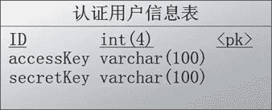

# Spring Cloud 基于 JWT 创建统一的认证服务

> 原文：[`c.biancheng.net/view/5500.html`](http://c.biancheng.net/view/5500.html)

认证服务肯定要有用户信息，不然怎么认证是否为合法用户？因为是内部的调用认证，可以简单一点，用数据库管理就是一种方式。或者可以配置用户信息，然后集成分布式配置管理就完美了。

## 表结构

本教程中的案例把查数据库这一步骤省略了，大家可以自行补充，但是表的设计还是要跟大家讲解的。用户表的形式如图 1 所示。


图 1  用户表
相关的代码如下所示。

```

create table auth_user(
  id int(4) not null,
  accessKey varchar(100) not null,
  secretKey varchar(100) not null,
  Primary key (id)
);
Alter table auth_user comment '认证用户信息表';
```

这里只有简单的几个字段，若大家有别的需求可以自行去扩展。代码中的 accessKey 和 secretKey 是用户身份的标识。

## JWT 工具类封装

JWT 的 GitHub 地址是：[`github.com/jwtk/jjwt`](https://github.com/jwtk/jjwt)，依赖配置代码如下所示。

<dependency>
    <groupId>io.jsonwebtoken</groupId>
    <artifactId>jjwt</artifactId>
    <version>0.7.0</version>
</dependency>

用工具类进行认证主要有以下几个方法：

*   生成 Token。
*   检查 Token 是否合法。
*   刷新 RSA 公钥以及私钥。

生成 Token 是在进行用户身份认证之后，通过用户的 ID 来生成一个 Token，这个 Token 采用 RSA 加密的方式进行加密，Token 的内容包括用户的 ID 和过期时间。

检查 Token 则是根据调用方带来的 Token 检查是否为合法用户，就是对 Token 进行解密操作，能解密并且在有效期内表示合法，合法则返回用户 ID。

刷新 RSA 公钥及私钥的作用是防止公钥、私钥泄露，公钥、私钥一般是写死的，不过我们可以做成配置的。集成配置管理中心后，可以对公钥、私钥进行动态修改，修改之后需要重新初始化公钥、私钥的对象信息。

获取 Token 代码如下所示。

```

/**
* 获取 Token
*
* @param uid 用户 ID
* @param exp 失效时间, 单位分钟
* @return
*/
public static String getToken(String uid, int exp) {
    Long endTime = System.currentTimeMillis() + 1000 * 60 * exp;
    return Jwts.builder().setSubject(uid).setExpiration(new Date(endTime))
            .signWith(SignatureAlgorithm.RS512, priKey).compact();
}
```

检查 Token 是否合法代码如下所示。

```

/**
* 检查 Token 是否合法
*
* @param token
* @return JWTResult
*/
public JWTResult checkToken(String token) {
    try {
        Claims claims = Jwts.parser().setSigningKey(pubKey).parseClaimsJws(token).getBody();
        String sub = claims.get("sub", String.class);
        return new JWTResult(true, sub, "合法请求", ResponseCode.SUCCESS_CODE.getCode());
    } catch (ExpiredJwtException e) {
        // 在解析 JWT 字符串时, 如果'过期时间字段'已经早于当前时间,
        // 将会抛出 ExpiredJwtException 异常, 说明本次请求已经失效
        return new JWTResult(false, null, "token 已过期 ", ResponseCode.TOKEN_TIMEOUT_CODE.getCode());
    } catch (SignatureException e) {
        // 在解析 JWT 字符串时, 如果密钥不正确, 将会解析失败, 抛出
        // SignatureException 异常, 说明该 JWT 字符串是伪造的
        return new JWTResult(false, null, "非法请求", ResponseCode.NO_AUTH_CODE.getCode());
    } catch (Exception e) {
        return new JWTResult(false, null, "非法请求", ResponseCode.NO_AUTH_CODE.getCode());
    }
}
```

完整代码如下所示。

```

/**
* API 调用认证工具类，采用 RSA 加密
*/
public class JWTUtils {
    private static RSAPrivateKey priKey;
    private static RSAPublicKey pubKey;

    private static class SingletonHolder {
        private static final JWTUtils INSTANCE = new JWTUtils();
    }

    public synchronized static JWTUtils getInstance(String modulus, String privateExponent, String publicExponent) {
        if (priKey == null && pubKey == null) {
            priKey = RSAUtils.getPrivateKey(modulus, privateExponent);
            pubKey = RSAUtils.getPublicKey(modulus, publicExponent);
        }
        return SingletonHolder.INSTANCE;
    }

    public synchronized static void reload(String modulus, String privateExponent, String publicExponent) {
        priKey = RSAUtils.getPrivateKey(modulus, privateExponent);
        pubKey = RSAUtils.getPublicKey(modulus, publicExponent);
    }

    public synchronized static JWTUtils getInstance() {
        if (priKey == null && pubKey == null) {
            priKey = RSAUtils.getPrivateKey(RSAUtils.modulus, RSAUtils.private_exponent);
            pubKey = RSAUtils.getPublicKey(RSAUtils.modulus, RSAUtils.public_exponent);
        }
        return SingletonHolder.INSTANCE;
    }

    /**
     * 获取 Token
     *
     * @param uid 用户 ID
     * @param exp 失效时间，单位分钟
     * @return
     */
    public static String getToken(String uid, int exp) {
        long endTime = System.currentTimeMillis() + 1000 * 60 * exp;
        return Jwts.builder().setSubject(uid).setExpiration(new Date(endTime))
                .signWith(SignatureAlgorithm.RS512, priKey).compact();
    }

    /**
     * 获取 Token
     *
     * @param uid 用户 ID
     * @return
     */
    public String getToken(String uid) {
        long endTime = System.currentTimeMillis() + 1000 * 60 * 1440;
        return Jwts.builder().setSubject(uid).setExpiration(new Date(endTime))
                .signWith(SignatureAlgorithm.RS512, priKey).compact();
    }

    /**
     * 检查 Token 是否合法
     *
     * @param token
     * @return JWTResult
     */
    public JWTResult checkToken(String token) {
        try {
            Claims claims = Jwts.parser().setSigningKey(pubKey).parseClaimsJws(token).getBody();
            String sub = claims.get("sub", String.class);
            return new JWTResult(true, sub, "合法请求", ResponseCode.SUCCESS_CODE.getCode());
        } catch (ExpiredJwtException e) {
            // 在解析 JWT 字符串时，如果‘过期时间字段’已经早于当前时间，将会抛出 ExpiredJwtException 异常，说明本次请求已经失效
            return new JWTResult(false, null, "token 已过期", ResponseCode.TOKEN_TIMEOUT_CODE.getCode());
        } catch (SignatureException e) {
            // 在解析 JWT 字符串时，如果密钥不正确，将会解析失败，抛出 SignatureException 异常，说明该 JWT 字符串是伪造的
            return new JWTResult(false, null, "非法请求", ResponseCode.NO_AUTH_CODE.getCode());
        } catch (Exception e) {
            return new JWTResult(false, null, "非法请求", ResponseCode.NO_AUTH_CODE.getCode());
        }
    }

    public static class JWTResult {
        private boolean status;
        private String uid;
        private String msg;
        private int code;

        public JWTResult() {
            super();
        }

        public JWTResult(boolean status, String uid, String msg, int code) {
            super();
            this.status = status;
            this.uid = uid;
            this.msg = msg;
            this.code = code;
        }

        public int getCode() {
            return code;
        }

        public void setCode(int code) {
            this.code = code;
        }

        public String getMsg() {
            return msg;
        }

        public void setMsg(String msg) {
            this.msg = msg;
        }

        public boolean isStatus() {
            return status;
        }

        public void setStatus(boolean status) {
            this.status = status;
        }

        public String getUid() {
            return uid;
        }

        public void setUid(String uid) {
            this.uid = uid;
        }
    }
}
```

## 认证接口

认证接口用于调用方进行认证时，认证通过则返回一个加密的 Token 给对方，对方就可以用这个 Token 去请求别的服务了，认证获取 Token 代码如下所示。

```

@PostMapping("/token")
public ResponseData auth(@RequestBody AuthQuery query) throws Exception {
    if (StringUtils.isBlank(query.getAccessKey()) || StringUtils.isBlank(query.getSecretKey())) {
        return ResponseData.failByParam("accessKey and secretKey not null");
    }
    User user = authService.auth(query);
    if (user == null) {
        return ResponseData.failByParam(" 认证失败 ");
    }
    JWTUtils jwt = JWTUtils.getInstance();
    return ResponseData.ok(jwt.getToken(user.getId().toString()));
}
```

认证参数代码如下所示。

```

/**
* API 用户认证参数类
*/
public class AuthQuery {
    private String accessKey;
    private String secretKey;
    // get set ...
}
```

AuthService 中的 auth 方法就是根据 accessKey 和 secretKey 判断是否有这个用户。

由于篇幅有限，请大家继续阅读以下教程：

*   服务提供方进行调用认证
*   服务消费方申请 Token
*   Feign 调用前统一申请 Token 传递到调用的服务中
*   RestTemplate 调用前统一申请 Token 传递到调用的服务中
*   Zuul 中传递 Token 到路由的服务中