# Spring Boot Admin 的介绍及使用

> 原文：[`c.biancheng.net/view/5509.html`](http://c.biancheng.net/view/5509.html)

Spring Boot 有一个非常好用的监控和管理的源软件，这个软件就是 Spring Boot Admin。该软件能够将 Actuator 中的信息进行界面化的展示，也可以监控所有 Spring Boot 应用的健康状况，提供实时警报功能。

主要的功能点有：

*   显示应用程序的监控状态
*   应用程序上下线监控
*   查看 JVM，线程信息
*   可视化的查看日志以及下载日志文件
*   动态切换日志级别
*   Http 请求信息跟踪
*   其他功能点……

可点击 [`github.com/codecentric/spring-boot-admin`](https://github.com/codecentric/spring-boot-admin) 更多了解 Spring-boot-admin。

## 创建 Spring Boot Admin 项目

创建一个 Spring Boot 项目，用于展示各个服务中的监控信息，加上 Spring Boot Admin 的依赖，具体代码如下所示。

<dependency>
    <groupId>org.springframework.boot</groupId>
    <artifactId>spring-boot-starter-web</artifactId>
</dependency>
<dependency>
    <groupId>de.codecentric</groupId>
    <artifactId>spring-boot-admin-starter-server</artifactId>
    <version>2.0.2</version>
</dependency>

创建一个启动类，具体代码如下所示。

```

@EnableAdminServer
@SpringBootApplication
public class App {
    public static void main(String[] args) {
        SpringApplication.run(App.class, args);
    }
}
```

在属性文件中增加端口配置信息：

server.port=9091

启动程序，访问 Web 地址 http://localhost:9091 就可以看到主页面了，这个时候是没有数据的，如图 1 所示。

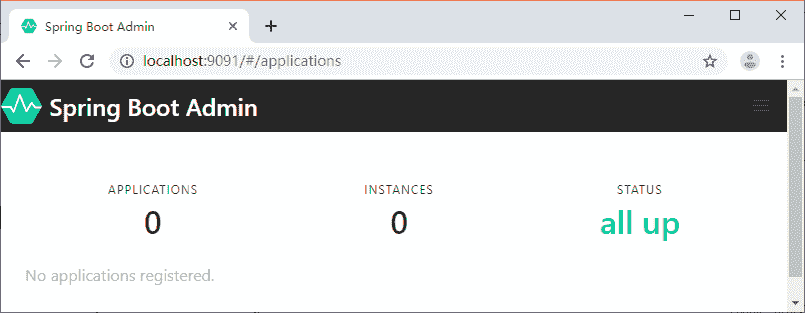
图 1  Spring Boot Admin 主页

## 将服务注册到 Spring Boot Admin

创建一个 Spring Boot 项目，名称为 spring-boot-admin-client。添加 Spring Boot Admin Client 的 Maven 依赖，代码如下所示。

<dependency>
    <groupId>de.codecentric</groupId>
    <artifactId>spring-boot-admin-starter-client</artifactId>
    <version>2.0.2</version>
</dependency>

然后在属性文件中添加下面的配置：

server.port=9092
spring.boot.admin.client.url=http://localhost:9091

spring.boot.admin.client.url：Spring Boot Admin 服务端地址。

将服务注册到 Admin 之后我们就可以在 Admin 的 Web 页面中看到我们注册的服务信息了，如图 2 所示。

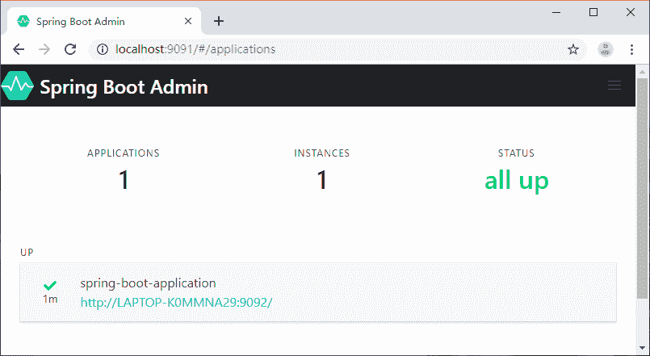
图 2  Spring Boot Admin 主页（有数据）
点击实例信息跳转到详细页面，可以查看更多的信息，如图 3 所示。

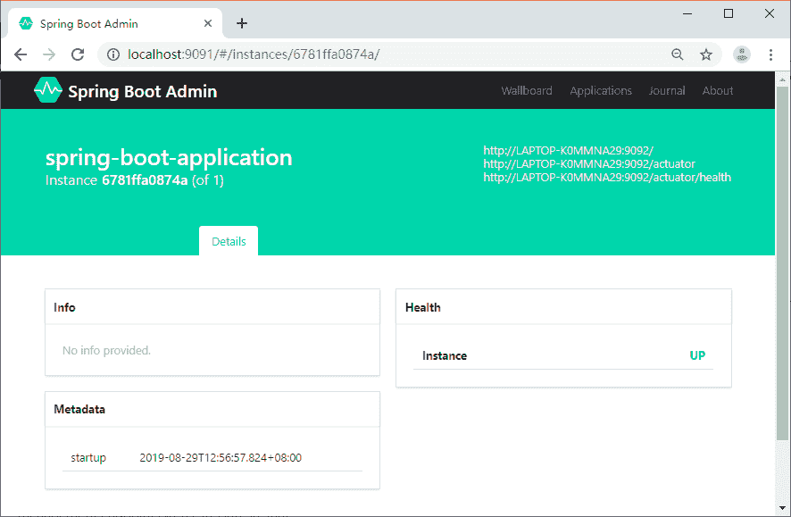
图 3  Spring Boot Admin 详情
可以看到详情页面并没有展示丰富的监控数据，这是因为没有将 spring-boot-admin-client 的端点数据暴露出来。

在 spring-boot-admin-client 中加入 actuator 的 Maven 依赖，代码如下所示。

<dependency>
    <groupId>org.springframework.boot</groupId>
    <artifactId>spring-boot-starter-actuator</artifactId>
</dependency>

然后在属性文件中追加下面的配置：

management.endpoints.web.exposure.include=*

management.endpoints.web.exposure.include：暴露所有的 actuator 端点信息重启 spring-boot-admin-client，我们就可以在详情页面看到更多的数据，如图 4 所示。

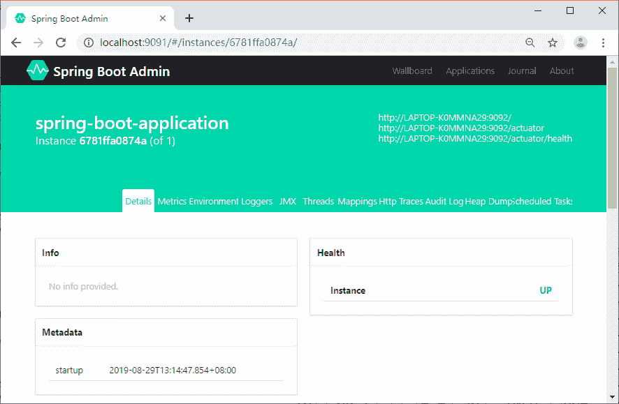
图 4  Spring Boot Admin 详情（有数据）

## 监控内容介绍

自定义的 Info 信息、健康状态、元数据，如图 5 所示。

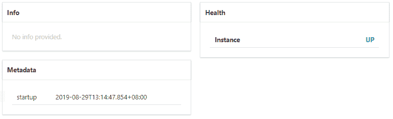
图 5  Spring Boot Admin 数据展示（一）
CPU、线程等信息如图 6 所示。

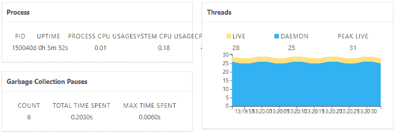
图 6  Spring Boot Admin 数据展示（二）
内存使用情况如图 7 所示。

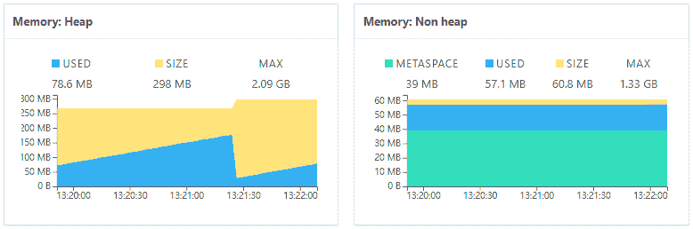
图 7  Spring Boot Admin 数据展示（三）
配置信息如图 8 所示。

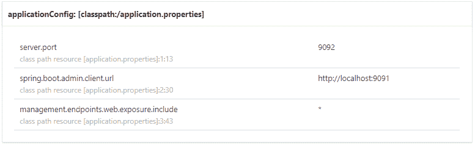
图 8  Spring Boot Admin 数据展示（四）
日志级别调整如图 9 所示。

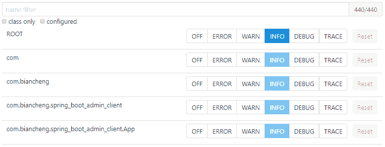
图 9  Spring Boot Admin 数据展示（五）
Http 请求信息如图 10 所示。

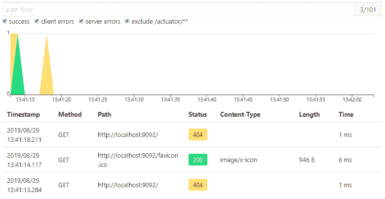
图 10  Spring Boot Admin 数据展示（六）

## 如何在 Admin 中查看各个服务的日志

Spring Boot Admin 提供了基于 Web 页面的方式实时查看服务输出的本地日志，前提是服务中配置了 logging.file。

我们在 spring-boot-admin-client 的属性文件中增加下面的内容：

logging.file=/Users/zhangsan/Downloads/spring-boot-admin-client.log

重启服务，就可以在 Admin Server 的 Web 页面中看到新加了一个 Logfile 菜单，如图 11 所示。

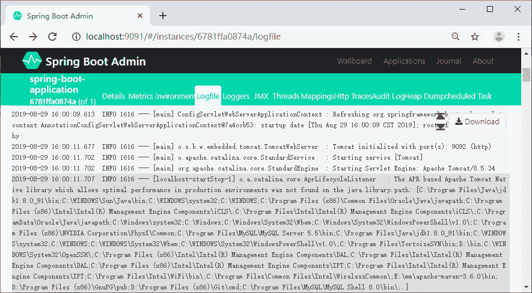
图 11  Spring Boot Admin 日志