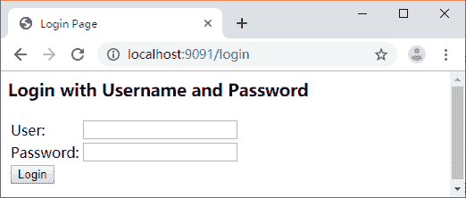

# 使用 Spring Security 给 Spring Boot Admin 开启认证

> 原文：[`c.biancheng.net/view/5518.html`](http://c.biancheng.net/view/5518.html)

监控类的数据 Web 管理端最好不要设置成直接通过输入访问地址就可以访问，必须得进行用户认证才行，以保证数据的安全性。Spring Boot Admin 开启认证也可以借助于 spring-boot-starter-security。

加入依赖，代码如下所示。

<dependency>
    <groupId>org.springframework.boot</groupId>
    <artifactId>spring-boot-starter-security</artifactId>
</dependency>

然后在属性文件里面配置认证信息：

spring.security.user.name=zhangsan
spring.security.user.password=123456

自定义安全配置类，代码如下所示。

```

@Configuration
public static class SecurityPermitAllConfig extends WebSecurityConfigurerAdapter {
    private final String adminContextPath;

    public SecurityPermitAllConfig(AdminServerProperties adminServerProperties) {
        this.adminContextPath = adminServerProperties.getContextPath();
    }

    @Override
    protected void configure(HttpSecurity http) throws Exception {
        SavedRequestAwareAuthenticationSuccessHandler successHandler = new SavedRequestAwareAuthenticationSuccessHandler();
        successHandler.setTargetUrlParameter("redirectTo");
        // 静态资源和登录页面可以不用认证
        http.authorizeRequests().antMatchers(adminContextPath + "/assets/**").permitAll()
                .antMatchers(adminContextPath + "/login").permitAll()
                // 其他请求必须认证
                .anyRequest().authenticated()
                // 自定义登录和退出
                .and().formLogin().loginPage(adminContextPath + "/login").successHandler(successHandler).and().logout()
                .logoutUrl(adminContextPath + "/logout")
                // 启用 HTTP-Basic, 用于 Spring Boot Admin Client 注册
                .and().httpBasic().and().csrf().disable();
    }
}
```

重启程序，然后就会发现需要输入用户名和密码才能访问 Spring Boot Admin 的 Web 管理端，如下图所示。


这里需要注意的是，如果 Spring Boot Admin 服务开启了认证，监控的服务中也需要配置对应的用户名和密码，否则会注册失败。

在 spring-boot-admin-client 属性文件中加上用户认证信息：

spring.boot.admin.client.username=zhangsan
spring.boot.admin.client.password=123456

账号密码需要跟 Spring Boot Admin Server 一致。