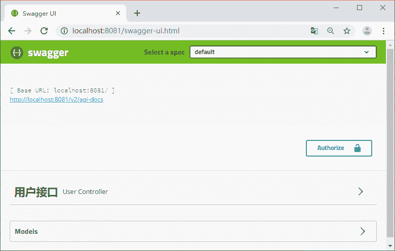
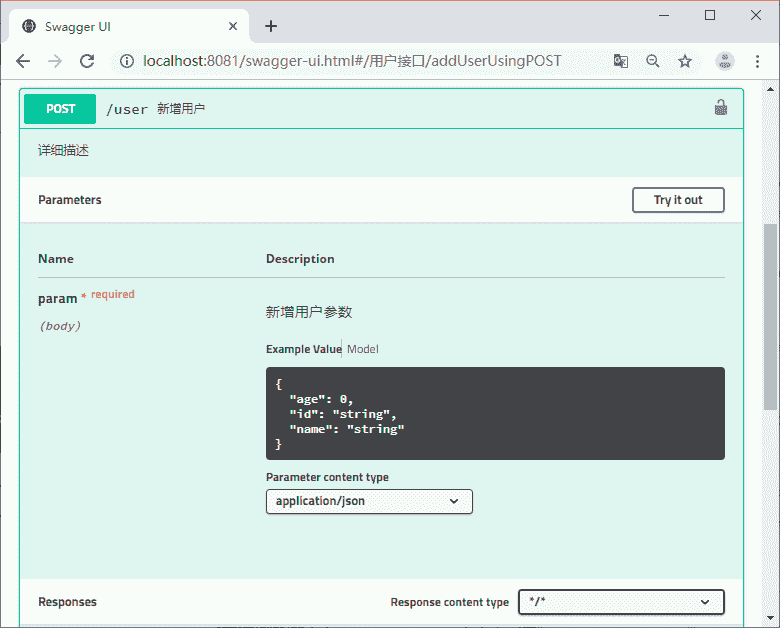
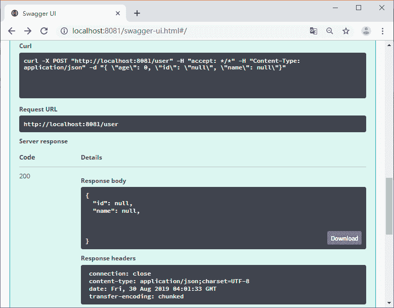

# Swagger 是什么？Swagger 怎么用？

> 原文：[`c.biancheng.net/view/5532.html`](http://c.biancheng.net/view/5532.html)

Swagger 是一个规范且完整的框架，用于生成、描述、调用和可视化 RESTful 风格的 Web 服务。

Swagger 的目标是对 REST API 定义一个标准且和语言无关的接口，可以让人和计算机拥有无须访问源码、文档或网络流量监测就可以发现和理解服务的能力。当通过 Swagger 进行正确定义，用户可以理解远程服务并使用最少实现逻辑与远程服务进行交互。与为底层编程所实现的接口类似，Swagger 消除了调用服务时可能会有的猜测。

#### Swagger 的优势

*   支持 API 自动生成同步的在线文档：使用 Swagger 后可以直接通过代码生成文档，不再需要自己手动编写接口文档了，对程序员来说非常方便，可以节约写文档的时间去学习新技术。
*   提供 Web 页面在线测试 API：光有文档还不够，Swagger 生成的文档还支持在线测试。参数和格式都定好了，直接在界面上输入参数对应的值即可在线测试接口。

## 集成 Swagger 管理 API 文档

#### 1）项目中集成 Swagger

集成 Swagger 我们使用封装好了的 Starter 包，代码如下所示。

<!-- Swagger -->
<dependency>
    <groupId>com.spring4all</groupId>
    <artifactId>swagger-spring-boot-starter</artifactId>
    <version>1.7.1.RELEASE</version>
</dependency>

在启动类中使用 @EnableSwagger2Doc 开启 Swagger，代码如下所示。

```

@EnableSwagger2Doc
@SpringBootApplication
public class AuthApplication {
    public static void main(String[] args) {
        SpringApplication.run(AuthApplication.class, args);
    }
}
```

#### 2）使用 Swagger 生成文档

Swagger 是通过注解的方式来生成对应的 API，在接口上我们需要加上各种注解来描述这个接口，关于 Swagger 注解的使用在教程后面会有详细讲解，本节只是带大家快速使用 Swagger，使用方法代码如下所示。

```

@ApiOperation(value = "新增用户")
@ApiResponses({ @ApiResponse(code = 200, message = "OK", response = UserDto.class) })
@PostMapping("/user")
public UserDto addUser(@RequestBody AddUserParam param) {
    System.err.println(param.getName());
    return new UserDto();
}
```

参数类定义代码如下所示。

```

@Data
@ApiModel(value = "com.biancheng.auth.param.AddUserParam", description = "新增用户参数")
public class AddUserParam {

    @ApiModelProperty(value = "ID")
    private String id;

    @ApiModelProperty(value = "名称")
    private String name;

    @ApiModelProperty(value = "年龄")
    private int age;
}
```

## 在线测试接口

接口查看地址可以通过服务地址 /swagger-ui.html 来访问，见图 1。


图 1  swagger 主页
可以展开看详情，见图 2。


图 2  swagger 接口主页
在 param 中输入参数，点击 Try it out 按钮可以调用接口，见图 3。


图 3  swagger 接口调用结果