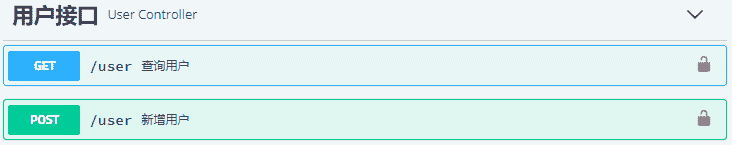
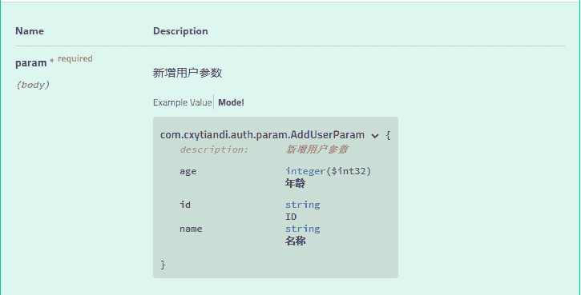
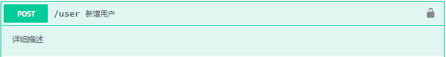

# Swagger 常用注解使用详解

> 原文：[`c.biancheng.net/view/5533.html`](http://c.biancheng.net/view/5533.html)

Swagger 通过注解的方式对接口进行描述，本节主要讲解一些常用生成接口文档的注解。

#### 1\. Api

@Api 用在类上，说明该类的作用。可以标记一个 Controller 类作为 Swagger 文档资源，使用方式代码如下所示。

```

@Api(tags={"用户接口"})
@RestController
public class UserController {

}
```

效果图如图 1 所示。


图 1  API 描述
tags：接口说明，可以在页面中显示。可以配置多个，当配置多个的时候，在页面中会显示多个接口的信息。

#### 2\. ApiModel

@ApiModel 用在类上，表示对类进行说明，用于实体类中的参数接收说明。使用方式代码如下所示。

@ApiModel(value = "com.biancheng.auth.param.AddUserParam", description = "新增用户参数")
public class AddUserParam {
}

效果图如图 2 所示。


图 2  APIModel 描述

#### 3\. ApiModelProperty

@ApiModelProperty() 用于字段，表示对 model 属性的说明。使用方式代码如下所示。

```

@Data
@ApiModel(value = "com.biancheng.auth.param.AddUserParam", description = "新增用户参数")
public class AddUserParam {

    @ApiModelProperty(value = "ID")
    private String id;

    @ApiModelProperty(value = "名称")
    private String name;

    @ApiModelProperty(value = "年龄")
    private int age;

}
```

效果如图 2 右下角。

#### 4\. ApiParam

@ApiParam 用于 Controller 中方法的参数说明。使用方式代码如下所示。

```

@PostMapping("/user")
public UserDto addUser(@ApiParam(value = "新增用户参数", required = true) @RequestBody AddUserParam param) {
    System.err.println(param.getName());
    return new UserDto();
}
```

效果如图 2 中登录参数的展示。

*   value：参数说明
*   required：是否必填

#### 5\. ApiOperation

@ApiOperation 用在 Controller 里的方法上，说明方法的作用，每一个接口的定义。使用方式代码如下所示。

@ApiOperation(value="新增用户", notes="详细描述")
public UserDto addUser(@ApiParam(value = "新增用户参数", required = true) @RequestBody AddUserParam param) {

}

效果图如图 3 所示。


图 3  ApiOperation 描述

*   value：接口名称
*   notes：详细说明

#### 6\. ApiResponse 和 ApiResponses

@ApiResponse 用于方法上，说明接口响应的一些信息；@ApiResponses 组装了多个 @ApiResponse。使用方式代码如下所示。

```

@ApiResponses({ @ApiResponse(code = 200, message = "OK", response = UserDto.class) })
@PostMapping("/user")
public UserDto addUser(@ApiParam(value = "新增用户参数", required = true) @RequestBody AddUserParam param) {

}
```

#### 7\. ApiImplicitParam 和 ApiImplicitParams

用于方法上，为单独的请求参数进行说明。使用方式代码如下所示。

```

@ApiImplicitParams({
        @ApiImplicitParam(name = "id", value = "用户 ID", dataType = "string", paramType = "query", required = true, defaultValue = "1") })
@ApiResponses({ @ApiResponse(code = 200, message = "OK", response = UserDto.class) })
@GetMapping("/user")
public UserDto getUser(@RequestParam("id") String id) {
    return new UserDto();
}
```

*   name：参数名，对应方法中单独的参数名称。
*   value：参数中文说明。
*   required：是否必填。
*   paramType：参数类型，取值为 path、query、body、header、form。
*   dataType：参数数据类型。
*   defaultValue：默认值。