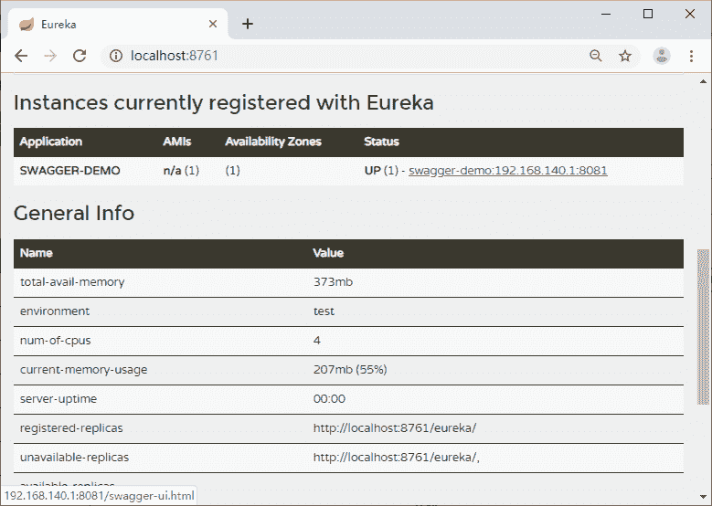
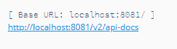

# Spring Cloud Eureka 控制台快速查看 Swagger 文档

> 原文：[`c.biancheng.net/view/5534.html`](http://c.biancheng.net/view/5534.html)

本节主要介绍如何在 Eureka 控制台快速查看 Swagger 文档和 Swagger 测试接口时需要完成的请求认证。

## Eureka 控制台快速查看 Swagger 文档

在服务很多的情况下，我们想通过 Eureka 中注册的实例信息，能够直接跳转到 API 文档页面，这个时候可以定义 Eureka 的 Page 地址。在 application.properties 中增加如下配置即可：

eureka.instance.status-page-url=http://${spring.cloud.client.ip-address}: ${server.port}/swagger-ui.html

在 Eureka Web 控制台就可以直接点击注册的实例跳转到 Swagger 文档页面了，如图 1 所示。

图 1  Eureka 自定义 Swagger 主页地址

## 请求认证

当我们的服务中有认证的逻辑，程序中会把认证的 Token 设置到请求头中，在用 Swagger 测试接口的时候也需要带上 Token 才能完成接口的测试。

点击 Authorize 按钮（如图 2 所示），填写认证信息（如图 3 所示）。

图 2  Authorize 入口按钮

图 3  Authorize 信息填写
默认的请求头名称是 Token，这里改成了 Authorization，通过配置文件修改：

swagger.authorization.key-name=Authorization