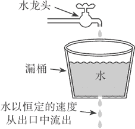

# Spring Cloud 服务限流详解

> 原文：[`c.biancheng.net/view/5543.html`](http://c.biancheng.net/view/5543.html)

高并发系统中有三把利器用来保护系统：缓存、降级和限流。限流的目的是为了保护系统不被大量请求冲垮，通过限制请求的速度来保护系统。在电商的秒杀活动中，限流是必不可少的一个环节。

限流的方式也有多种，可以在 Nginx 层面限流，也可以在应用当中限流，比如在 API 网关中。

## 限​流算法

常见的限流算法有：令牌桶、漏桶。计数器也可以进行限流实现。

#### 1）令牌桶

令牌桶算法是一个存放固定容量令牌的桶，按照固定速率往桶里添加令牌。可以控制流量也可以控制并发量，假如我们想要控制 API 网关的并发量最高为 1000，可以创建一个令牌桶，以固定的速度往桶里添加令牌，超出了 1000 则不添加。

当一个请求到达之后就从桶中获取一个令牌，如果能获取到令牌就可以继续往下请求，获取不到就说明令牌不够，并发量达到了最高，请求就被拦截。

#### 2）漏桶

漏桶是一个固定容量的桶，按照固定的速率流出，可以以任意的速率流入到漏桶中，超出了漏桶的容量就被丢弃，总容量是不变的。但是输出的速率是固定的，无论你上面的水流入的多快，下面的出口只有这么大，就像水坝开闸放水一样，如图 1 所示。



图 1  漏桶算法图解

## 单节点限流

单节点限流指的是只对这个节点的并发量进行控制，相对于集群限流来说单节点限流比较简单，稳定性也好，集群限流需要依赖第三方中间件来存储数据，单节点限流数据存储在本地内存中即可，风险性更低。

从应用的角度来说单节点的限流就够用了，如果我们的应用有 3 个节点，总共能扛住 9000 的并发，那么单个节点最大能扛住的量就是 3000，只要单个节点扛住了就没什么问题了。

我们可以用上面讲的令牌桶算法或者漏桶算法来进行单节点的限流操作，算法的实现可以使用 Google Guava 中提供的算法实现类。实际使用中令牌桶算法更适合一些，当然这个得参考业务需求，之所以选择令牌桶算法是因为它可以处理突发的流量，漏桶算法就不行，因为漏桶的速率是固定的。

首先需要依赖 Guava，其实也可以不用，在 Spring Cloud 中好多组件都依赖了 Guava，如果你的项目是 Spring Cloud 技术栈的话可以不用自己配置，间接就已经依赖了，代码如下所示。

<dependency>
    <groupId>com.google.guava</groupId>
    <artifactId>guava</artifactId>
    <version>18.0</version>
</dependency>

创建一个限流的过滤器，order 返回 0，执行优先级第一，代码如下所示。

```

public class LimitFilter extends ZuulFilter {
    public static volatile RateLimiter rateLimiter = RateLimiter.create(100.0);

    public LimitFilter() {
        super();
    }

    @Override
    public boolean shouldFilter() {
        return true;
    }

    @Override
    public String filterType() {
        return "pre";
    }

    @Override
    public int filterOrder() {
        return 0;
    }

    @Override
    public Object run() {
        // 总体限流 rateLimiter.acquire();
        return null;
    }
}
```

注册限流过滤器，代码如下所示。

@Bean
public LimitFilter limitFilter() {
    return new LimitFilter();
}

上面的方案有一个致命的问题就是速率值是写死的，往往我们需要根据服务器的配置以及当时的并发量来设置一个合理的值，那么就需要速率这个值能够实时修改，并且生效，这时配置中心又派上用场了。

添加 Apollo 的配置，代码如下所示。

```

@Data
@Configuration
public class BasicConf {
    @Value("${limitRate:10}")
    private double limitRate;
}
```

有一个问题是当这个值修改的时候需要重新初始化 RateLimiter，在配置类中实现修改回调的方法代码如下所示。

```

@Data
@Configuration
public class BasicConf {

    @Value("${limitRate:10}")
    private double limitRate;

    @ApolloConfig
    private Config config;

    @ApolloConfigChangeListener
    public void onChange(ConfigChangeEvent changeEvent) {
        if (changeEvent.isChanged("limitRate")) {
            // 更 新 RateLimiter
            LimitFilter.rateLimiter = RateLimiter.create(config.getDoubleProperty("limitRate", 10.0));
        }
    }
}
```

我们可以用 ab 来测试一下接口，代码如下所示。

ab -n 1000 -c 30 http://192.168.10.170:2103/fsh-house/house/1
Benchmarking 192.168.10.170 (be patient)
Completed 100 requests
Completed 200 requests
Completed 300 requests
Completed 400 requests
Completed 500 requests
Completed 600 requests
Completed 700 requests
Completed 800 requests
Completed 900 requests
Completed 1000 requests
Finished 1000 requests

Server Software:
Server Hostname:                192.168.10.170
Server Port:            2103

Document Path:          /fsh-house/house/1
Document Length:                796 bytes
Concurrency Level:              30
Time taken for tests:   98.989 seconds
Complete requests:              1000
Failed requests:                6
(Connect: 0, Receive: 0, Length: 6, Exceptions: 0)
Total transferred:              1001434 bytes
HTML transferred:               833434 bytes
Requests per second:    10.10 [#/sec] (mean) Time per
request:            2969.679 [ms] (mean) Time per
request:            98.989 [ms] (mean, across all concurrent requests)
Transfer rate:          9.88 [Kbytes/sec] received

*   -n 1000 表示总共请求 1000 次
*   -c 30 表示并发数量

我们可以看到执行完这 1000 次请求总共花费了 98 秒，Time taken for tests 就是请求所花费的总时间，这是在限流参数为 10 的情况下，我们还可以把参数调到 100 然后测试一下，代码如下所示。

ab -n 1000 -c 30 http://192.168.10.170:2103/fsh-house/house/1
Benchmarking 192.168.10.170 (be patient) Completed 100
requests Completed 200
requests Completed 300
requests Completed 400
requests Completed 500
requests Completed 600
requests Completed 700
requests Completed 800
requests Completed 900
requests Completed 1000 requests Finished 1000 requests Server Software:
Server Hostname:                192.168.10.170
Server Port:            2103
Document Path:          /fsh-house/house/1
Document Length:                7035 bytes
Concurrency Level:              30
Time taken for tests:   9.061 seconds
Complete requests:              1000
Failed requests:                30
(Connect: 0, Receive: 0, Length: 30, Exceptions: 0)
Total transferred:              7015830 bytes
HTML transferred:               6847830 bytes
Requests per second:    110.37 [#/sec] (mean)
Time per request:               271.821 [ms] (mean)
Time per request:               9.061 [ms] (mean, across all concurrent requests)
Transfer rate:          756.17 [Kbytes/sec] received

限流的参数调大后，请求 9 秒就完成了，这就证明我们的限流操作起作用了。

## 集群限流

集群限流可以借助 Redis 来实现，至于实现的方式也有很多种，下面我们介绍一种比较简单的限流方式。

我们可以按秒来对并发量进行限制，比如整个集群中每秒只能访问 1000 次。我们可以利用计数器来判断，Redis 的 key 为当前秒的时间戳，value 就是访问次数的累加，当次数超出了我们限制的范围内，直接拒绝即可。需要注意的是集群中服务器的时间必须一致才能没有误差，下面我们来看代码。

首先在我们的 API 网关中集成 Redis 的操作，我们引入 Spring Data Redis 来操作 Redis，代码如下所示。

<dependency>
    <groupId>org.springframework.boot</groupId>
    <artifactId>spring-boot-starter-data-redis</artifactId>
</dependency>

属性配置文件中配置 Redis 的连接信息

spring.redis.host=192.168.10.47
spring.redis.port=6379

集成后就直接可以使用 RedisTemplate 来操作 Redis 了，这里配置了一个 RedisTemplate，key 为 String 类型，value 为 Long 类型，用来计数，代码如下所示。

```

@Configuration
public class RedisConfig {

    @Bean(name = "longRedisTemplate")
    public RedisTemplate<String, Long> redisTemplate(RedisConnectionFactory jedisConnectionFactory) {
        RedisTemplate<String, Long> template = new RedisTemplate<String, Long>();
        template.setConnectionFactory(jedisConnectionFactory);
        template.setKeySerializer(new StringRedisSerializer());
        template.setHashValueSerializer(new GenericToStringSerializer<Long>(Long.class));
        template.setValueSerializer(new GenericToStringSerializer<Long>(Long.class));
        return template;
    }
}
```

在之前的限流类的配置中增加集群限流的速率配置，代码如下所示。

```

@Data
@Configuration
public class BasicConf {
    @Value("${clusterLimitRate:10}")
    private double clusterLimitRate;
}
```

接下来我们改造之前单体限流用的过滤器 LimitFilter，采用 Redis 来进行限流操作，代码如下所示。

```

public class LimitFilter extends ZuulFilter {
    private Logger log = LoggerFactory.getLogger(LimitFilter.class);

    public static volatile RateLimiter rateLimiter = RateLimiter.create(100);

    @Autowired
    @Qualifier("longRedisTemplate")
    private RedisTemplate<String, Long> redisTemplate;

    @Autowired
    private BasicConf basicConf;

    public LimitFilter() {
        super();
    }

    @Override
    public boolean shouldFilter() {
        return true;
    }

    @Override
    public String filterType() {
        return "pre";
    }

    @Override
    public int filterOrder() {
        return 0;
    }

    @Override
    public Object run() {
        RequestContext ctx = RequestContext.getCurrentContext();
        Long currentSecond = System.currentTimeMillis() / 1000;
        String key = "fsh-api-rate-limit-" + currentSecond;
        try {
            if (!redisTemplate.hasKey(key)) {
                redisTemplate.opsForValue().set(key, 0L, 100, TimeUnit.SECONDS);
            }
            int rate = basicConf.getClusterLimitRate();
            // 当集群中当前秒的并发量达到了设定的值, 不进行处理
            // 注意集群中的网关与所在服务器时间必须同步
            if (redisTemplate.opsForValue().increment(key, 1) > rate) {
                ctx.setSendZuulResponse(false);
                ctx.set("isSuccess", false);
                ResponseData data = ResponseData.fail("当前负载太高，请稍后重试", ResponseCode.LIMIT_ERROR_CODE.getCode());
                ctx.setResponseBody(JsonUtils.toJson(data));
                ctx.getResponse().setContentType("application/json;charset=utf-8");
                return null;
            }
        } catch (Exception e) {
            log.error("集群限流异常", e);
            // Redis 挂掉等异常处理，可以继续单节点限流
            // 单节点限流
            rateLimiter.acquire();
        }
        return null;
    }
}
```

我们来看看 run 方法里面的逻辑，首先我们是获取了当前时间的时间戳然后转换成秒，定义了一个 Redis 的 key。判断这个 key 是否存在，不存在则插入一个，初始值为 0，然后通过 increment 来为这个 key 累加计数，并获取累加之后的值，increment 是原子性的，不会有并发问题，如果当前秒的数量超出了我们设定的值那就说明当前的并发量已经达到了极限值，然后直接拒绝请求。

这里还需要进行异常处理，前文推荐用单节点限流的方式来进行就是因为集群性质的限流需要依赖第三方中间件，如果中间件挂了，那么就会影响现有的业务，这里需要处理的是如果操作 Redis 出异常了怎么办？

首先是进行集群的限流，如果 Redis 出现挂了之类的问题，捕获到异常之后立刻启用单节点限流，进行双重保护。当然必须有完整的监控系统，当 Redis 出现问题之后必须马上处理。Redis 在生产环境中必须用集群，当然集群也有可能会出问题，所以单节点限流是一种比较好的方案。

## 具体服务限流

前面我们学习了如何进行单节点的限流和集群的限流。虽然抗住了整体的并发量，但是会有一个弊端，如果这些并发量都是针对一个服务的，那么这个服务还是会扛不住的，针对具体的服务做具体的限制才是最好的选择。

基于前面的基础，要针对具体的服务做限制是比较简单的事情，针对单节点限流我们的做法如下。

之前是用一个 RateLimiter 来防止整体的并发量，针对具体服务的前期是需要知道当前的请求会被转发到哪个服务里去，知道了这个我们只需要为每个服务创建一个 RateLimiter，不同的服务用不同的 RateLimiter 就可以实现具体服务的限制了。

集群的限流是通过时间的秒作为 key 来计数实现的，如果是针对具体的服务，只需要把服务名称加到 key 中就可以了，即一个服务就是一个 key，限流的操作自然而然是针对具体的服务。

可以用 Zuul 提供的 Route Filter 来做，在 Route Filter 中可以直接获取当前请求是要转发到哪个服务，代码如下所示。

RequestContext ctx = RequestContext.getCurrentContext();
Object serviceId = ctx.get("serviceId");

serviceId 就是 Eureka 中注册的服务名称。

## 具体接口限流

即使我们做了整体的集群限流，如果某个服务的具体限流持续并发量很大且是同一个接口，那么还会影响到其他接口的使用，华章所有的资源都被这一个接口占用了，其他的接口请求过来只能等待或者抛弃，所以我们需要将限流做得更细，可以针对具体的 API 接口进行并发控制。

具体的接口控制并发量我们将这个控制放到具体的服务中，之所以不放到 API 网关去做控制是因为 API 的量太大了，如果统一到 API 网关来控制那么需要配置很多 API 的并发量信息，如果放到具体的服务上，我们可以通过注解的方式在接口的方法上做文章，添加一个注解就可以实现并发控制，还可以结合我们的 Apollo 来做动态修改，当然也可以在 API 网关做，笔者推荐在具体的服务上做。

首先我们定义一个注解，用来标识某个接口需要进行并发控制，这个注解是通用的，可以放在公共的库中。在注解中定义一个 confKey，这个 key 对应的是 Apollo 中的配置 key，也就是说我们这个并发的数字不写死，而是通过 Apollo 来做关联，到时候可以动态修改，实时生效，代码如下所示。

```

/**
* 对 API 进行访问速度限制 
* 限制的速度值在 Apollo 配置中通过 key 关联
*/
@Target(ElementType.METHOD)
@Retention(RetentionPolicy.RUNTIME)
@Documented
public @interface ApiRateLimit {
    /**
     * Apollo 配置中的 key
     *
     * @return
     */
    String confKey();
}
```

接下来我们定义一个启动监听器，这个也是通用的，可以放在公共库中。这个启动监听器的主要作用就是扫描所有的 API 接口类，也就是我们的 Controller。

获取 Controller 中所有加了 ApiRateLimit 注解的信息，然后进行初始化操作，控制并发我们这里用 JDK 自带的 Semaphore 来实现，当然你也可以用之前讲的 RateLimiter，代码如下所示。

```

@Component
public class InitApiLimitRateListener implements ApplicationContextAware {

    public void setApplicationContext(ApplicationContext ctx) throws BeansException {
        Environment environment = ctx.getEnvironment();
        String defaultLimit = environment.getProperty("open.api.defaultLimit");
        Object rate = defaultLimit == null ? 100 : defaultLimit;
        ApiLimitAspect.semaphoreMap.put("open.api.defaultLimit", new Semaphore(Integer.parseInt(rate.toString())));
        Map<String, Object> beanMap = ctx.getBeansWithAnnotation(RestController.class);
        Set<String> keys = beanMap.keySet();
        for (String key : keys) {
            Class<?> clz = beanMap.get(key).getClass();
            String fullName = beanMap.get(key).getClass().getName();
            if (fullName.contains("EnhancerBySpringCGLIB") || fullName.contains("$$")) {
                fullName = fullName.substring(0, fullName.indexOf("$$"));
                try {
                    clz = Class.forName(fullName);
                } catch (ClassNotFoundException e) {
                    throw new RuntimeException(e);
                }
            }
            Method[] methods = clz.getMethods();
            for (Method method : methods) {
                if (method.isAnnotationPresent(ApiRateLimit.class)) {
                    String confKey = method.getAnnotation(ApiRateLimit.class).confKey();
                    if (environment.getProperty(confKey) != null) {
                        int limit = Integer.parseInt(environment.getProperty(confKey));
                        ApiLimitAspect.semaphoreMap.put(confKey, new Semaphore(limit));
                    }
                }
            }
        }
    }
}
```

上面的代码就是初始化的整个逻辑，在最开始的时候就是获取 open.api.defaultLimit 的值，那么这个值会配置在 Apollo 中，如果没有则给予一个默认值。open.api.defaultLimit 是考虑到并不是所有的接口都需要配置具体的限制并发的数量，所以给了一个默认的限制，也就是说没有加 ApiRateLimit 注解的接口就用这个默认的并发限制。

拿到所有的 Controller 类的信息，通过判断类上是否有 RestController 注解来确定这就是一个接口，然后获取类中所有的方法，获取方法上有 ApiRateLimit 注解的 key，通过 key 获取配置的值，然后 new 一个 Semaphore 存入控制并发的切面的 map 中，切面下面会定义。

通过切面来对访问的接口进行并发控制，当然也可以用拦截器、过滤器之类的，切面也是共用的，可以放公共库中，代码如下所示。

```

/**
* 具体 API 并发控制
*/
@Aspect
@Order(value = Ordered.HIGHEST_PRECEDENCE)
public class ApiLimitAspect {
    public static Map<String, Semaphore> semaphoreMap = new ConcurrentHashMap<String, Semaphore>();

    @Around("execution(*com.biancheng.*.*.controller.*.*(..))")
    public Object around(ProceedingJoinPoint joinPoint) {
        Object result = null;
        Semaphore semap = null;
        Class<?> clazz = joinPoint.getTarget().getClass();
        String key = getRateLimitKey(clazz, joinPoint.getSignature().getName());
        if (key != null) {
            semap = semaphoreMap.get(key);
        } else {
            semap = semaphoreMap.get("open.api.defaultLimit");
        }
        try {
            semap.acquire();
            result = joinPoint.proceed();
        } catch (Throwable e) {
            throw new RuntimeException(e);
        } finally {
            semap.release();
        }
        return result;
    }

    private String getRateLimitKey(Class<?> clazz, String methodName) {
        for (Method method : clazz.getDeclaredMethods()) {
            if (method.getName().equals(methodName)) {
                if (method.isAnnotationPresent(ApiRateLimit.class)) {
                    String key = method.getAnnotation(ApiRateLimit.class).confKey();
                    return key;
                }
            }
        }
        return null;
    }
}
```

整个切面中的代码量不多，但是作用非常大，所有接口的请求都将会经过它，这是一个环绕通知。

第一行是一个 ConcurrentHashMap，用来存储我们之前在监听器里面初始化好的 Semaphore 对象，需要重点关注的是 around 中的逻辑。

首先获取当前访问的目标对象以及方法名称，通过 getRateLimitKey 获取当前访问的方法是否有限制并发的 key，通过 key 从 semaphoreMap 中获取对应的 Semaphore 对象做并发限制。

配置进行并发控制的切面，代码如下所示。

```

@Configuration
public class BeanConfig {
    /**
     * 具体的 API 并发控制
     *
     * @return
     */
    @Bean
    public ApiLimitAspect apiLimitAspect() {
        return new ApiLimitAspect();
    }
}
```

到这里整个限制的流程就结束了。启动服务，可以用并发测试工具 Apache ab 来测试效果。将并发数量配置为 1，测试请求 1000 次看需要多长时间，然后调大并发数量，再次请求，虽然比较耗时，但我们可以发现并发配置数量越小的耗时时间越长，这就证明并发控制生效了。

目前没有加我们自定义的注解，所有的接口都是用默认的并发控制数量，如果我们想对某个接口单独做并发控制，只需要在方法上加上 ApiRateLimit 注解即可，具体代码如下所示。

```

/**
* 获取房产信息
*
* @param houseId 房产编号
* @return
*/
@ApiRateLimit(confKey = "open.api.hosueInfo")
@GetMapping("/{houseId}")
public ResponseData hosueInfo(@PathVariable("houseId") Long houseId, HttpServletRequest request) {
    String uid = request.getHeader("uid");
    System.err.println("===" + uid);
    return ResponseData.ok(houseService.getHouseInfo(houseId));
}
```

ApiRateLimit 中配置的 confKey 要和 Apollo 配置中的 key 对应才行。目前限流的信号量对象是在启动时进行初始化的，如果需要实现在 Apollo 中动态新增或者修改配置也能生效的话，需要对配置的修改进行监听，然后动态创建信号量对象添加到 semaphoreMap 中。