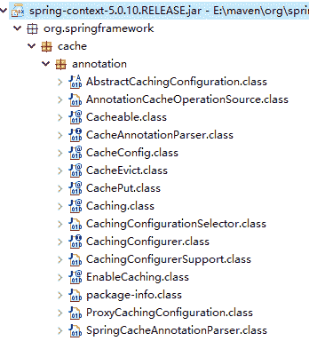
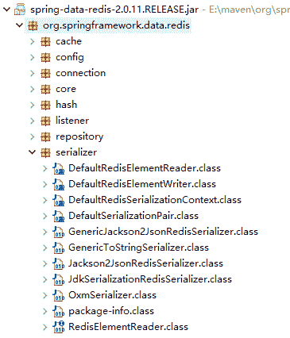

# Spring Cloud 集成 Spring Data Redis

> 原文：[`c.biancheng.net/view/5553.html`](http://c.biancheng.net/view/5553.html)

Redis 是一个开源的使用 ANSI C 语言编写、支持网络、可基于内存亦可持久化的日志型、Key-Value 数据库，并提供多种语言的 API。

Redis 是一个高性能的 key-value 数据库，同时支持多种存储类型，包括 String（字符串）、List（链表）、Set（集合）、Zset（sorted set——有序集合）和 Hash（哈希类型）。

## 用 Redistemplate 操作 Redis

在 Java 中操作 Redis 我们可以用 Jedis，也可以用 Spring Data Redis。

本节我们基于 Spring Data Redis 操作 Redis，Spring Data Redis 也是基于 Jedis 来实现的，它在 Jedis 上面封装了一层，让我们操作 Redis 更加简单。

关于在 Spring Boot 中集成 Spring Data Redis 不做过多讲解，本节主要讲怎么用 Redistemplate 操作 Redis。

Redistemplate 是一个泛型类，可以指定 Key 和 Value 的类型，我们以字符串操作来讲解，可以直接用 StringRedisTemplate 来操作。

在使用的类中直接注入 StringRedisTemplate 即可，如下代码所示。

@Autowired
private StringRedisTemplate stringRedisTemplate;

StringRedisTemplate 中提供了很多方法来操作数据，主要有以下几种：

*   opsForValue：操作 Key Value 类型
*   opsForHash：操作 Hash 类型
*   opsForList：操作 List 类型
*   opsForSet：操作 Set 类型
*   opsForZSet：操作 opsForZSet 类型

下面我们以 Key Value 类型来讲解，设置一个缓存，缓存时间为 1 小时，如下代码所示。

stringRedisTemplate.opsForValue().set("key", "C 语言中文网", 1, TimeUnit.HOURS);

获取缓存，如下代码所示。

String value = stringRedisTemplate.opsForValue().get("key");

删除缓存，如下代码所示。

stringRedisTemplate.delete("key");

判断一个 key 是否存在，如下代码所示。

boolean exists = stringRedisTemplate.hasKey("key");

如果你不喜欢用这些封装好的方法，想要用最底层的方法来操作也是可以的。通过 StringRedisTemplate 可以拿到 RedisConnection，如下代码所示。

RedisConnection connection = stringRedisTemplate.getConnectionFactory().getConnection();

## 用 Repository 操作 Redis

凡是 Spring Data 系列的框架，都是一种风格，我们都可以用 Repository 方式来操作数据。下面我们看下怎么使用 Repository。

定义一个数据存储的实体类，@Id 类似于数据库中的主键，能够自动生成，RedisHash 是 Hash 的名称，相当于数据库的表名，如下代码所示。

```

@Data
@RedisHash("persons")
public class Person {
    @Id
    String id;
    String firstname;
    String lastname;
}
```

定义 Repository 接口，代码如下所示。

```

public interface PersonRepository extends CrudRepository<Person, String> {

}
```

使用接口对数据进行增删改查操作，代码如下所示。

```

@Autowired
PersonRepository repo;
public void basicCrudOperations() {
    Person person = new Person("张三", "zhangsan");
    repo.save(person);
    repo.findOne(person.getId());
    repo.count();
    repo.delete(person);
}
```

数据保存到 Redis 中会变成两部分，一部分是一个 set，里面存储的是所有数据的 ID 值，另一部分是一个 Hash，存储的是具体每条数据。

## Spring Cache 缓存数据

一般的缓存逻辑都是下面代码这样的方式，首先判断缓存中是否有数据，有就获取数据返回，没有就从数据库中查数据，然后缓存进去，再返回。

```

public Person get(String id) {
    Person person = repo.findOne(id);
    if (person != null) {
        return person;
    }
    person = dao.findById(id);
    repo.save(person);
    return person;
}
```

首先这种方式在逻辑上是肯定没有问题的，大部分人也都是这么用的，不过当这种代码充满整个项目的时候，看起来就非常别扭了，感觉有点多余，不过通过 Spring Cache 就能解决这个问题。我们不需要关心缓存的逻辑，只需要关注从数据库中查询数据，将缓存的逻辑交给框架来实现。

Spring Cache 利用注解方式来实现数据的缓存，还具备相当的灵活性，能够使用 SpEL（Spring Expression Language）来定义缓存的 key，还能定义多种条件判断。

Spring Cache 的注解定义在 spring-context 包中，如图 1 所示。


图 1  Spring Cache 注解
常用的注解有 @Cacheable、@CachePut、@CacheEvict。

*   @Cacheable：用于查询的时候缓存数据。
*   @CachePut：用于对数据修改的时候修改缓存中的数据。
*   @CacheEvict：用于对数据删除的时候清除缓存中的数据。

首先我们配置一下 Redistemplate，设置下序列化方式为 JSON，这样存在于 Redis 中的数据查看起来就比较方便了，如下代码所示。

```

@Configuration
@EnableCaching
public class RedisConfig {

    @Bean
    public RedisTemplate<String, String> redisTemplate(RedisConnectionFactory factory) {
        RedisTemplate<String, String> redisTemplate = new RedisTemplate<String, String>();
        redisTemplate.setConnectionFactory(factory);
        redisTemplate.afterPropertiesSet();
        setSerializer(redisTemplate);
        return redisTemplate;
    }

    private void setSerializer(RedisTemplate<String, String> template) {
        Jackson2JsonRedisSerializer jackson2JsonRedisSerializer = new Jackson2JsonRedisSerializer(Object.class);
        ObjectMapper om = new ObjectMapper();
        om.setVisibility(PropertyAccessor.ALL, JsonAutoDetect.Visibility.ANY);
        om.enableDefaultTyping(ObjectMapper.DefaultTyping.NON_FINAL);
        jackson2JsonRedisSerializer.setObjectMapper(om);
        template.setKeySerializer(new StringRedisSerializer());
        template.setValueSerializer(jackson2JsonRedisSerializer);
    }
}
```

除了 Json 序列化，还有很多其他的序列化方式，读者可以根据自己的需求来设置，序列化的类在 Spring-Data-Redis 包中，如图 2 所示。


图 2  Spring Cache 序列化
除了配置序列化方式，我们还可以配置 CacheManager 来设置缓存的过期时间，代码如下所示。

```

@Bean
public CacheManager cacheManager(RedisConnectionFactory factory) {
    RedisCacheConfiguration cacheConfiguration = RedisCacheConfiguration.defaultCacheConfig()
            .entryTtl(Duration.ofDays(1)).disableCachingNullValues()
            .serializeValuesWith(RedisSerializationContext.SerializationPair
                    .fromSerializer(new GenericJackson2JsonRedisSerializer()));
    return RedisCacheManager.builder(factory).cacheDefaults(cacheConfiguration).build();
}
```

还可以配置缓存 Key 的自动生成方式，这里是用类名+方法名+参数来生成缓存的 Key，只有这样才能让 Key 具有唯一性，当然你也可以使用默认的 org.springframework.cache.interceptor.SimpleKeyGenerator，代码如下所示。

```

@Bean
public KeyGenerator keyGenerator() {
    return new KeyGenerator() {
        @Override
        public Object generate(Object target, Method method, Object... params) {
            StringBuilder sb = new StringBuilder();
            sb.append(target.getClass().getName());
            sb.append(":" + method.getName());
            for (Object obj : params) {
                sb.append(":" + obj.toString());
            }
            return sb.toString();
        }
    };
}
```

接下来，我们改造一下上面定义的 get 方法，用注解的方式来使用缓存，具体代码如下所示。

```

@Cacheable(value="get", key="#id")
public Person get(String id) {
    return findById(id);
}
```

@Cacheable 中的 value 我们可以定义成与方法名称一样。标识这个方法的缓存 key，会在 Redis 中存储一个 Zset，Zset 的 key 就是我们定义的 value 的值，Zset 中会存储具体的每个缓存的 key，也就是当调用 get("1001") 的时候，Zset 中就会存储 1001，同时 Redis 中会有一个单独的 String 类型的数据，Key 是 1001。

#id 是 SpEL 的语法，通过参数名来定义缓存 key，上面的 key 如果直接用参数 id 来定义的话会出问题的，比如当另一个缓存方法的参数也是 1001 的时候，这个 key 就会冲突。所以我们最好还是定义一个唯一的前缀，然后再加上参数，这样就不会有冲突了，比如：key="'get'+#id"。

除了用 SpEL 来自定义 key，我们刚刚其实配置了一个 keyGenerator，它就是用来生成 key 的，使用方法代码如下所示。

```

@Cacheable(value = "get", keyGenerator = "keyGenerator")
public Person get(String id) {
    return findById(id);
}
```

指定 keyGenerator 后，就可以不用配置 key，通过 keyGenerator 会自动生成缓存的 key，生成的规则就是我们配置中自己定义的，我们可以看到使用我们自定义的 keyGenerator 之后，存储在 Redis 中的数据的 key 是很长的一个字符串，规则也就是我们自定义的类名+方法名+参数。

@CachePut、@CacheEvict 的用法和 @Cacheable 一样，本节不做演示。

## 缓存异常处理

在用注解进行自动缓存的过程中，包括 Redis 的链接都是框架自动完成的，在缓存过程中如果 Redis 连接不上出现了异常，这时候整个请求都将失败。

缓存是一种辅助的手段，就算不能用，也不能影响正常的业务逻辑，如果我们直接用 Redis 的连接或者 Redistemplate 来操作的话可以通过异常捕获来解决这个问题，在用注解进行自动缓存的时候我们需要定义异常处理类来对异常进行处理。

```

@Configuration
public class CacheAutoConfiguration extends CachingConfigurerSupport {
    private Logger logger = LoggerFactory.getLogger(CacheAutoConfiguration.class);

    /**
     * redis 数据操作异常处理, 这里的处理：在日志中打印出错误信息, 但是放行
     * 保证 redis 服务器出现连接等问题的时候不影响程序的正常运行, 使得能够出问题时不用缓存 , 继续执行业务逻辑去查询 DB
     *
     * @return
     */
    @Bean
    public CacheErrorHandler errorHandler() {
        CacheErrorHandler cacheErrorHandler = new CacheErrorHandler() {
            @Override
            public void handleCacheGetError(RuntimeException e, Cache cache, Object key, Object value) {
                logger.error("redis 异常：key=[{}]", key, e);
            }

            @Override
            public void handleCacheEvictError(RuntimeException e, Cache cache, Object key) {
                logger.error("redis 异常：key=[{}]", key, e);
            }

            @Override
            public void handleCacheClearError(RuntimeException e, Cache cache) {
                logger.error("redis 异常：", e);
            }

            @Override
            public void handleCacheClearError(RuntimeException e, Cache cache) {
                logger.error("redis 异常：", e);
            };
            return cacheErrorHandler;
        }
    }
}
```

通过上面的处理，即使 Redis 挂掉了，程序连接不上时也不会影响业务功能，而是会继续执行查询数据库的操作。

## 自定义缓存工具类

在上面代码中，我们首先判断缓存中是否有数据，如果没有就从数据库中查询，然后再缓存进行，这样操作比较麻烦，还得写判断。使用注解的方式相对来说就简单多了，如果你不想用注解的方式，还是想在代码层面自己做缓存控制，那么我们可以自己封装一个工具类来避免写大量的判断操作。笔者以字符串操作为例，不涉及反序列化为对象的封装，封装缓存的基本操作，读者可以自行扩展。

首先定义一个缓存操作的接口，提供获取缓存，删除缓存操作，具体代码如下所示。

```

public interface CacheService {
    /**
     * 设置缓存
     *
     * @param key      缓存 KEY
     * @param value    缓存值
     * @param timeout  缓存过期时间
     * @param timeUnit 缓存过期时间单位
     */
    public void setCache(String key, String value, long timeout, TimeUnit timeUnit);

    /**
     * 获取缓存
     *
     * @param key 缓存 KEY
     * @return
     */
    public String getCache(String key);

    public <V, K> String getCache(K key, Closure<V, K> closure);

    public <V, K> String getCache(K key, Closure<V, K> closure, long timeout, TimeUnit timeUnit);

    /**
     * 删除缓存
     *
     * @param key 缓存 KEY
     */
    public void deleteCache(String key);
}
```

实现类代码如下所示。

```

@Service
public class CacheServiceImpl implements CacheService {

    @Autowired
    private StringRedisTemplate stringRedisTemplate;

    private long timeout = 1L;

    private TimeUnit timeUnit = TimeUnit.HOURS;

    @Override
    public void setCache(String key, String value, long timeout, TimeUnit timeUnit) {
        stringRedisTemplate.opsForValue().set(key, value, timeout, timeUnit);
    }

    @Override
    public String getCache(String key) {
        return stringRedisTemplate.opsForValue().get(key);
    }

    @Override
    public void deleteCache(String key) {
        stringRedisTemplate.delete(key);
    }

    @Override
    public <V, K> String getCache(K key, Closure<V, K> closure) {
        return doGetCache(key, closure, this.timeout, this.timeUnit);
    }

    @Override
    public <V, K> String getCache(K key, Closure<V, K> closure, long timeout, TimeUnit timeUnit) {
        return doGetCache(key, closure, timeout, timeUnit);
    }

    private <K, V> String doGetCache(K key, Closure<V, K> closure, long timeout, TimeUnit timeUnit) {
        String ret = getCache(key.toString());
        if (ret == null) {
            Object r = closure.execute(key);
            setCache(key.toString(), r.toString(), timeout, timeUnit);
            return r.toString();
        }
        return ret;
    }
}
```

定义一个方法回调的接口，用于执行回调的业务逻辑。代码如下所示。

public interface Closure<O, I> {
    public O execute(I input);
}

下面我们对这个缓存操作类的代码进行讲解。简单的 set 和 get 缓存不做过多讲解，因为和直接使用 RedisTemplate 没什么区别，本节主要讲的是基于方法的回调实现缓存。

我们的目的也很简单，就是先去判断缓存中是否存在，不存在的话则从数据库查询，然后将插入到缓存中的逻辑统一，不用每个方法中都去写这个判断的逻辑。

方法的回调实现是基于 Closure 接口来做的，使用方法代码如下所示。

```

@Autowired
private CacheService cacheService;

public String get() {
    String cacheKey = "1001";
    return cacheService.getCache(cacheKey, new Closure<String, String>() {
        @Override
        public String execute(String id) {
            // 执行你的业务逻辑
            return userService.getById(id);
        }
    });
}
```

通过这样的封装，我们就不用在每个缓存的地方都去判断了，当缓存中有值的时候，getCache 方法会根据缓存的 key 去缓存中获取，然后返回；如果没有值的话会执行 execute 中的逻辑获取数据，然后缓存起来再返回。