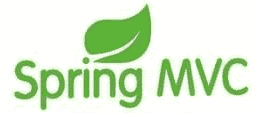

# Spring MVC 框架入门教程

> 原文：[`c.biancheng.net/spring_mvc/`](http://c.biancheng.net/spring_mvc/)

Spring MVC 是 Spring 提供给 Web 应用的框架设计。Spring MVC 是一个典型的教科书式的 mvc 构架，不像 Struts 等都是变种或者不是完全基于 mvc 系统的框架。

Spring MVC 角色划分清晰，分工明细，并且和 Spring 框架无缝结合。作为当今业界最主流的 Web 开发框架，Spring MVC 已经成为当前最热门的开发技能，同时也广泛用于桌面开发领域。

这套 Spring MVC 入门教程对 Spring MVC 框架进行详细讲解，内容细致、讲解清晰。还包含了大量实例，帮助读者巩固所学知识，提高编程能力。非常适合 Web 开发者和想要使用 Spring MVC 开发基于 Java 的 Web 应用的读者阅读。