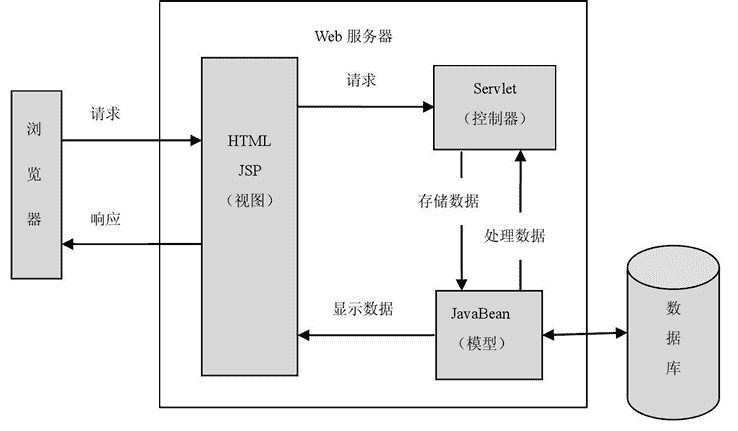

# MVC 设计模式简介

> 原文：[`c.biancheng.net/view/4391.html`](http://c.biancheng.net/view/4391.html)

MVC 设计不仅限于 Java Web 应用，还包括许多应用，比如前端、PHP、.NET 等语言。之所以那么做的根本原因在于解耦各个模块。

MVC 是 Model、View 和 Controller 的缩写，分别代表 Web 应用程序中的 3 种职责。

*   模型：用于存储数据以及处理用户请求的业务逻辑。
*   视图：向控制器提交数据，显示模型中的数据。
*   控制器：根据视图提出的请求判断将请求和数据交给哪个模型处理，将处理后的有关结果交给哪个视图更新显示。

基于 Servlet 的 MVC 模式的具体实现如下。

*   模型：一个或多个 JavaBean 对象，用于存储数据（实体模型，由 JavaBean 类创建）和处理业务逻辑（业务模型，由一般的 Java 类创建）。
*   视图：一个或多个 JSP 页面，向控制器提交数据和为模型提供数据显示，JSP 页面主要使用 HTML 标记和 JavaBean 标记来显示数据。
*   控制器：一个或多个 Servlet 对象，根据视图提交的请求进行控制，即将请求转发给处理业务逻辑的 JavaBean，并将处理结果存放到实体模型 JavaBean 中，输出给视图显示。

基于 Servlet 的 MVC 模式的流程如图 1 所示。

图 1  JSP 中的 MVC 模式