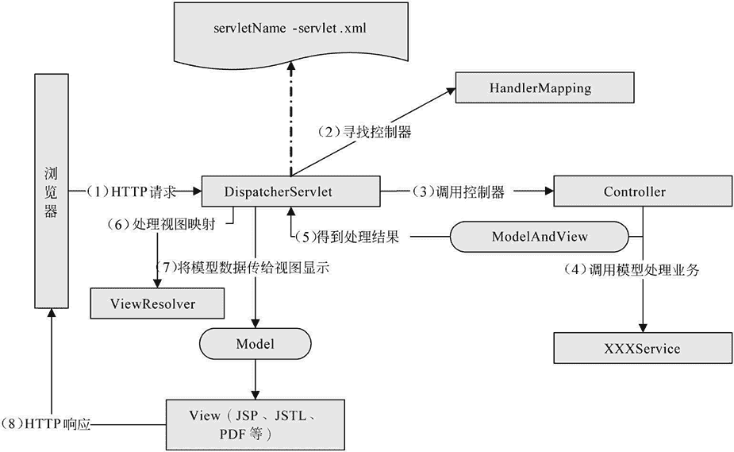

# Spring MVC 处理用户请求的完整流程

> 原文：[`c.biancheng.net/view/4392.html`](http://c.biancheng.net/view/4392.html)

Spring MVC 框架是高度可配置的，包含多种视图技术，例如 JSP 技术、Velocity、Tiles、iText 和 POI。

Spring MVC 框架并不关心使用的视图技术，也不会强迫开发者只使用 JSP 技术，但教程中使用的视图是 JSP，本节主要介绍 Spring MVC 框架处理用户请求的完整流程和处理中包含的 4 个接口。

## Spring MVC 工作流程

Spring MVC 框架主要由 DispatcherServlet、处理器映射、控制器、视图解析器、视图组成，其工作原理如图 1 所示。

图 1  Spring MVC 工作原理图
从图 1 可总结出 Spring MVC 的工作流程如下：

1.  客户端请求提交到 DispatcherServlet。
2.  由 DispatcherServlet 控制器寻找一个或多个 HandlerMapping，找到处理请求的 Controller。
3.  DispatcherServlet 将请求提交到 Controller。
4.  Controller 调用业务逻辑处理后返回 ModelAndView。
5.  DispatcherServlet 寻找一个或多个 ViewResolver 视图解析器，找到 ModelAndView 指定的视图。
6.  视图负责将结果显示到客户端。

## Spring MVC 接口

在图 1 中包含 4 个 Spring MVC 接口，即 DispatcherServlet、HandlerMapping、Controller 和 ViewResolver。

Spring MVC 所有的请求都经过 DispatcherServlet 来统一分发，在 DispatcherServlet 将请求分发给 Controller 之前需要借助 Spring MVC 提供的 HandlerMapping 定位到具体的 Controller。

HandlerMapping 接口负责完成客户请求到 Controller 映射。

Controller 接口将处理用户请求，这和 Java Servlet 扮演的角色是一致的。一旦 Controller 处理完用户请求，将返回 ModelAndView 对象给 DispatcherServlet 前端控制器，ModelAndView 中包含了模型（Model）和视图（View）。

从宏观角度考虑，DispatcherServlet 是整个 Web 应用的控制器；从微观考虑，Controller 是单个 Http 请求处理过程中的控制器，而 ModelAndView 是 Http 请求过程中返回的模型（Model）和视图（View）。

ViewResolver 接口（视图解析器）在 Web 应用中负责查找 View 对象，从而将相应结果渲染给客户。