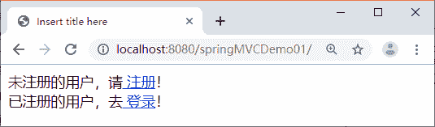

# 第一个 Spring MVC 应用（Spring MVC 框架搭建教程）

> 原文：[`c.biancheng.net/view/4394.html`](http://c.biancheng.net/view/4394.html)

本节通过一个简单的 Web 应用 springMVCDemo01 来演示 Spring MVC 入门程序的实现过程。

#### 1）创建 Web 应用并引入 JAR 包

在 MyEclipse 中创建一个名为 springMVCDemo01 的 Web 应用，在 springMVCDemo01 的 lib 目录中添加 Spring MVC 程序所需要的 JAR 包，包括 Spring 的 4 个核心 JAR 包、commons-logging 的 JAR 包以及两个与 Web 相关的 JAR 包（spring-web-3.2.13.RELEASE.jar 和 spring-webmvc-3.2.13\. RELEASE.jar）。

另外，在 Spring MVC 应用中使用注解时不要忘记添加 spring-aop-3.2.13.RELEASE.jar 包，添加后的 JAR 包如图 1 所示。


图 1  添加后的 JAR 包

#### 2）在 web.xml 文件中部署 DispatcherServlet

在开发 Spring MVC 应用时需要在 web.xml 中部署 DispatcherServlet，代码如下：

```

<?xml version="1.0" encoding="UTF-8"?>
<web-app xmlns:xsi="http://www.w3.org/2001/XMLSchema-instance"
    xmlns="http://java.sun.com/xml/ns/javaee" xmlns:web="http://java.sun.com/xml/ns/javaee/web-app_2_5.xsd"
    xsi:schemaLocation="http://java.sun.com/xml/ns/javaee http://java.sun.com/xml/ns/javaee/web-app_3_0.xsd"
    version="3.0">
    <display-name>springMVC</display-name>
    <!-- 部署 DispatcherServlet -->
    <servlet>
        <servlet-name>springmvc</servlet-name>
        <servlet-class>org.springframework.web.servlet.DispatcherServlet</servlet-class>
        <!-- 表示容器再启动时立即加载 servlet -->
        <load-on-startup>1</load-on-startup>
    </servlet>
    <servlet-mapping>
        <servlet-name>springmvc</servlet-name>
        <!-- 处理所有 URL -->
        <url-pattern>/</url-pattern>
    </servlet-mapping>
</web-app>
```

上述 DispatcherServlet 的 servlet 对象 springmvc 初始化时将在应用程序的 WEB-INF 目录下查找一个配置文件，该配置文件的命名规则是“servletName-servlet.xml”，例如 springmvc-servlet.xml。

另外，也可以将 Spring MVC 配置文件存放在应用程序目录中的任何地方，但需要使用 servlet 的 init-param 元素加载配置文件。示例代码如下：

```

<!-- 部署 DispatcherServlet -->
<servlet>
    <servlet-name>springmvc</servlet-name>
    <servlet-class>org.springframework.web.servlet.DispatcherServlet
    </servlet-class>
    <init-param>
        <param-name>contextConfigLocation</param-name>
        <param-value>classpath:springmvc-servlet.xml</param-value>
    </init-param>
    <!-- 表示容器再启动时立即加载 servlet -->
    <load-on-startup>1</load-on-startup>
</servlet>
<servlet-mapping>
    <servlet-name>springmvc</servlet-name>
    <url-pattern>/</url-pattern>
</servlet-mapping>
```

#### 3）创建 Web 应用首页

在 springMVCDemo01 应用的 WebContent 目录下有个应用首页 index.jsp。index.jsp 的代码如下：

```

<%@ page language="java" contentType="text/html; charset=UTF-8"
    pageEncoding="UTF-8"%>
<!DOCTYPE html PUBLIC "-//W3C//DTD HTML 4.01 Transitional//EN" "http://www.w3.org/TR/html4/loose.dtd">
<html>
<head>
<meta http-equiv="Content-Type" content="text/html; charset=UTF-8">
<title>Insert title here</title>
</head>
<body>
    未注册的用户，请<a href="${pageContext.request.contextPath }/register"> 注册</a>！
    <br/>
    已注册的用户，去<a href="${pageContext.request.contextPath }/login"> 登录</a>！
</body>
</html>
```

#### 4）创建 Controller 类

在 src 目录下创建 controller 包，并在该包中创建 RegisterController 和 LoginController 两个传统风格的控制器类（实现了 Controller 接口），分别处理首页中“注册”和“登录”超链接的请求。

RegisterController 的具体代码如下：

```

package controller;

import javax.servlet.http.HttpServletRequest;
import javax.servlet.http.HttpServletResponse;

import org.springframework.web.servlet.ModelAndView;
import org.springframework.web.servlet.mvc.Controller;

public class LoginController implements Controller {
    public ModelAndView handleRequest(HttpServletRequest arg0,
            HttpServletResponse arg1) throws Exception {
        return new ModelAndView("/WEB-INF/jsp/register.jsp");
    }
}
```

LoginController 的具体代码如下：

```

package controller;

import javax.servlet.http.HttpServletRequest;
import javax.servlet.http.HttpServletResponse;

import org.springframework.web.servlet.ModelAndView;
import org.springframework.web.servlet.mvc.Controller;

public class RegisterController implements Controller {

    public ModelAndView handleRequest(HttpServletRequest arg0,
            HttpServletResponse arg1) throws Exception {
        return new ModelAndView("/WEB-INF/jsp/login.jsp");
    }
}
```

#### 5）创建 Spring MVC 配置文件并配置 Controller 映射信息

传统风格的控制器定义之后，需要在 Spring MVC 配置文件中部署它们（学习基于注解的控制器后不再需要部署控制器）。在 WEB-INF 目录下创建名为 springmvc-servlet.xml 的配置文件，具体代码如下：

```

<?xml version="1.0" encoding="UTF-8"?>
<beans xmlns="http://www.springframework.org/schema/beans"
    xmlns:xsi="http://www.w3.org/2001/XMLSchema-instance"
    xmlns:mvc="http://www.springframework.org/schema/mvc"
    xmlns:p="http://www.springframework.org/schema/p"
    xmlns:context="http://www.springframework.org/schema/context"
    xsi:schemaLocation="
        http://www.springframework.org/schema/beans
        http://www.springframework.org/schema/beans/spring-beans.xsd
        http://www.springframework.org/schema/context
        http://www.springframework.org/schema/context/spring-context.xsd
        http://www.springframework.org/schema/mvc
        http://www.springframework.org/schema/mvc/spring-mvc.xsd">
    <!-- LoginController 控制器类，映射到"/login" -->   
    <bean name="/login" class="controller.LoginController"/>   
    <!-- LoginController 控制器类，映射到"/register" -->
    <bean name="/register" class="controller.RegisterController"/>
</beans>
```

#### 6）应用的其他页面

RegisterController 控制器处理成功后跳转到 /WEB-INF/jsp 下的 register.jsp 视图，LoginController 控制器处理成功后跳转到 /WEB-INF/jsp 下的 login.jsp 视图，因此在应用的 /WEB-INF/jsp 目录下应有 register.jsp 和 login.jsp 页面，这两个 JSP 页面的代码在此省略。

#### 7）发布并运行 Spring MVC 应用

在 MyEclipse 中第一次运行 Spring MVC 应用时需要将应用发布到 Tomcat。例如在运行 springMVCDemo01 应用时可以选中应用名称 springMVCDemo01 并右击，然后选择 Run As→Run on Server 命令，打开如图 2 所示的对话框，在对话框中单击 Finish 按钮完成发布并运行。


图 1  在 MyEclipse 中发布并运行 Spring MVC 应用
通过地址“http://localhost:8080/springMVCDemo01”首先访问 index.jsp 页面，如图 2 所示。


图 2  index.jsp 页面
在如图 2 所示的页面中，当用户单击“注册”超链接时，根据 springmvc-servlet.xml 文件中的映射将请求转发给 RegisterController 控制器处理，处理后跳转到 /WEB-INF/jsp 下的 register.jsp 视图。同理，当单击“登录”超链接时，控制器处理后转到 /WEB-INF/jsp 下的 login.jsp 视图。