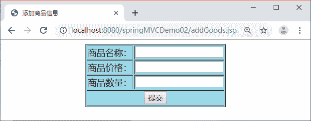

# Spring MVC 类型转换的意义

> 原文：[`c.biancheng.net/view/4414.html`](http://c.biancheng.net/view/4414.html)

本节以一个简单应用（JSP+Servlet）为示例来介绍类型转换的意义。如图 1 所示的添加商品页面用于收集用户输入的商品信息，商品信息包括商品名称（字符串类型 String）、商品价格（双精度浮点类型 double）、商品数量（整数类型 int）。


图 1  添加商品信息的收集页面 addGoods.jsp 页面的代码如下：

```

<%@ page language="java" contentType="text/html; charset=UTF-8"
    pageEncoding="UTF-8"%>
<!DOCTYPE html PUBLIC "-//W3C//DTD HTML 4.01 Transitional//EN" "http://www.w3.org/TR/html4/loose.dtd">
<html>
<head>
<meta http-equiv="Content-Type" content="text/html; charset=UTF-8">
<title>添加商品信息</title>
</head>
<body>
    <form action="addGoods" method="post">
        <table border=1 bgcolor="lightblue" align="center">
            <tr>
                <td>商品名称：</td>
                <td><input class="textSize" type="text" name="goodsname" /></td>
            </tr>
            <tr>
                <td>商品价格：</td>
                <td><input class="textSize" type="text" name="goodsprice" /></td>
            </tr>
            <tr>
                <td>商品数量：</td>
                <td><input class="textSize" type="text" name="goodsnumber" /></td>
            </tr>
            <tr>
                <td colspan="2" align="center">
                    <input type="submit" value="提交" />
                </td>
            </tr>
        </tab1e>
    </form>
</body>
</html>
```

希望页面收集到的数据提交到 addGoods 的 Servlet（AddGoodsServlet 类），该 Servlet 将这些请求信息封装成一个 Goods 类的值对象。

Goods 类的代码如下：

```

package pojo;

public class Goods {
    private String goodsname;
    private double goodsprice;
    private int goodsnumber;

    // 无参数的构造方法
    public Goods() {
    }

    // 有参数的构造方法
    public Goods(String goodsname, double goodsprice, int goodsnumber) {
        super();
        this.goodsname = goodsname;
        this.goodsprice = goodsprice;
        this.goodsnumber = goodsnumber;
    }
    // 此处省略了 setter 和 getter 方法
}
```

AddGoodsServlet 类的代码如下：

```

package servlet;

import java.io.IOException;

import javax.servlet.ServletException;
import javax.servlet.http.HttpServlet;
import javax.servlet.http.HttpServletRequest;
import javax.servlet.http.HttpServletResponse;

import pojo.Goods;

public class AddGoodsServlet extends HttpServlet {

    public void doGet(HttpServletRequest request, HttpServletResponse response)
            throws ServletException, IOException {

        doPost(request, response);

    }

    public void doPost(HttpServletRequest request, HttpServletResponse response)
            throws ServletException, IOException {

        response.setContentType("text/html;charset=utf-8");
        // 设置编码，防止乱码
        request.setCharacterEncoding("utf-8");
        // 获取参数值
        String goodsname = request.getParameter("goodsname");
        String goodsprice = request.getParameter("goodsprice");
        String goodsnumber = request.getParameter("goodsnumber");
        // 下面进行类型转换
        double newgoodsprice = Double.parseDouble(goodsprice);
        int newgoodsnumber = Integer.parseInt(goodsnumber);
        // 将转换后的数据封装成 goods 值对象
        Goods goods = new Goods(goodsname, newgoodsprice, newgoodsnumber);
        // 将 goods 值对象传递给数据访问层，进行添加操作，代码省略
        ...
    }
}
```

对于上面这个应用而言，开发者需要自己在 Servlet 中进行类型转换，并将其封装成值对象。这些类型转换操作全部手工完成，异常烦琐。

对于 Spring MVC 框架而言，它必须将请求参数转换成值对象类中各属性对应的数据类型——这就是类型转换的意义。