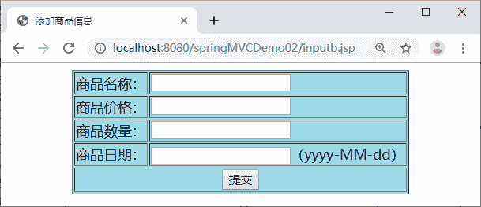
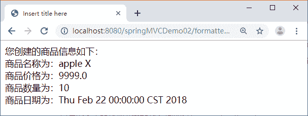

# Spring MVC Formatter（数据格式化）详解

> 原文：[`c.biancheng.net/view/4417.html`](http://c.biancheng.net/view/4417.html)

Spring MVC 框架的 Formatter<T> 与 Converter<S，T> 一样，也是一个可以将一种数据类型转换成另一种数据类型的接口。不同的是，Formatter<T> 的源数据类型必须是 String 类型，而 Converter<S，T> 的源数据类型是任意数据类型。

在 Web 应用中由 HTTP 发送的请求数据到控制器中都是以 String 类型获取，因此在 Web 应用中选择 Formatter<T> 比选择 Converter<S，T> 更加合理。

## 内置的格式化转换器

Spring MVC 提供了几个内置的格式化转换器，具体如下。

*   NumberFormatter：实现 Number 与 String 之间的解析与格式化。
*   CurrencyFormatter：实现 Number 与 String 之间的解析与格式化（带货币符号）。
*   PercentFormatter：实现 Number 与 String 之间的解析与格式化（带百分数符号）。
*   DateFormatter：实现 Date 与 String 之间的解析与格式化。

## 自定义格式化转换器

自定义格式化转换器就是编写一个实现 org.springframework.format.Formatter 接口的 Java 类。该接口声明如下：

public interface Formatter<T>

这里的 T 表示由字符串转换的目标数据类型。该接口有 parse 和 print 两个接口方法，自定义格式化转换器类必须覆盖它们。

public T parse(String s,java.util.Locale locale)
public String print(T object,java.util.Locale locale)

parse 方法的功能是利用指定的 Locale 将一个 String 类型转换成目标类型，print 方法与之相反，用于返回目标对象的字符串表示。

下面通过具体应用 springMVCDemo04 讲解自定义格式化转换器的用法，springMVCDemo04  应用与 springMVCDemo03 应用具有相同的 JAR 包、web.xml。

应用的具体要求如下：

1）用户在页面表单中输入信息来创建商品，输入页面效果如图 1 所示。


图 1  信息输入页面
2）控制器使用实体 bean 类 GoodsModelb 接收页面提交的请求参数，GoodsModelb 类的属性如下。

```

private String goodsname;
private double goodsprice;
private int goodsnumber;
private Date goodsdate;
```

3）GoodsModelb 实体类接收请求参数时，商品名称、价格和数量使用内置的类型转换器完成转换；商品日期需要用自定义的格式化转换器完成。

4）用格式化转换器转换之后的数据显示在 showGoodsb.jsp 页面，效果如图 2 所示。


图 2  格式化后信息的显示页面
由图 2 可以看出，日期由字符串值“2018-02-22”格式化成 Date 类型。

如果想实现上述 springMVCDemo04 应用的需求，需要做以下 5 件事：

*   创建实体类；
*   创建控制器类；
*   创建自定义格式化转换器类；
*   注册格式化转换器；
*   创建相关视图。

按照上述步骤采用自定义格式化转换器完成需求。

#### 1）创建实体类

在 springMVCDemo04 的 src 目录下创建 pojo 包，并在该包中创建名为 GoodsModelb 的实体类，代码如下：

```

package pojo;

import java.util.Date;

public class GoodsModel {
    private String goodsname;
    private double goodsprice;
    private int goodsnumber;
    private Date goodsdate;
    //省略 setter 和 getter 方法
}
```

#### 2）创建控制器类

在 springMVCDemo04 的 src 目录下创建 controller 包，并在该包中创建名为 FormatterController 的控制器类，代码如下：

```

package controller;

import org.springframework.stereotype.Controller;
import org.springframework.ui.Model;
import org.springframework.web.bind.annotation.RequestMapping;

import pojo.GoodsModelb;

@Controller
public class FormatterController {
    @RequestMapping("/formatter")
    public String myConverter(GoodsModelb gm, Model model) {
        model.addAttribute("goods", gm);
        return "showGoodsb";
    }
}
```

#### 3）创建自定义格式化转换器类

在 springMVCDemo04 的 src 目录下创建 formatter 包，并在该包中创建名为 MyFormatter 的自定义格式化转换器类，代码如下：

```

package controller;

import java.text.ParseException;
import java.text.SimpleDateFormat;
import java.util.Date;
import java.util.Locale;

import org.springframework.format.Formatter;

public class MyFormatter implements Formatter<Date> {
    SimpleDateFormat dateFormat = new SimpleDateFormat("yyyy-MM-dd");

    public String print(Date object, Locale arg1) {
        return dateFormat.format(object);
    }

    public Date parse(String source, Locale arg1) throws ParseException {
        return dateFormat.parse(source); // Formatter 只能对字符串转换
    }
}
```

#### 4）注册格式化转换器

在 springMVCDemo04  的 WEB-INF 目录下创建配置文件 springmvc-servlet.xml，并在配置文件中注册格式化转换器，具体代码如下：

```

<?xml version="1.0" encoding="UTF-8"?>
<beans xmlns="http://www.springframework.org/schema/beans"
    xmlns:xsi="http://www.w3.org/2001/XMLSchema-instance" xmlns:mvc="http://www.springframework.org/schema/mvc"
    xmlns:p="http://www.springframework.org/schema/p" xmlns:context="http://www.springframework.org/schema/context"
    xsi:schemaLocation="
        http://www.springframework.org/schema/beans
        http://www.springframework.org/schema/beans/spring-beans.xsd
        http://www.springframework.org/schema/context
        http://www.springframework.org/schema/context/spring-context.xsd
        http://www.springframework.org/schema/mvc
        http://www.springframework.org/schema/mvc/spring-mvc.xsd">
    <!-- 使用扫描机制扫描 controller 包 -->
    <context:component-scan base-package="controller" />
    <!--注册 MyFormatter-->
    <bean id="conversionService" class="org.springframework.context.support.ConversionServiceFactoryBean">
        <property name="formatters">
            <list>
                <bean class="formatter.MyFormatter"/>
            </list>
        </property>
    </bean>
    <mvc:annotation-driven conversion-service="conversionService"/>
    <bean
        class="org.springframework.web.servlet.view.InternalResourceViewResolver">
        <property name="prefix" value="/WEB-INF/jsp/" />
        <property name="suffix" value=".jsp" />
    </bean>
</beans>
```

#### 5）创建相关视图

在 springMVCDemo04  应用的 WebContent 目录下创建信息输入页面 inputb.jsp，核心代码如下：

```

<%@ page language="java" contentType="text/html; charset=UTF-8"
    pageEncoding="UTF-8"%>
<!DOCTYPE html PUBLIC "-//W3C//DTD HTML 4.01 Transitional//EN" "http://www.w3.org/TR/html4/loose.dtd">
<html>
<head>
<meta http-equiv="Content-Type" content="text/html; charset=UTF-8">
<title>添加商品信息</title>
</head>
<body>
    <form action="addGoods" method="post">
        <table border=1 bgcolor="lightblue" align="center">
            <tr>
                <td>商品名称：</td>
                <td><input class="textSize" type="text" name="goodsname" /></td>
            </tr>
            <tr>
                <td>商品价格：</td>
                <td><input class="textSize" type="text" name="goodsprice" /></td>
            </tr>
            <tr>
                <td>商品数量：</td>
                <td><input class="textSize" type="text" name="goodsnumber" /></td>
            </tr>
            <tr>
                <td>商品日期：</td>
                <td><input class="textSize" type="text" name="goodsdata" />（yyyy-MM-dd）</td>
            </tr>
            <tr>
                <td colspan="2" align="center">
                    <input type="submit" value="提交" />
                </td>
            </tr>
        </tab1e>
    </form>
</body>
</html>
```

在 springMVCDemo04 应用的 /WEB-INF/jsp 目录下创建信息显示页面 showGoodsb.jsp，核心代码如下：

```

<body>
    您创建的商品信息如下：
    <!-- 使用 EL 表达式取出 Action 类的属性 goods 的值 -->
    商品名称为：${goods.goodsname }<br/>
    商品价格为：${goods.goodsprice }<br/>
    商品名称为：${goods.goodsnumber }<br/>
    商品日期为：${goods.goodsdate}
</body>
```

最后通过地址“http://localhost：8080/springMVCDemo04/inputb.jsp”测试应用。