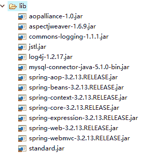
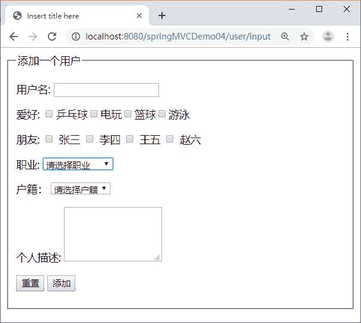
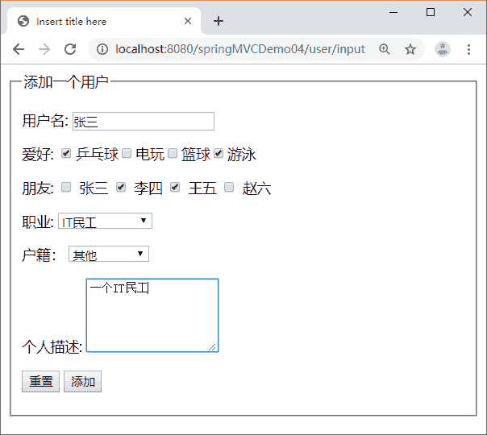
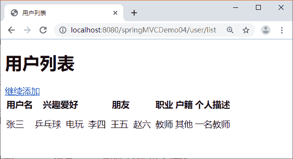

# Spring MVC 数据绑定和表单标签的应用（附带实例）

> 原文：[`c.biancheng.net/view/4428.html`](http://c.biancheng.net/view/4428.html)

为了让读者进一步学习数据绑定和表单标签，本节给出了一个应用范例 springMVCDemo04。该应用中实现了 User 类属性和 JSP 页面中表单参数的绑定，同时在 JSP 页面中分别展示了 input、textarea、checkbox、checkboxs、select 等标签。

## 应用的相关配置

在 springMVCDemo04 应用中需要使用 JSTL，因此不仅需要将 Spring MVC 的相关 JAR 包复制到应用的 WEN-INF/lib 目录下，还需要从 Tomcat 的 webapps\examples\WEB-INF\lib 目录下将 JSTL 的相关 JAR 包复制到应用的 WEN-INF/lib 目录下。

springMVCDemo04 的 JAR 包如图 1 所示。
图 1  springMVCDemo04 的 JAR 包
为了避免出现中文乱码问题，需要在 web.xml 文件中增加编码过滤器，同时将 JSP 页面编码设置为 UTF-8，form 表单的提交方式必须为 post。

web.xml 的代码如下：

```

<?xml version="1.0" encoding="UTF-8"?>
<web-app xmlns:xsi="http://www.w3.org/2001/XMLSchema-instance" 
    xmlns="http://java.sun.com/xml/ns/javaee" 
    xmlns:web="http://java.sun.com/xml/ns/javaee/web-app_2_5.xsd" 
    xsi:schemaLocation="http://java.sun.com/xml/ns/javaee http://java.sun.com/xml/ns/javaee/web-app_3_0.xsd" version="3.0">
    <!--配置 DispatcherServlet-->
    <servlet>
        <servlet-name>springmvc</servlet-name>
        <servlet-class>org.springframework.web.servlet.DispatcherServlet</servlet-class>
    <load-on-startup>1</load-on-startup>
    </servlet>
    <servlet-mapping>
        <servlet-name>springmvc</servlet-name>
        <url-pattern>/</url-pattern>
    </servlet-mapping>
    <!--避免中文乱码-->
    <filter>
        <filter-name>encodingFilter</filter-name>
        <filter-class>
             org.springframework.web.filter.CharacterEncodingFilter
        </filter-class>
    <init-param>
        <param-name>encoding</param-name>
        <param-value>UTF-8</param-value>
    </init-param>
    <init-param>
        <param-name>forceEncoding</param-name>
        <param-value>true</param-value>
    </init-param>
    </filter>
    <filter-mapping>
        <filter-name>encodingFilter</filter-name>
        <url-pattern>/*</url-pattern>
    </filter-mapping>
</web-app>
```

配置文件 springmvc-servlet.xml 与教程前面的示例中学习过的配置文件没有区别，这里不再赘述。

## 领域模型

应用中实现了 User 类属性和 JSP 页面中表单参数的绑定，User 类包含了和表单参数名对应的属性，以及属性的 set 和 get 方法。在 springMVCDemo04 应用的 src 目录下创建 pojo 包，并在该包中创建 User 类。

User 类的代码如下：

```

package pojo;

public class User {
    private String userName;
    private String[] hobby; // 兴趣爱好
    private String[] friends; // 朋友
    private String carrer;
    private String houseRegister;
    private String remark;
    // 省略 setter 和 getter 方法
}
```

## Service 层

应用中使用了 Service 层，在 Service 层使用静态集合变量 users 模拟数据库存储用户信息，包括添加用户和查询用户两个功能方法。在 springMVCDemo04 应用的 src 目录下创建 service 包，并在该包中创建 UserService 接口和 UserServiceImpl 实现类。

UserService 接口的代码如下：

```

package service;
import java.util.ArrayList;
import pojo.User;
public interface UserService {
    boolean addUser(User u);
    ArrayList<User> getUsers();
}
```

UserServiceImpl 实现类的代码如下：

```

package service;

import java.util.ArrayList;
import pojo.User;
@Service
public class UserServiceImpl implements UserService {
    // 使用静态集合变量 users 模拟数据库
    private static ArrayList<User> users = new ArrayList<User>();

    @Override
    public boolean addUser(User u) {
        if (!"IT 民工".equals(u.getCarrer())) { // 不允许添加 IT 民工
            users.add(u);
            return true;
        }
        return false;
    }

    @Override
    public ArrayList<User> getUsers() {
        return users;
    }
}
```

## Controller 层

在 Controller 类 UserController 中定义了请求处理方法，包括处理 user/input 请求的 inputUser 方法以及处理 user/save 请求的 addUser 方法，其中在 addUser 方法中用到了重定向。

在 UserController 类中，通过 @Autowired 注解在 UserController 对象中主动注入 UserService 对象，实现对 user 对象的添加和查询等操作。

通过 model 的 addAttribute 方法将 User 类对象、HashMap 类型的 hobbys 对象、String[] 类型的 carrers 对象以及 String[] 类型的 houseRegisters 对象传递给 View（userAdd.jsp）。

在 springMVCDemo04 应用的 src 目录下创建 controller 包，并在该包中创建 UserController 控制器类。

UserController 类的代码如下：

```

package controller;

import java.util.HashMap;
import java.util.List;
import org.apache.commons.logging.Log;
import org.apache.commons.logging.LogFactory;
import org.springframework.beans.factory.annotation.Autowired;
import org.springframework.stereotype.Controller;
import org.springframework.ui.Model;
import org.springframework.web.bind.annotation.ModelAttribute;
import org.springframework.web.bind.annotation.RequestMapping;
import pojo.User;
import service.UserService;

@Controller
@RequestMapping("/user")
public class UserController {
    // 得到一个用来记录日志的对象,这样在打印信息的时候能够标记打印的是哪个类的信息
    private static final Log logger = LogFactory.getLog(UserController.class);
    @Autowired
    private UserService userService;

    @RequestMapping(value = "/input")
    public String inputuser(Model model) {
        HashMap<String, String> hobbys = new HashMap<String, String>();
        hobbys.put("篮球", "篮球");
        hobbys.put("乒乓球", "乒乓球");
        hobbys.put("电玩", "电玩");
        hobbys.put("游泳", "游泳");
        // 如果 model 中没有 user 属性，userAdd.jsp 会抛出异常，因为表单标签无法找到
        // modelAttribute 属性指定的 form backing object
        model.addAttribute("user", new User());
        model.addAttribute("hobbys", hobbys);
        model.addAttribute("carrers", new String[] { "教师", "学生", "coding 搬运工",
                "IT 民工", "其他" });
        model.addAttribute("houseRegisters", new String[] { "北京", "上海", "广州",
                "深圳", "其他" });
        return "userAdd";
    }

    @RequestMapping(value = "/save")
    public String addUser(@ModelAttribute User user, Model model) {
        if (userService.addUser(user)) {
            logger.info("成功");
            return "redirect:/user/list";
        } else {
            logger.info("失败");
            HashMap<String, String> hobbys = new HashMap<String, String>();
            hobbys.put("篮球", "篮球");
            hobbys.put("乒乓球", "乒乓球");
            hobbys.put("电玩", "电玩");
            hobbys.put("游泳", "游泳");
            // 这里不需要 model.addAttribute ("user", new User ()),因为 @ModelAttribute
            // 指定 form backing object
            model.addAttribute("hobbys", hobbys);
            model.addAttribute("carrers", new String[] { "教师", "学生",
                    " coding 搬运工", "IT 民工", "其他" });
            model.addAttribute("houseRegisters", new String[] { "北京", "上海",
                    "广州", "深圳", "其他" });
            return "userAdd";
        }
    }

    @RequestMapping(value = "/list")
    public String listUsers(Model model) {
        List<User> users = userService.getUsers();
        model.addAttribute("users", users);
        return "userList";
    }
}
```

## View 层

View 层包含两个 JSP 页面，一个是信息输入页面 userAdd.jsp，一个是信息显示页面 userList.jsp。在 springMVCDemo04 应用的 WEB-INF/jsp 目录下创建这两个 JSP 页面。

在 userAdd.jsp 页面中将 Map 类型的 hobbys 绑定到 checkboxes 上，将 String[] 类型的 carrers 和 houseRegisters 绑定到 select 上，实现通过 option 标签对 select 添加选项，同时表单的 method 方法需指定为 post 来避免中文乱码问题。

在 userList.jsp 页面中使用 JSTL 标签遍历集合中的用户信息 。

userAdd.jsp 的代码如下：

```

<%@ page language="java" contentType="text/html; charset=UTF-8"
    pageEncoding="UTF-8"%>
<%@taglib prefix="form" uri="http://www.springframework.org/tags/form"%>
<!DOCTYPE html PUBLIC "-//W3C//DTD HTML 4.01 Transitional//EN" "http://www.w3.org/TR/html4/loose.dtd">
<html>
<head>
<meta http-equiv="Content-Type" content="text/html; charset=UTF-8">
<title>Insert title here</title>
</head>
<body>
    <form:form modelAttribute="user" method="post" action="${pageContext.request.contextPath }/user/save">
        <fieldset>
            <legend> 添加一个用户 </legend>
            <P>
                <label>用户名:</label>
                <form:input path="userName" />
            </p>
            <P>
                <label>爱好:</label>
                <form:checkboxes items="${hobbys}" path="hobby" />
            </p>
            <P>
                <label>朋友:</label>
                <form:checkbox path="friends" value="张三" /> 张三
                <form:checkbox path="friends" value="李四" /> 李四
                <form:checkbox path="friends" value="王五" /> 王五
                <form:checkbox path="friends" value="赵六" /> 赵六
            </p>
            <P>
                <label>职业:</label>
                <form:select path="carrer">
                    <option />请选择职业
                    <form:options items="${carrers }" />
                </form:select>
            </p>
            <P>
                <label>户籍：</label>
                <form:select path="houseRegister">
                    <option />请选择户籍
                    <form:options items="${houseRegisters }" />
                </form:select>
            </p>
            <P>
                <label>个人描述:</label>
                <form:textarea path="remark" rows="5" />
            </p>
            <p id="buttons">
                <input id="reset" type="reset">
                <input id="submit" type="submit" value="添加">
            </p>
        </fieldset>
    </form:form>
</body>
</html>
```

userList.jsp 的代码如下：

```

<%@ page language="java" contentType="text/html; charset=UTF-8"
    pageEncoding="UTF-8"%>
<%@ taglib prefix="c" uri="http://java.sun.com/jsp/jstl/core"%>
<!DOCTYPE html PUBLIC "-//W3C//DTD HTML 4.01 Transitional//EN" "http://www.w3.org/TR/html4/loose.dtd">
<html>
<head>
<meta http-equiv="Content-Type" content="text/html; charset=UTF-8">
<title>用户列表</title>
</head>
<body>
    <h1>用户列表</h1>
    <a href="<c:url value="${pageContext.request.contextPath }/user/input"/>">继续添加</a>
    <table>
        <tr>
            <th>用户名</th>
            <th>兴趣爱好</th>
            <th>朋友</th>
            <th>职业</th>
            <th>户籍</th>
            <th>个人描述</th>
        </tr>
        <c:forEach items="${users}" var="user">
            <tr>
                <td>${user.userName }</td>
                <td>
                    <c:forEach items="${user.hobby }" var="hobby">
                        ${hobby }&nbsp;
                    </c:forEach>
                </td>
                <td>
                    <c:forEach items="${user.friends}" var="friend">
                        ${friend }&nbsp;
                    </c:forEach>
                </td>
                <td>${user.carrer }</td>
                <td>${user.houseRegister }</td>
                <td>${user.remark }</td>
            </tr>
        </c:forEach>
    </table>
</body>
</html>
```

## 测试应用

通过地址“http://localhost:8080/springMVCDemo04/user/input”测试应用，添加用户信息页面效果如图 2 所示。

如果在图 2 中职业选择“IT 民工”，添加失败。失败后还回到添加页面，输入过的信息不再输入，自动回填（必须结合 form 标签）。自动回填是数据绑定的一个优点。失败页面如图 3 所示。


图 2  添加用户信息页面
 
图 3  添加用户信息失败页面
在图 3 中输入正确信息，添加成功后重定向到信息显示页面，效果如图 4 所示。


图 4  信息显示页面