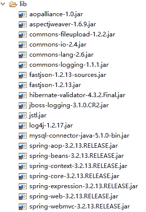
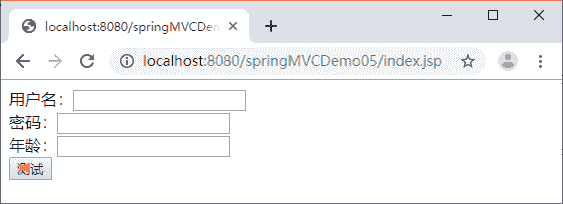
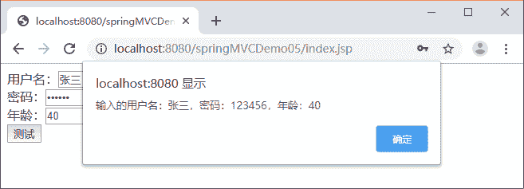
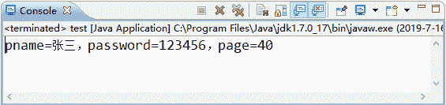

# Spring MVC JSON 数据交互（附带实例）

> 原文：[`c.biancheng.net/view/4430.html`](http://c.biancheng.net/view/4430.html)

Spring MVC 在数据绑定的过程中需要对传递数据的格式和类型进行转换，它既可以转换 String 等类型的数据，也可以转换 JSON 等其他类型的数据。本节将针对 Spring MVC 中 JSON 类型的数据交互进行讲解。

## JSON 概述

JSON（JavaScript Object Notation, JS 对象标记）是一种轻量级的数据交换格式。与 XML 一样，JSON 也是基于纯文本的数据格式。它有对象结构和数组结构两种数据结构。

#### 1）对象结构

对象结构以“{”开始、以“}”结束，中间部分由 0 个或多个以英文“，”分隔的 key/value 对构成，key 和 value 之间以英文“：”分隔。对象结构的语法结构如下：

{
    key1:value1,
    key2:value2,
    ...
}

其中，key 必须为 String 类型，value 可以是 String、Number、Object、Array 等数据类型。例如，一个 person 对象包含姓名、密码、年龄等信息，使用 JSON 的表示形式如下：

{
    "pname":"张三",
    "password":"123456",
    "page":40
}

#### 2）数组结构

数组结构以“[”开始、以“]”结束，中间部分由 0 个或多个以英文“，”分隔的值的列表组成。数组结构的语法结构如下：

{
    value1,
    value2,
    ...
}

上述两种（对象、数组）数据结构也可以分别组合构成更加复杂的数据结构。例如，一个 student 对象包含 sno、sname、hobby 和 college 对象，其 JSON 的表示形式如下：

{
    "sno":"201802228888",
    "sname":"张三",
    "hobby":["篮球","足球"]，
    "college":{
        "cname":"清华大学",
        "city":"北京"
    }
}

## JSON 数据转换

为实现浏览器与控制器类之间的 JSON 数据交互，Spring MVC 提供了 MappingJackson2HttpMessageConverter 实现类默认处理 JSON 格式请求响应。该实现类利用 Jackson 开源包读写 JSON 数据，将 Java 对象转换为 JSON 对象和 XML 文档，同时也可以将 JSON 对象和 XML 文档转换为 Java 对象。

在使用注解开发时需要用到两个重要的 JSON 格式转换注解，分别是 @RequestBody 和 @ResponseBody。

*   @RequestBody：用于将请求体中的数据绑定到方法的形参中，该注解应用在方法的形参上。
*   @ResponseBody：用于直接返回 return 对象，该注解应用在方法上。

下面通过一个案例来演示如何进行 JSON 数据交互，具体步骤如下。

#### 1）创建应用并导入相关 JAR 包

创建 springMVCDemo05 应用，然后将 Spring MVC 的相关 JAR 包、JSON 转换包添加到 springMVCDemo05 的 lib 目录下。springMVCDemo05 的 lib 目录如图 1 所示。


图 1  springMVCDemo05 的相关 JAR 包

#### 2）配置 web.xml

在 web.xml 文件中对 Spring MVC 的前端控制器等信息进行配置，其代码和《数据绑定和表单标签的应用》教程中的 SpringMVCDemo04 一样，这里不再赘述。

#### 3）配置 Spring MVC 的核心配置文件

在 WEB-INF 目录下创建 Spring MVC 的核心配置文件 springmvc-servlet.xml，代码如下：

```

<?xml version="1.0" encoding="UTF-8"?>
<beans xmlns="http://www.springframework.org/schema/beans"
    xmlns:xsi="http://www.w3.org/2001/XMLSchema-instance" 
    xmlns:mvc="http://www.springframework.org/schema/mvc"
    xmlns:p="http://www.springframework.org/schema/p" 
    xmlns:context="http://www.springframework.org/schema/context"
    xsi:schemaLocation="
        http://www.springframework.org/schema/beans
        http://www.springframework.org/schema/beans/spring-beans.xsd
        http://www.springframework.org/schema/context
        http://www.springframework.org/schema/context/spring-context.xsd
        http://www.springframework.org/schema/mvc
        http://www.springframework.org/schema/mvc/spring-mvc.xsd">
    <!-- 使用扫描机制扫描控制器类 -->
    <context:component-scan base-package="controller" />
    <mvc:annotation-driven />
    <!-- annotation-driven 用于简化开发的配置，注解 DefaultAnnotationHandlerMapping 和 AnnotationMethodHandlerAdapter -->
    <!-- 使用 resources 过滤掉不需要 dispatcherservlet 的资源（即静态资源，例如 css、js、html、images）。
        在使用 resources 时必须使用 annotation-driven，否则 resources 元素会阻止任意控制器被调用 -->
    <!-- 允许 js 目录下的所有文件可见 -->
    <mvc:resources location="/js/" mapping="/js/**" />
    <!-- 配置视图解析器 -->
    <bean
        class="org.springframework.web.servlet.view.InternalResourceViewResolver">
        <property name="prefix" value="/WEB-INF/jsp/" />
        <property name="suffix" value=".jsp" />
    </bean>
</beans>
```

#### 4）创建 POJO 类

在 src 目录下创建 pojo 包，并在该包中创建 POJO 类 Person，代码如下：

package pojo;

public class Person {
    private String pname;
    private String password;
    private Integer page;
    //省略 setter 和 getter 方法
}

#### 5）创建 JSP 页面测试 JSON 数据交互

在页面 index.jsp 来测试 JSON 数据交互，代码如下：

```

<%@ page language="java" contentType="text/html; charset=UTF-8"
    pageEncoding="UTF-8"%>
<!DOCTYPE html PUBLIC "-//W3C//DTD HTML 4.01 Transitional//EN" "http://www.w3.org/TR/html4/loose.dtd">
<html>
<head>
<meta http-equiv="Content-Type" content="text/html; charset=UTF-8">
<title></title>
<script type="text/javaScript" src="${pageContext.request.contextPath }/js/jquery-1.8.3.min.js"></script>
</head>
<body>
    <form action="">
        用户名：<input type="text" name="pname" id="pname" /><br> 
        密码：<input type="password" name="password" id="password" /> <br> 
        年龄：<input type="text" name="page" id="page"><br> 
        <input type="button" value="测试" onclick="testJson()" />
    </form>
</body>
<script type="text/javaScript">
    function testJson() {
        //获取输入的值 pname 为 id
        alert($("#pname").val());
        var pname = $("#pname").val();
        var password = $("#password").val();
        var page = $("#page").val();
        $.ajax({
            //请求路径
            url : "${pageContext.request.contextPath }/testJson",
            //请求类型
            type : "post",
            //data 表示发送的数据
            data : JSON.stringify({
                pname : pname,
                password : password,
                page : page
            }), //定义发送请求的数据格式为 JSON 字符串
            contentType : "application/json;charset=utf-8",
            //定义回调响应的数据格式为 JSON 字符串，该属性可以省略
            dataType : "json",
            //成功响应的结果
            success : function(data) {
                if (data != null) {
                    alert("输入的用户名：" + data.pname + "，密码：" + data.password
                            + "， 年龄：" + data.page);
                }
            }
        });
    }
</script>
</html>
```

在 index.jsp 页面中编写了一个测试 JSON 交互的表单，当单击“测试”按钮时执行页面中的 testJson() 函数。在该函数中使用了 jQuery 的 AJAX 方式将 JSON 格式的数据传递给以“/testJson”结尾的请求中。

因为在 index.jsp 中使用的是 jQuery 的 AJAX 进行的 JSON 数据提交和响应，所以还需要引入 jquery.js 文件。本例引入了 WebContent 目录下 js 文件夹中的 jquery-3.2.1.min.js，读者可以在源程序中找到该文件。

#### 6）创建控制器类

在 src 目录下创建 controller 包，并在该包中创建一个用于用户操作的控制器类 TestController，代码如下：

```

package TestController;

import org.springframework.stereotype.Controller;
import org.springframework.web.bind.annotation.RequestBody;
import org.springframework.web.bind.annotation.RequestMapping;
import org.springframework.web.bind.annotation.ResponseBody;

import pojo.Person;

@Controller
public class TestController {
    /**
     * 接收页面请求的 JSON 参数，并返回 JSON 格式的结果
     */
    @RequestMapping("testJson")
    @ResponseBody
    public Person testJson(@RequestBody Person user) {
        // 打印接收的 JSON 格式数据
        System.out.println("pname=" + user.getPname() + ",password="
                + user.getPassword() + ",page" + user.getPage());
        ;
        // 返回 JSON 格式的响应
        return user;
    }
}
```

在上述控制器类中编写了接收和响应 JSON 格式数据的 testJson 方法，方法中的 @RequestBody 注解用于将前端请求体中的 JSON 格式数据绑定到形参 user 上，@ResponseBody 注解用于直接返回 Person 对象（当返回 POJO 对象时默认转换为 JSON 格式数据进行响应）。

#### 7）运行 index.jsp 页面，测试程序

将 springMVCDemo05 应用发布到 Tomcat 服务器并启动服务器，在浏览器中访问地址“http://localhost：8080/springMVCDemo05/index.jsp”，运行效果如图 2 所示。


图 2  index.jsp 测试页面
在图 2 所示的输入框中输入信息后单击“测试”按钮，当程序正确执行时页面将弹出显示输入信息的对话框，如图 3 所示。


图 3  index.jsp 正确执行的效果
同时，MyEclipse 的控制台将打印出相应数据，如图 4 所示。


图 4  MyEclipse 运行结果
从图 3 和图 4 所示的结果可以看出，编写的代码可以将 JSON 格式的请求数据转换为方法中的 Java 对象，也可以将 Java 对象转换为 JSON 格式的响应数据