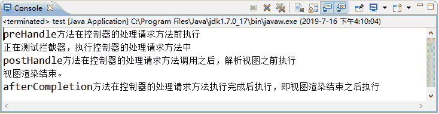
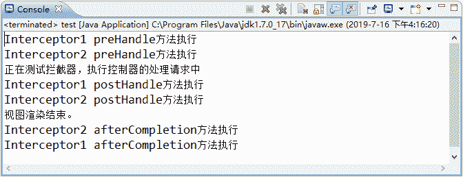

# Spring MVC 拦截器的执行流程

> 原文：[`c.biancheng.net/view/4435.html`](http://c.biancheng.net/view/4435.html)

本节我们主要讲解 SpringMVC 拦截器的执行流程。分两部分介绍，首先介绍单个拦截器执行流程然后介绍多个拦截器的执行流程。

## 单个拦截器的执行流程

在配置文件中如果只定义了一个拦截器，程序将首先执行拦截器类中的 preHandle 方法，如果该方法返回 true，程序将继续执行控制器中处理请求的方法，否则中断执行。如果 preHandle 方法返回 true，并且控制器中处理请求的方法执行后、返回视图前将执行 postHandle 方法，返回视图后才执行 afterCompletion 方法。

下面通过一个应用 springMVCDemo06 演示拦截器的执行流程，具体步骤如下：

#### 1）创建应用

创建一个名为 springMVCDemo06 的 Web 应用，并将 Spring MVC 相关的 JAR 包复制到 lib 目录中。

#### 2）创建 web.xml

在 WEB-INF 目录下创建 web.xml 文件，该文件中的配置信息如下：

```

<?xml version="1.0" encoding="UTF-8"?>
<web-app xmlns:xsi="http://www.w3.org/2001/XMLSchema-instance" 
    xmlns="http://java.sun.com/xml/ns/javaee" 
    xmlns:web="http://java.sun.com/xml/ns/javaee/web-app_2_5.xsd" 
    xsi:schemaLocation="http://java.sun.com/xml/ns/javaee http://java.sun.com/xml/ns/javaee/web-app_3_0.xsd" version="3.0">
    <!--配置 DispatcherServlet-->
    <servlet>
        <servlet-name>springmvc</servlet-name>
        <servlet-class>org.springframework.web.servlet.DispatcherServlet</servlet-class>
    <load-on-startup>1</load-on-startup>
    </servlet>
    <servlet-mapping>
        <servlet-name>springmvc</servlet-name>
        <url-pattern>/</url-pattern>
    </servlet-mapping>
</web-app>
```

#### 3）创建控制器类

在 src 目录下创建一个名为 controller 的包，并在该包中创建控制器类 Interceptor Controller，代码如下：

```

package Controller;

import org.springframework.stereotype.Controller;
import org.springframework.web.bind.annotation.RequestMapping;

@Controller
public class InterceptorController {
    @RequestMapping("/gotoTest")
    public String gotoTest() {
        System.out.println("正在测试拦截器，执行控制器的处理请求方法中");
        return "test";
    }
}
```

#### 4）创建拦截器类

在 src 目录下创建一个名为 interceptor 的包，并在该包中创建拦截器类 TestInterceptor，代码与《拦截器的配置和使用》教程中的示例代码相同。

#### 5）创建配置文件 springmvc-servlet.xml

在 WEB-INF 目录下创建配置文件 springmvc-servlet.xml，代码如下：

```

<?xml version="1.0" encoding="UTF-8"?>
<beans xmlns="http://www.springframework.org/schema/beans"
    xmlns:xsi="http://www.w3.org/2001/XMLSchema-instance" 
    xmlns:mvc="http://www.springframework.org/schema/mvc"
    xmlns:p="http://www.springframework.org/schema/p" 
    xmlns:context="http://www.springframework.org/schema/context"
    xsi:schemaLocation="
        http://www.springframework.org/schema/beans
        http://www.springframework.org/schema/beans/spring-beans.xsd
        http://www.springframework.org/schema/context
        http://www.springframework.org/schema/context/spring-context.xsd
        http://www.springframework.org/schema/mvc
        http://www.springframework.org/schema/mvc/spring-mvc.xsd">
    <!-- 使用扫描机制扫描控制器类 -->
    <context:component-scan base-package="controller" />
    <!-- 配置视图解析器 -->
    <bean
        class="org.springframework.web.servlet.view.InternalResourceViewResolver">
        <property name="prefix" value="/WEB-INF/jsp/" />
        <property name="suffix" value=".jsp" />
    </bean>
    <!-- 配置拦截器 -->
    <mvc:interceptors>
        <!-- 配置一个全局拦截器，拦截所有请求 -->
        <bean class="interceptor.TestInterceptor" />
    </mvc:interceptors>
</beans>
```

#### 6）创建视图 JSP 文件

在 WEB-INF 目录下创建一个 jsp 文件夹，并在该文件夹中创建一个 JSP 文件 test.jsp，代码如下：

```

<%@ page language="java" contentType="text/html; charset=UTF-8"
    pageEncoding="UTF-8"%>
<!DOCTYPE html PUBLIC "-//W3C//DTD HTML 4.01 Transitional//EN" "http://www.w3.org/TR/html4/loose.dtd">
<html>
<head>
<meta http-equiv="Content-Type" content="text/html; charset=UTF-8">
<title>Insert title here</title>
</head>
<body>
    视图
    <%System.out.println("视图渲染结束。"); %>
</body>
</html>
```

#### 7）测试拦截器

首先将 springMVCDemo06 应用发布到 Tomcat 服务器，并启动 Tomcat 服务器，然后通过地址“http://localhost:8080/springMVCDemo06/gotoTest”测试拦截器。程序正确执行后控制台的输出结果如图 1 所示。


图 1  单个拦截器的执行过程

## 多个拦截器的执行流程

在 Web 应用中通常需要有多个拦截器同时工作，这时它们的 preHandle 方法将按照配置文件中拦截器的配置顺序执行，而它们的 postHandle 方法和 afterCompletion 方法则按照配置顺序的反序执行。

下面通过修改“单个拦截器的执行流程”小节的 springMVCDemo06 应用来演示多个拦截器的执行流程，具体步骤如下：

#### 1）创建多个拦截器

在 springMVCDemo06 应用的 interceptor 包中创建两个拦截器类 Interceptor1 和 Interceptor2。

```

package interceptor;

import javax.servlet.http.HttpServletRequest;
import javax.servlet.http.HttpServletResponse;
import org.springframework.web.servlet.HandlerInterceptor;
import org.springframework.web.servlet.ModelAndView;

public class Interceptor1 implements HandlerInterceptor {
    public boolean preHandle(HttpServletRequest request,
            HttpServletResponse response, Object handler) throws Exception {
        System.out.println("Interceptor preHandle 方法执行");
        /** 返回 true 表示继续向下执行，返回 false 表示中断后续的操作 */
        return true;
    }

    @Override
    public void postHandle(HttpServletRequest request,
            HttpServletResponse response, Object handler,
            ModelAndView modelAndView) throws Exception {
        System.out.println("Interceptor1 postHandle 方法执行");
    }

    @Override
    public void afterCompletion(HttpServletRequest request,
            HttpServletResponse response, Object handler, Exception ex)
            throws Exception {
        System.out.println("Interceptor1 afterCompletion 方法执行");
    }
}
```

Interceptor2 类的代码如下：

```

package interceptor;

import javax.servlet.http.HttpServletRequest;
import javax.servlet.http.HttpServletResponse;
import org.springframework.web.servlet.HandlerInterceptor;
import org.springframework.web.servlet.ModelAndView;

public class Interceptor2 implements HandlerInterceptor {
    public boolean preHandle(HttpServletRequest request,
            HttpServletResponse response, Object handler) throws Exception {
        System.out.println("Interceptor2 preHandle 方法执行");
        /** 返回 true 表示继续向下执行，返回 false 表示中断后续的操作 */
        return true;
    }

    @Override
    public void postHandle(HttpServletRequest request,
            HttpServletResponse response, Object handler,
            ModelAndView modelAndView) throws Exception {
        System.out.println("Interceptor2 postHandle 方法执行");
    }

    @Override
    public void afterCompletion(HttpServletRequest request,
            HttpServletResponse response, Object handler, Exception ex)
            throws Exception {
        System.out.println("Interceptor2 afterCompletion 方法执行");
    }
}
```

#### 2）配置拦截器

在配置文件 springmvc-servlet.xml 中的 <mvc：interceptors> 元素内配置两个拦截器 Interceptor1 和 Interceptor2，配置代码如下：

```

<mvc:interceptors>
    <!-- 配置一个全局拦截器，拦截所有请求 -->
    <!--<bean class="interceptor.TestInterceptor" />-->
    <mvc:interceptor>
        <!-- 配置拦截器作用的路径 -->
        <mvc:mapping path="/**"/>
        <!--定义在<mvc:interceptor>元素中，表示匹配指定路径的请求才进行拦截-->
        <bean class="interceptor.Interceptor1"/>
    </mvc:interceptor>
    <mvc:interceptor>
        <!-- 配置拦截器作用的路径 -->
        <mvc:mapping path="/gotoTest"/>
        <!--定义在<mvc:interceptor>元素中，表示匹配指定路径的请求才进行拦截-->
        <bean class="interceptor.Interceptor2"/>
    </mvc:interceptor>
</mvc:interceptors>
```

#### 3）测试多个拦截器

首先将 springMVCDemo06 应用发布到 Tomcat 服务器并启动 Tomcat 服务器，然后通过地址“http://localhost：8080/springMVCDemo06/gotoTest”测试拦截器。程序正确执行后控制台的输出结果如图 2 所示。


图 2  多个拦截器的执行过程