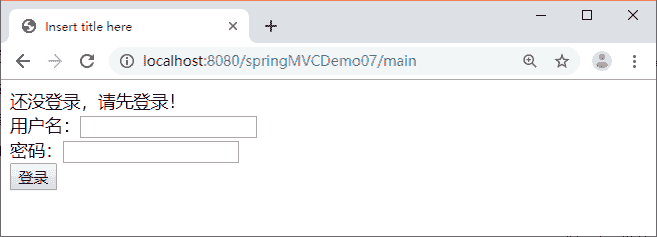
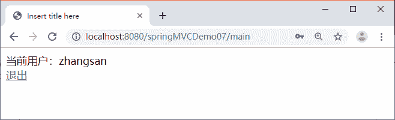
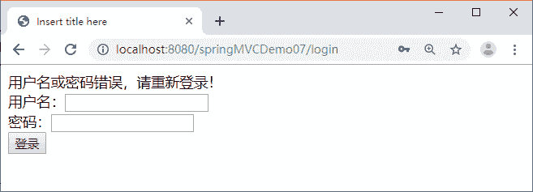

# Spring MVC 拦截器实现用户登录权限验证案例

> 原文：[`c.biancheng.net/view/4437.html`](http://c.biancheng.net/view/4437.html)

本节将通过拦截器来完成一个用户登录权限验证的 Web 应用 springMVCDemo07，具体要求如下：只有成功登录的用户才能访问系统的主页面 main.jsp，如果没有成功登录而直接访问主页面，则拦截器将请求拦截，并转发到登录页面 login.jsp。当成功登录的用户在系统主页面中单击“退出”链接时回到登录页面。

具体实现步骤如下：

#### 1）创建应用

创建 Web 应用 springMVCDemo07，并将 Spring MVC 相关的 JAR 包复制到 lib 目录中。

#### 2）创建 POJO 类

在 springMVCDemo07 的 src 目录中创建 pojo 包，并在该包中创建 User 类，具体代码如下：

```

public class User {
    private String uname;
    private String upwd;
    //省略 setter 和 getter 方法
}
```

#### 3）创建控制器类

在 springMVCDemo07 的 src 目录中创建 controller 包，并在该包中创建控制器类 UserController，具体代码如下：

```

package controller;

import javax.servlet.http.HttpSession;
import org.springframework.stereotype.Controller;
import org.springframework.ui.Model;
import org.springframework.web.bind.annotation.RequestMapping;
import pojo.User;

@Controller
public class UserController {
    /**
     * 登录页面初始化
     */
    @RequestMapping("/toLogin")
    public String initLogin() {
        return "login";
    }

    /**
     * 处理登录功能
     */
    @RequestMapping("/login")
    public String login(User user, Model model, HttpSession session) {
        System.out.println(user.getUname());
        if ("zhangsan".equals(user.getUname())
                && "123456".equals(user.getUpwd())) {
            // 登录成功，将用户信息保存到 session 对象中
            session.setAttribute("user", user);
            // 重定向到主页面的跳转方法
            return "redirect:main";
        }
        model.addAttribute("msg", "用户名或密码错误，请重新登录！ ");
        return "login";
    }

    /**
     * 跳转到主页面
     */
    @RequestMapping("/main")
    public String toMain() {
        return "main";
    }

    /**
     * 退出登录
     */
    @RequestMapping("/logout")
    public String logout(HttpSession session) {
        // 清除 session
        session.invalidate();
        return "login";
    }
}
```

#### 4）创建拦截器类

在 springMVCDemo07 的 src 目录中创建 interceptor 包，并在该包中创建拦截器类 LoginInterceptor，具体代码如下：

```

package interceptor;

import javax.servlet.http.HttpServletRequest;
import javax.servlet.http.HttpServletResponse;
import javax.servlet.http.HttpSession;
import org.springframework.web.servlet.HandlerInterceptor;
import org.springframework.web.servlet.ModelAndView;

public class LoginInterceptor implements HandlerInterceptor {
    @Override
    public boolean preHandle(HttpServletRequest request,
            HttpServletResponse response, Object handler) throws Exception {
        // 获取请求的 URL
        String url = request.getRequestURI();
        // login.jsp 或登录请求放行，不拦截
        if (url.indexOf("/toLogin") >= 0 || url.indexOf("/login") >= 0) {
            return true;
        }
        // 获取 session
        HttpSession session = request.getSession();
        Object obj = session.getAttribute("user");
        if (obj != null)
            return true;
        // 没有登录且不是登录页面，转发到登录页面，并给出提示错误信息
        request.setAttribute("msg", "还没登录，请先登录！");
        request.getRequestDispatcher("/WEB-INF/jsp/login.jsp").forward(request,
                response);
        return false;
    }

    @Override
    public void afterCompletion(HttpServletRequest arg0,
            HttpServletResponse arg1, Object arg2, Exception arg3)
            throws Exception {
        // TODO Auto-generated method stub
    }

    @Override
    public void postHandle(HttpServletRequest arg0, HttpServletResponse arg1,
            Object arg2, ModelAndView arg3) throws Exception {
        // TODO Auto-generated method stub
    }
}
```

#### 5）配置拦截器

在 WEB-INF 目录下创建配置文件 springmvc-servlet.xml 和 web.xml。web.xml 的代码和 springMVCDemo07 一样，这里不再赘述。在 springmvc-servlet.xml 文件中配置拦截器 LoginInterceptor，具体代码如下：

```

<?xml version="1.0" encoding="UTF-8"?>
<beans xmlns="http://www.springframework.org/schema/beans"
    xmlns:xsi="http://www.w3.org/2001/XMLSchema-instance"
    xmlns:mvc="http://www.springframework.org/schema/mvc"
    xmlns:p="http://www.springframework.org/schema/p"
    xmlns:context="http://www.springframework.org/schema/context"
    xsi:schemaLocation="
        http://www.springframework.org/schema/beans
        http://www.springframework.org/schema/beans/spring-beans.xsd
        http://www.springframework.org/schema/context
        http://www.springframework.org/schema/context/spring-context.xsd
        http://www.springframework.org/schema/mvc
        http://www.springframework.org/schema/mvc/spring-mvc.xsd">
    <!-- 使用扫描机制扫描控制器类 -->
    <context:component-scan base-package="controller" />
    <!-- 配置视图解析器 -->
    <bean class="org.springframework.web.servlet.view.InternalResourceViewResolver">
        <property name="prefix" value="/WEB-INF/jsp/" />
        <property name="suffix" value=".jsp" />
    </bean>
    <!-- 配置拦截器 -->
    <mvc:interceptors>
        <mvc:interceptor>
            <!-- 配置拦截器作用的路径 -->
            <mvc:mapping path="/**" />
            <bean class="interceptor.LoginInterceptor" />
        </mvc:interceptor>
    </mvc:interceptors>
</beans>
```

#### 6）创建视图 JSP 页面

在 WEB-INF 目录下创建文件夹 jsp，并在该文件夹中创建 login.jsp 和 main.jsp。

login.jsp 的代码如下：

```

<%@ page language="java" contentType="text/html; charset=UTF-8"
    pageEncoding="UTF-8"%>
<!DOCTYPE html PUBLIC "-//W3C//DTD HTML 4.01 Transitional//EN" "http://www.w3.org/TR/html4/loose.dtd">
<html>
<head>
<meta http-equiv="Content-Type" content="text/html; charset=UTF-8">
<title>Insert title here</title>
</head>
<body>
    ${msg }
    <form action="${pageContext.request.contextPath }/login" method="post">
        用户名：<input type="text" name="uname" /><br>
        密码：<input type="password" name="upwd" /><br>
        <input type="submit" value="登录" />
    </form>
</body>
</html>
```

main.jsp 的代码如下：

```

<%@ page language="java" contentType="text/html; charset=UTF-8"
pageEncoding="UTF-8"%>
<!DOCTYPE html PUBLIC "-//W3C//DTD HTML 4.01 Transitional//EN" "http://www.w3.org/TR/html4/loose.dtd">
<html>
<head>
<meta http-equiv="Content-Type" content="text/html; charset=UTF-8">
<title>Insert title here</title>
</head>
<body>
    当前用户：${user.uname }<br />
    <a href="${pageContext.request.contextPath }/logout">退出</a>
</body>
</html>
```

#### 7）发布并测试应用

首先将 springMVCDemo07 应用发布到 Tomcat 服务器并启动 Tomcat 服务器，然后通过地址“http://localhost:8080/springMVCDemo07/main”测试应用，运行效果如图 1 所示。


图 1  没有登录直接访问主页面的效果
从图 1 可以看出，当用户没有登录而直接访问系统主页面时请求将被登录拦截器拦截，返回到登录页面，并提示信息。如果用户在用户名框中输入“zhangsan”，在密码框中输入“123456”，单击“登录”按钮后浏览器的显示结果如图 2 所示。如果输入的用户名或密码错误，浏览器的显示结果如图 3 所示。


图 2  成功登录的效果

图 3  用户名或密码错误
当单击图 2 中的“退出”链接后，系统将从主页面返回到登录页面。