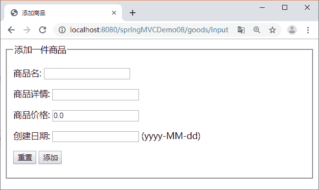
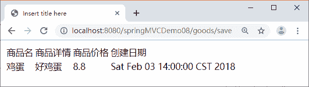
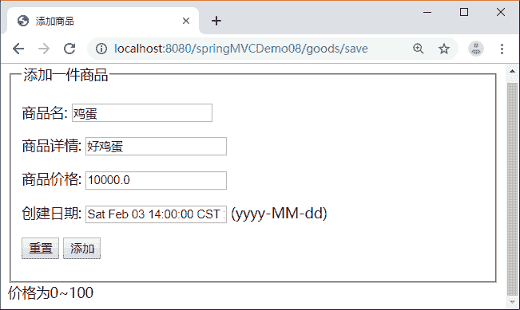

# Spring MVC 验证器应用实例（超详细）

> 原文：[`c.biancheng.net/view/4448.html`](http://c.biancheng.net/view/4448.html)

本节使用一个应用 springMVCDemo08 讲解 Spring 验证器的编写及使用。该应用中有一个数据输入页面 addGoods.jsp，效果如图 1 所示。

图 1  数据输入页面有一个数据显示页面 goodsList.jsp，效果如图 2 所示。

图 2  数据显示页面
编写一个实现 org.springframework.validation.Validator 接口的验证器类 GoodsValidator，验证要求如下：

*   商品名和商品详情不能为空。
*   商品价格在 0 到 100。
*   创建日期不能在系统日期之后。

根据上述要求，按照如下步骤完成 springMVCDemo08 应用。

#### 1）创建应用

创建 springMVCDemo08 应用，并导入 Spring MVC 的相关 JAR 包。另外，需要使用 JSTL 标签显示数据，所以需要导入 JSTL 的 JAR 包。springMVCDemo08 需要的 JAR 包和《Spring MVC 数据绑定和表单标签》教程中 springMVCDemo04 应用相同，在这里不在赘述。

#### 2）创建数据输入页面

在 WEB-INF 目录下创建文件夹 jsp，并在该文件夹中创建数据输入页面 addGoods.jsp。代码如下：

```

<%@ page language="java" contentType="text/html; charset=UTF-8"
    pageEncoding="UTF-8"%>
<%@taglib prefix="form" uri="http://www.springframework.org/tags/form"%>
<!DOCTYPE html PUBLIC "-//W3C//DTD HTML 4.01 Transitional//EN" "http://www.w3.org/TR/html4/loose.dtd">
<html>
<head>
<meta http-equiv="Content-Type" content="text/html; charset=UTF-8">
<title>添加商品</title>
</head>
<body>
    <form:form modelAttribute="goods"
        action="${pageContext.request. contextPath }/goods/save" method="post">
        <fieldset>
            <legend> 添加一件商品 </legend>
            <P>
                <label>商品名:</label>
                <form:input path="gname" />
            </p>
            <p>
                <label>商品详情:</label>
                <form:input path="gdescription" />
            </p>
            <P>
                <label>商品价格:</label>
                <form:input path="gprice" />
            </p>
            <P>
                <label>创建日期:</label>
                <form:input path="gdate" />
                (yyyy-MM-dd)
            </p>
            <p id="buttons">
                <input id="reset" type="reset">
                <input id="submit" type="submit" value="添加">
            </p>
        </fieldset>
        <!-- 取出所有验证错误 -->
        <form:errors path="*" />
    </form:form>
</body>
</html>
```

#### 3）编写模型类

在 src 目录下创建 pojo 包，并在该包中定义领域模型类 Goods，封装输入参数。在该类中使用 @DateTimeFormat（pattern="yyyy-MM-dd"）格式化创建日期。

模型类 Goods 的具体代码如下：

```

package pojo;

import java.util.Date;

import org.springframework.format.annotation.DateTimeFormat;

public class Goods {
    private String gname;
    private String gdescription;
    private double gprice;
    // 日期格式化（需要在配置文件中配置 FormattingConversionServiceFactoryBean)
    @DateTimeFormat(pattern = "yyyy-MM-dd")
    private Date gdate;

    public String getGname() {
        return gname;
    }

    public void setGname(String gname) {
        this.gname = gname;
    }

    public String getGdescription() {
        return gdescription;
    }

    public void setGdescription(String gdescription) {
        this.gdescription = gdescription;
    }

    public double getGprice() {
        return gprice;
    }

    public void setGprice(double gprice) {
        this.gprice = gprice;
    }

    public Date getGdate() {
        return gdate;
    }

    public void setGdate(Date gdate) {
        this.gdate = gdate;
    }
}
```

#### 4）编写验证器类

在 src 目录下创建 validator 包，并在该包中编写实现 org.springframework.validation.Validator 接口的验证器类 GoodsValidator，使用 @Component 注解将 GoodsValidator 类声明为验证组件。具体代码如下：

```

package validator;

import java.util.Date;
import org.springframework.stereotype.Component;
import org.springframework.validation.Errors;
import org.springframework.validation.ValidationUtils;
import org.springframework.validation.Validator;
import pojo.Goods;

@Component
public class GoodsValidator implements Validator {
    @Override
    public boolean supports(Class<?> klass) {
        // 要验证的 model,返回值为 false 则不验证
        return Goods.class.isAssignableFrom(klass);
    }

    @Override
    public void validate(Object object, Errors errors) {
        Goods goods = (Goods) object; // object 要验证的对象
        // goods.gname.required 是错误消息属性文件中的编码(国际化后对应的是国际化的信息)
        ValidationUtils.rejectIfEmpty(errors, "gname", "goods. gname.required");
        ValidationUtils.rejectIfEmpty(errors, "gdescription",
                "goods.gdescription.required");
        if (goods.getGprice() > 100 || goods.getGprice() < 0) {
            errors.rejectValue("gprice", "gprice.invalid");
        }
        Date goodsDate = goods.getGdate();
        // 在系统时间之后
        if (goodsDate != null && goodsDate.after(new Date())) {
            errors.rejectValue("gdate", "gdate.invalid");
        }
    }
}
```

#### 5）编写错误消息属性文件

在 WEB-INF 目录下创建文件夹 resource，并在该文件夹中编写属性文件 errorMessages.properties。文件内容如下：

goods.gname.required=请输入商品名称
goods.gdescription.required=请输入商品详情
gprice.invalid=价格为 0~100
gdate.invalid=创建日期不能在系统日期之后

Unicode 编码（MyEclipse 带有将汉字转换成 Unicode 编码的功能）的属性文件内容如下：

goods.gname.required=\u8BF7\u8F93\u5165\u5546\u54C1\u540D\u79F0
goods.gdescription.required=\u8BF7\u8F93\u5165\u5546\u54C1\u8BE6\u60C5
gprice.invalid=\u4EF7\u683C\u4E3A0~100
gdate.invalid=\u521B\u5EFA\u65E5\u671F\u4E0D\u80FD\u5728\u7CFB\u7EDF\u65E5\u671F\u4E4B\u540E

在属性文件创建完成后需要告诉 Spring MVC 从该文件中获取错误消息，则需要在配置文件中声明一个 messageSource bean，具体代码如下：

```

<!-- 配置消息属性文件 -->
<bean id="messageSource"
    class="org.springframework.context.support.ReloadableResourceBundleMessageSource">
    <property name="basename" value="/WEB-INF/resource/errorMessages" />
</bean>
```

#### 6）编写 Service 层

在 src 目录下创建 service 包，并在该包中编写一个 GoodsService 接口。具体代码如下：

```

package service;
import java.util.ArrayList;
import pojo.Goods;
public interface GoodsService {
    public boolean save(Goods g);

    public ArrayList<Goods> getGoods();
}
```

GoodsServiceImpl 实现类具体代码如下：

```

package service;

import java.util.ArrayList;
import org.springframework.stereotype.Service;
import pojo.Goods;

@Service
public class GoodsServiceImpl implements GoodsService {
    // 使用静态集合变量 goods 模拟数据库
    private static ArrayList<Goods> goods = new ArrayList<Goods>();

    @Override
    public boolean save(Goods g) {
        goods.add(g);
        return true;
    }

    @Override
    public ArrayList<Goods> getGoods() {
        return goods;
    }
}
```

#### 7）编写控制器类

在 src 目录下创建 controller 包，并在该包中编写控制器类 GoodsController，在该类中使用 @Resource 注解注入自定义验证器。另外，在控制器类中包含两个处理请求的方法，具体代码如下：

```

package controller;

import javax.annotation.Resource;
import org.apache.commons.logging.Log;
import org.apache.commons.logging.LogFactory;
import org.springframework.beans.factory.annotation.Autowired;
import org.springframework.stereotype.Controller;
import org.springframework.ui.Model;
import org.springframework.validation.BindingResult;
import org.springframework.validation.Validator;
import org.springframework.web.bind.annotation.ModelAttribute;
import org.springframework.web.bind.annotation.RequestMapping;
import pojo.Goods;
import service.GoodsService;

@Controller
@RequestMapping("/goods")
public class GoodsController {
    // 得到一个用来记录日志的对象，这样在打印信息的时候能够标记打印的是哪个类的信息
    private static final Log logger = LogFactory.getLog(GoodsController.class);

    @Autowired
    private GoodsService goodsService;
    // 注解验证器相当于"GoodsValidator validator=new GoodsValidator () ; "
    @Resource
    private Validator validator;

    @RequestMapping("/input")
    public String input(Model model) {
        // 如果 model 中没有 goods 属性，addGoods.jsp 会抛出异常
        // 因为表单标签无法找到 modelAttribute 属性指定的 form backing object
        model.addAttribute("goods", new Goods());
        return "addGoods";
    }

    @RequestMapping("/save")
    public String save(@ModelAttribute Goods goods, BindingResult result,
            Model model) {
        this.validator.validate(goods, result); // 添加验证
        if (result.hasErrors()) {
            return "addGoods";
        }

        goodsService.save(goods);
        logger.info("添加成功");
        model.addAttribute("goodsList", goodsService.getGoods());
        return "goodsList";
    }
}
```

#### 8）编写配置文件

在 WEB-INF 目录下编写配置文件 springmvc-servlet.xml，具体代码如下：

```

<?xml version="1.0" encoding="UTF-8"?>
<beans xmlns="http://www.springframework.org/schema/beans"
    xmlns:xsi="http://www.w3.org/2001/XMLSchema-instance"
    xmlns:mvc="http://www.springframework.org/schema/mvc"
    xmlns:p="http://www.springframework.org/schema/p"
    xmlns:context="http://www.springframework.org/schema/context"
    xsi:schemaLocation="
        http://www.springframework.org/schema/beans
        http://www.springframework.org/schema/beans/spring-beans.xsd
        http://www.springframework.org/schema/context
        http://www.springframework.org/schema/context/spring-context.xsd
        http://www.springframework.org/schema/mvc
        http://www.springframework.org/schema/mvc/spring-mvc.xsd">
    <!-- 使用扫描机制扫描包 -->
    <context:component-scan base-package="controller" />
    <context:component-scan base-package="service" />
    <context:component-scan base-package="validator" />
    <!-- 注册格式化转换器，因为用到日期转换 -->
    <bean id="conversionService"
        class="org.springframework.format.support.FormattingConversionServiceFactoryBean">
    </bean>
    <!-- 配置视图解析器 -->
    <bean
        class="org.springframework.web.servlet.view.InternalResourceViewResolver">
        <property name="prefix" value="/WEB-INF/jsp/" />
        <property name="suffix" value=".jsp" />
    </bean>
    <!-- 配置消息属性文件 -->
    <bean id="messageSource"
        class="org.springframework.context.support.ReloadableResourceBundleMessageSource">
        <property name="basename" value="/WEB-INF/resource/errorMessages" />
    </bean>
</beans>
```

#### 9）创建数据显示页面

在 WEB-INF/jsp 目录下创建数据显示页面 goodsList.jsp。核心代码如下：

```

<%@ page language="java" contentType="text/html; charset=UTF-8"
    pageEncoding="UTF-8"%>
<%@taglib prefix="c" uri="http://java.sun.com/jsp/jstl/core"%>
<!DOCTYPE html PUBLIC "-//W3C//DTD HTML 4.01 Transitional//EN" "http://www.w3.org/TR/html4/loose.dtd">
<html>
<head>
<meta http-equiv="Content-Type" content="text/html; charset=UTF-8">
<title>Insert title here</title>
</head>
<body>
    <table>
        <tr>
            <td>商品名</td>
            <td>商品详情</td>
            <td>商品价格</td>
            <td>创建日期</td>
        </tr>
        <c:forEach items="${goodsList }" var="goods">
            <tr>
                <td>${goods.gname }</td>
                <td>${goods.gdescription }</td>
                <td>${goods.gprice }</td>
                <td>${goods.gdate }</td>
            </tr>
        </c:forEach>
    </table>
</body>
</html>
```

#### 10）创建 web.xml 文件

在 WEB-INF 目录下创建 web.xml 文件，在该文件中配置 Spring MVC 的核心控制器 DispatcherServlet 和字符编码过滤器，具体代码如下：

```

<?xml version="1.0" encoding="UTF-8"?>
<web-app xmlns:xsi="http://www.w3.org/2001/XMLSchema-instance" 
    xmlns="http://java.sun.com/xml/ns/javaee" 
    xmlns:web="http://java.sun.com/xml/ns/javaee/web-app_2_5.xsd" 
    xsi:schemaLocation="http://java.sun.com/xml/ns/javaee http://java.sun.com/xml/ns/javaee/web-app_3_0.xsd" version="3.0">
    <!--配置 DispatcherServlet-->
    <servlet>
        <servlet-name>springmvc</servlet-name>
        <servlet-class>org.springframework.web.servlet.DispatcherServlet</servlet-class>
    <load-on-startup>1</load-on-startup>
    </servlet>
    <servlet-mapping>
        <servlet-name>springmvc</servlet-name>
        <url-pattern>/</url-pattern>
    </servlet-mapping>
    <!--避免中文乱码-->
    <filter>
        <filter-name>encodingFilter</filter-name>
        <filter-class>
             org.springframework.web.filter.CharacterEncodingFilter
        </filter-class>
    <init-param>
        <param-name>encoding</param-name>
        <param-value>UTF-8</param-value>
    </init-param>
    <init-param>
        <param-name>forceEncoding</param-name>
        <param-value>true</param-value>
    </init-param>
    </filter>
    <filter-mapping>
        <filter-name>encodingFilter</filter-name>
        <url-pattern>/*</url-pattern>
    </filter-mapping>
</web-app>
```

#### 11）测试应用

发布 springMVCDemo08 应用并启动 Tomcat 服务器，然后通过地址“http://localhost：8080/springMVCDemo08/goods/input”测试应用。

当输入价格大于 100 元时，下面会提示“价格为 0~100”的信息，如图 3  所示。


图 3  错误提示页面