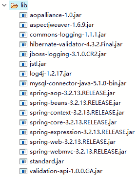

# Spring MVC Hibernate-Validator 数据验证实例

> 原文：[`c.biancheng.net/view/4451.html`](http://c.biancheng.net/view/4451.html)

创建 springMVCDemo09 应用，该应用实现的功能与《Spring MVC 验证器应用实例》节中的 springMVCDemo08 应用相同。springMVCDemo09 所需的 JAR 包如图 1 所示。


图 1  springMVCDemo09 的 JAR 包
在 springMVCDemo09 应用中不需要创建验证器类 GoodsValidator。另外，Service 层、View 层以及错误消息属性文件都与 springMVCDemo08 应用的相同。与 springMVCDemo08 应用的实现不同的是模型类、控制器类和 Spring MVC 的核心配置文件，具体如下：

#### 1）模型类

在模型类 Goods 中利用 JSR 303 的标注类型对属性进行验证，具体代码如下：

```

public class Goods {
    //goods.gname.required 错误消息 key（国际化后对应的就是国际化的信息）
    @NotBlank(message="{goods.gname.required}")
    private String gname;
    @NotBlank(message="{goods.gdesciption.required}")
    private String gdescription;
    @Range(min=0,max=100,message="{gprice.invalid}")
    private double gprice;
    // 日期格式化（需要在配置文件中配置 FormattingConversionServiceFactoryBean)
    @DateTimeFormat(pattern = "yyyy-MM-dd")
    @Past(message="{gdate.invalid}")
    private Date gdate;
    //省略 setter 和 getter 方法
```

}

#### 2）控制器类

在控制器类 GoodsController 中使用 @Valid 对模型对象进行验证，具体代码如下：

```

package controller;

import javax.annotation.Resource;
import org.apache.commons.logging.Log;
import org.apache.commons.logging.LogFactory;
import org.springframework.beans.factory.annotation.Autowired;
import org.springframework.stereotype.Controller;
import org.springframework.ui.Model;
import org.springframework.validation.BindingResult;
import org.springframework.validation.Validator;
import org.springframework.web.bind.annotation.ModelAttribute;
import org.springframework.web.bind.annotation.RequestMapping;
import pojo.Goods;
import service.GoodsService;

@Controller
@RequestMapping("/goods")
public class GoodsController {
    // 得到一个用来记录日志的对象，这样在打印信息的时候能够标记打印的是哪个类的信息
    private static final Log logger = LogFactory.getLog(GoodsController.class);
    @Autowired
    private GoodsService goodsService;
    @RequestMapping("/input")
    public String input(Model model) {
        // 如果 model 中没有 goods 属性，addGoods.jsp 会抛出异常
        // 因为表单标签无法找到 modelAttribute 属性指定的 form backing object
        model.addAttribute("goods", new Goods());
        return "addGoods";
    }

    @RequestMapping("/save")
    public String save(@ModelAttribute Goods goods, BindingResult result,Model model) {
        if (result.hasErrors()) {
            return "addGoods";
        }
        goodsService.save(goods);
        logger.info("添加成功");
        model.addAttribute("goodsList", goodsService.getGoods());
        return "goodsList";
    }
}
```

#### 3）配置文件

配置文件 springmvc-servlet.xml 的代码如下：

```

<?xml version="1.0" encoding="UTF-8"?>
<beans xmlns="http://www.springframework.org/schema/beans"
    xmlns:xsi="http://www.w3.org/2001/XMLSchema-instance"
    xmlns:mvc="http://www.springframework.org/schema/mvc"
    xmlns:p="http://www.springframework.org/schema/p"
    xmlns:context="http://www.springframework.org/schema/context"
    xsi:schemaLocation="
        http://www.springframework.org/schema/beans
        http://www.springframework.org/schema/beans/spring-beans.xsd
        http://www.springframework.org/schema/context
        http://www.springframework.org/schema/context/spring-context.xsd
        http://www.springframework.org/schema/mvc
        http://www.springframework.org/schema/mvc/spring-mvc.xsd">
    <!-- 使用扫描机制扫描包 -->
    <context:component-scan base-package="controller" />
    <context:component-scan base-package="service" />
    <!-- 配置消息属性文件 -->
    <bean id="messageSource" class="org.springframework.context.support.ReloadableResourceBundleMessageSource">
        <!-- 资源文件名 -->
        <property name="basenames">
            <list>
                <value>/WEB-INF/resource/errorMessages</value>
            </list>
        </property>
        <!-- 资源文件编码格式 -->
        <property name="fileEncodings" value="utf-8" />
        <!-- 对资源文件内容缓存的时间，单位为秒 -->
        <property name="cacheSeconds" value="120" />
    </bean>
    <!-- 注册校验器 -->
    <bean id="validator" class="org.springframework.validation.beanvalidation.LocalValidatorFactoryBean">
        <!-- hibernate 校验器 -->
        <property name="providerClass" value="org.hibernate.validator.HibernateValidator" />
        <!-- 指定校验使用的资源文件，在文件中配置校验错误信息，如果不指定则默认使用 classpath 下的 VaiidationMessages.properties -->
        <property name="validationMessageSource" ref="messageSource" />
    </bean>
    <!--开启 Spring 的 Valid 功能 -->
    <mvc:annotation-driven conversion-service="conversionService"
        validator="validator" />
    <!-- 注册格式化转换器，因为用到日期转换 -->
    <bean id="conversionService" 
        class="org.springframework.format.support.FormattingConversionServiceFactoryBean">
    </bean>
    <!-- 配置视图解析器 -->
    <bean class="org.springframework.web.servlet.view.InternalResourceViewResolver">
        <property name="prefix" value="/WEB-INF/jsp/" />
        <property name="suffix" value=".jsp" />
    </bean>
</beans>
```

#### 4）测试应用

通过地址“http://localhost：8080/springMVCDemo09/goods/input”测试 springMVCDemo09 应用。