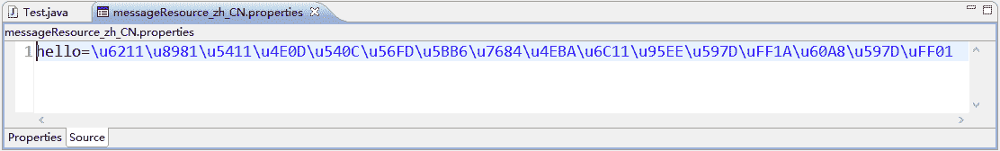

# Java 国际化概念和使用介绍

> 原文：[`c.biancheng.net/view/4455.html`](http://c.biancheng.net/view/4455.html)

国际化是商业软件系统的一个基本要求，因为当今的软件系统需要面对全球的浏览者。国际化的目的就是根据用户的语言环境的不同向用户输出与之相应的页面，以示友好。

程序国际化已成为 Web 应用的基本要求。随着网络的发展，大部分 Web 站点面对的已经不再是本地或者本国的浏览者，而是来自全世界各国、各地区的浏览者，因此国际化成为了 Web 应用不可或缺的一部分。

Java 国际化的思想是将程序中的信息放在资源文件中，程序根据支持的国家及语言环境读取相应的资源文件。资源文件是 key-value 对，每个资源文件中的 key 是不变的，但 value 随不同国家/语言变化。

Java 程序的国际化主要通过两个类来完成。

#### 1）java.util.Locale

用于提供本地信息，通常称它为语言环境。不同的语言、不同的国家和地区采用不同的 Locale 对象来表示。

#### 2）java.util.ResourceBundle

该类称为资源包，包含了特定于语言环境的资源对象。当程序需要一个特定于语言环境的资源时（例如字符串资源），程序可以从适合当前用户语言环境的资源包中加载它。采用这种方式可以编写独立于用户语言环境的程序代码，而与特定语言环境相关的信息则通过资源包来提供。

为了实现 Java 程序的国际化，必须事先提供程序所需要的资源文件。资源文件的内容由很多 key-value 对组成，其中 key 是程序使用的部分，而 value 是程序界面的显示。

资源文件的命名可以有如下 3 种形式：

*   baseName.properties。
*   baseName_language.properties。
*   baseName_language_country.properties。

baseName 是资源文件的基本名称，由用户自由定义，但是 language 和 country 必须为 Java 所支持的语言和国家/地区代码。例如：

*   中国大陆：baseName_zh_CN.properties。
*   美国：baseName_en_US.properties。

Java 中的资源文件只支持 ISO-8859-1 编码格式字符，直接编写中文会出现乱码。用户可以使用 Java 命令 native2ascii.exe 解决资源文件的中文乱码问题，使用 MyEclipse 编写资源属性文件，在保存资源文件时 MyEclipse 自动执行 native2ascii.exe 命令，因此在 MyEclipse 中资源文件不会出现中文乱码问题。

## Java 支持的语言和国家

java.util.Locale 类的常用构造方法如下：

public Locale(String language)；
public Locale(String language, String country)。

其中，language 表示语言，它的取值是由小写的两个字母组成的语言代码。country 表示国家或地区，它的取值是由大写的两个字母组成的国家或地区代码。

实际上，Java 并不能支持所有国家和语言，如果需要获取 Java 所支持的语言和国家，开发者可以通过调用 Locale 类的 getAvailableLocales 方法获取，该方法返回一个 Locale 数组，该数组中包含了 Java 所支持的语言和国家。

下面的 Java 程序简单示范了如何获取 Java 所支持的国家和语言：

```

import java.util.Locale;

public class Test {
    public static void main(String[] args) {
        // 返回 Java 所支持的语言和国家的数组
        Locale locales[] = Locale.getAvailableLocales();
        // 遍历数组元素，依次获取所支持的国家和语言
        for (int i = 0; i < locales.length; i++) {
            // 打印出所支持的国家和语言
            System.out.println(locales[i].getDisplayCountry() + "="
                    + locales[i].getCountry() + ""
                    + locales[i].getDisplayLanguage() + "="
                    + locales[i].getLanguage());
        }
    }
}
```

## Java 程序的国际化

假设有如下简单 Java 程序：

```

public class TestI18N {
    public static void main(String[] args) {
        System.out.println("我要向把不同国家的人民问好：您好！");
    }
}
```

为了让该程序支持国际化，需要将“我要向不同国家的人民问好：您好！”对应不同语言环境的字符串，定义在不同的资源文件中。

在 Web 应用的 src 目录下新建文件 messageResource_zh_CN.properties 和 messageResource_ en_US.properties。然后给资源文件 messageResource_zh_CN.properties 添加“hello=我要向不同国家的人民问好：您好！”内容，保存后可看到如图 1 所示的效果。


图 1  Unicode 编码资源文件
图 1 显示的内容看似是很多乱码，实际上是 Unicode 编码文件内容。至此，资源文件 messageResource_zh_CN.properties 创建完成。

最后给资源文件 messageResource_en_US.properties 添加“hello=I want to say hello to all world！”内容。

现在将 TestI18N.java 程序修改成如下形式：

```

import java.util.Locale;
import java.util.ResourceBundle;

public class TestI18N {
    public static void main(String[] args) {
        // 取得系统默认的国家语言环境
        Locale lc = Locale.getDefault();
        // 根据国家语言环境加载资源文件
        ResourceBundle rb = ResourceBundle.getBundle("messageResource", lc);
        // 打印出从资源文件中取得的信息
        System.out.println(rb.getString("hello"));
    }
}
```

上面程序中的打印语句打印的内容是从资源文件中读取的信息。如果在中文环境下运行程序，将打印“我要向不同国家的人民问好：您好！”。

如果在“控制面板”中将计算机的语言环境设置成美国，然后再次运行该程序，将打印“I want to say hello to all world！”。需要注意的是，如果程序找不到对应国家/语言的资源文件，系统该怎么办？

假设以简体中文环境为例，先搜索如下文件：

messageResource_zh_CN.properties

如果没有找到国家/语言都匹配的资源文件，再搜索语言匹配文件，即搜索如下文件：

messageResource_zh.properties

如果上面的文件还没有搜索到，则搜索 baseName 匹配的文件，即搜索如下文件：

messageResource.properties

如果上面 3 个文件都找不到，则系统将出现异常。

## 带占位符的国际化信息

在资源文件中消息文本可以带有参数，例如：

welcome={0}，欢迎学习 Spring MVC。

花括号中的数字是一个占位符，可以被动态的数据替换。在消息文本中占位符可以使用 0～9 的数字，也就是说消息文本的参数最多可以有 10 个。例如：

welcome={0}，欢迎学习 Spring MVC，今天是星期{1}。

如果要替换消息文本中的占位符，可以使用 java.text.MessageFormat 类，该类提供了一个静态方法 format，用来格式化带参数的文本。format 方法的定义如下：

public static String format(String pattern,Object ...arguments)

其中，pattern 字符串就是一个带占位符的字符串，消息文本中的数字占位符将按照方法参数的顺序（从第二个参数开始）被替换。

替换占位符的示例代码如下：

```

import java.text.MessageFormat;
import java.util.Locale;
import java.util.ResourceBundle;

public class TestFormat {
    public static void main(String[] args) {
        // 取得系统默认的国家语言环境
        Locale lc = Locale.getDefault();
        // 根据国家语言环境加载资源文件
        ResourceBundle rb = ResourceBundle.getBundle("messageResource", lc);
        // 从资源文件中取得的信息
        String msg = rb.getString("welcome");
        // 替换消息文本中的占位符，消息文本中的数字占位符将按照参数的顺序
        // （从第二个参数开始）被替换，即“我”替换{0}、“5”替换{1}
        String msgFor = MessageFormat.format(msg, "我", "5");
        System.out.println(msgFor);
    }
}
```