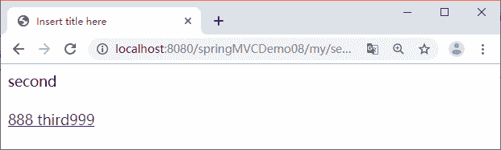

# Spring MVC 使用 SessionLocaleResolver 实现用户自定义切换语言实例

> 原文：[`c.biancheng.net/view/4464.html`](http://c.biancheng.net/view/4464.html)

在许多成熟的商业软件系统中可以让用户自由切换语言，而不是修改浏览器的语言设置。一旦用户选择了自己需要使用的语言环境，整个系统的语言环境将一直是这种语言环境。

Spring MVC 也可以允许用户自行选择程序语言。本章通过 Web 应用 springMVCDemo09 演示用户自定义切换语言，在该应用中使用 SessionLocaleResolver 实现国际化，具体步骤如下：

#### 1）创建应用

创建应用 springMVCDemo09，并导入 Spring MVC 相关的 JAR 包。

#### 2）创建国际化资源文件

在 WEB-INF/resource 目录下创建中英文资源文件 messages_en_US.properties 和 messages_zh_CN.properties。

messages_en_US.properties 的内容如下：

first=first
second=second
third={0} third{1}
language.en=English
language.cn=Chinese

messages_zh_CN.properties 的内容如下：

first=\u7B2C\u4E00\u9875
second=\u7B2C\u4E8C\u9875
third={0} \u7B2C\u4E09\u9875 {1}
language.cn=\u4E2D\u6587
language.en=\u82F1\u6587

#### 3）创建视图 JSP 文件

在 WEB-INF/jsp 目录下创建 3 个 JSP 文件，即 first.jsp、second.jsp 和 third.jsp。

first.jsp 的代码如下：

```

<%@ page language="java" contentType="text/html; charset=UTF-8"
    pageEncoding="UTF-8"%>
<%@taglib prefix="spring" uri="http://www.springframework.org/tags"%>
<!DOCTYPE html PUBLIC "-//W3C//DTD HTML 4.01 Transitional//EN" "http://www.w3.org/TR/html4/loose.dtd">
<html>
<head>
<meta http-equiv="Content-Type" content="text/html; charset=UTF-8">
<title>Insert title here</title>
</head>
<body>
    <a href="${pageContext.request.contextPath }/i18nTest?locale=zh_ CN">
        <spring:message code="language.cn" /> </a> --
    <a href="${pageContext.request.contextPath }/i18nTest?locale=en_US">
        <spring:message code="language.en" /> </a>
    <br>
    <br>
    <spring:message code="first" />
    <br>
    <br>
    <a href="${pageContext.request.contextPath }/my/second">
    <spring:message code="second" /> </a>
</body>
</html>
```

second.jsp 的代码如下：

```

<%@ page language="java" contentType="text/html; charset=UTF-8"
    pageEncoding="UTF-8"%>
<%@taglib prefix="spring" uri="http://www.springframework.org/tags"%>
<!DOCTYPE html PUBLIC "-//W3C//DTD HTML 4.01 Transitional//EN" "http://www.w3.org/TR/html4/loose.dtd">
<html>
<head>
<meta http-equiv="Content-Type" content="text/html; charset=UTF-8">
<title>Insert title here</title>
</head>
<body>
    <spring:message code="second"/><br><br>
    <a href="${pageContext.request.contextPath }/my/third">
        <spring:message code="third" arguments="888,999"/>
    </a>
</body>
</html>
```

third.jsp 的代码如下：

```

<%@ page language="java" contentType="text/html; charset=UTF-8"
    pageEncoding="UTF-8"%>
<%@taglib prefix="spring" uri="http://www.springframework.org/tags"%>
<!DOCTYPE html PUBLIC "-//W3C//DTD HTML 4.01 Transitional//EN" "http://www.w3.org/TR/html4/loose.dtd">
<html>
<head>
<meta http-equiv="Content-Type" content="text/html; charset=UTF-8">
<title>Insert title here</title>
</head>
<body>
    <spring:message code="third" arguments="888,999" />
    <br>
    <br>
    <a href="${pageContext.request.contextPath }/my/first">
        <spring:message code="first" />
    </a>
</body>
</html>
```

#### 4）创建控制器类

该应用有两个控制器类，一个是 I18NTestController 处理语言种类选择请求，一个是 MyController 进行页面导航。在 src 目录中创建一个名为 controller 的包，并在该包中创建这两个控制器类。

I18NTestController.java 的代码如下：

```

package controller;
import java.util.Locale;
import org.springframework.web.bind.annotation.RequestMapping;
@Controller
public class I18NTestController {
    @RequestMapping("/i18nTest")
    /**
     * locale 接收请求参数 locale 值，并存储到 session 中
     */
    public String first(Locale locale) {
        return "first";
    }
}
```

MyController 的代码如下：

```

package controller;

import org.springframework.stereotype.Controller;
import org.springframework.web.bind.annotation.RequestMapping;

@Controller
@RequestMapping("/my")
public class MyController {
    @RequestMapping("/first")
    public String first() {
        return "first";
    }

    @RequestMapping("/second")
    public String second() {
        return "second";
    }

    @RequestMapping("/third")
    public String third() {
        return "third";
    }
}
```

#### 5）创建配置文件

在 WEB-INF 目录下创建配置文件 springmvc-servlet.xml 和 web.xml。web.xml 的代码与 Spring MVC 简单应用的相同，这里不再赘述。springmvc-servlet.xml 的代码如下：

```

<?xml version="1.0" encoding="UTF-8"?>
<beans xmlns="http://www.springframework.org/schema/beans"
    xmlns:xsi="http://www.w3.org/2001/XMLSchema-instance" 
    xmlns:mvc="http://www.springframework.org/schema/mvc"
    xmlns:p="http://www.springframework.org/schema/p" 
    xmlns:context="http://www.springframework.org/schema/context"
    xsi:schemaLocation="
        http://www.springframework.org/schema/beans
        http://www.springframework.org/schema/beans/spring-beans.xsd
        http://www.springframework.org/schema/context
        http://www.springframework.org/schema/context/spring-context.xsd
        http://www.springframework.org/schema/mvc
        http://www.springframework.org/schema/mvc/spring-mvc.xsd">
    <!-- 使用扫描机制扫描包 -->
    <context:component-scan base-package="controller" />
    <!-- 配置视图解析器 -->
    <bean
        class="org.springframework.web.servlet.view.InternalResourceViewResolver">
        <property name="prefix" value="/WEB-INF/jsp/" />
        <property name="suffix" value=".jsp" />
    </bean>
    <!-- 国际化操作拦截器，如果采用基于 Session/Cookie 则必须配置 -->
    <mvc:interceptors>
        <bean class="org.springframework.web.servlet.i18n.LocaleChangeInterceptor" />
    </mvc:interceptors>
    <!-- 存储区域设置信息 -->
    <bean id="localeResolver"
        class="org.springframework.web.servlet.i18n.SessionLocaleResolver">
        <property name="defaultLocale" value="zh_CN"></property>
    </bean>
    <!-- 加载国际化资源文件 -->
    <bean id="messageSource"
        class="org.springframework.context.support.ReloadableResourceBundleMessageSource">
        <!-- <property name="basename" value="classpath:messages" /> -->
        <property name="basename" value="/WEB-INF/resource/messages" />
    </bean>
</beans>
```

#### 6）发布应用并测试

首先将 springMVCDemo09 应用发布到 Tomcat 服务器并启动 Tomcat 服务器，然后通过地址“http://localhost:8080/springMVCDemo08/my/first”测试第一个页面，运行结果如图 1 所示。


图 1  中文环境下 first.jsp 的运行结果
单击图 1 中的“第二页”超链接，打开 second.jsp 页面，运行结果如图 2 所示。


图 2  中文环境下 second.jsp 的运行结果
单击图 2 中的“第三页”超链接，打开 third.jsp 页面，运行结果如图 3 所示。


图 3  中文环境下 third.jsp 的运行结果
单击图 1 中的“英文”超链接，打开英文环境下的 first.jsp 页面，运行结果如图 4 所示。


图 4  英文环境下 first.jsp 的运行结果
单击图 4 中的 second 超链接，打开英文环境下的 second.jsp 页面，运行结果如图 5 所示。


图 5  英文环境下 second.jsp 的运行结果
单击图 5 中的 third 超链接，打开英文环境下的 third.jsp 页面，运行结果如图 6 所示。


图 6  英文环境下 third.jsp 的运行结果