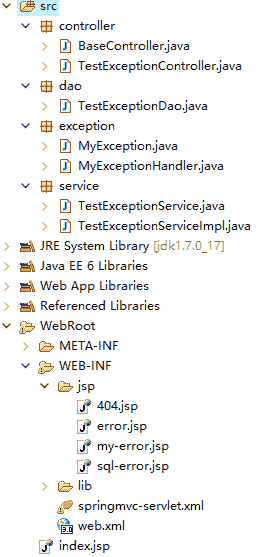

# Spring MVC 统一异常处理的 3 种方式（附带实例）

> 原文：[`c.biancheng.net/view/4466.html`](http://c.biancheng.net/view/4466.html)

在 Spring MVC 应用的开发中，不管是对底层数据库操作，还是业务层或控制层操作，都会不可避免地遇到各种可预知的、不可预知的异常需要处理。

如果每个过程都单独处理异常，那么系统的代码耦合度高，工作量大且不好统一，以后维护的工作量也很大。

如果能将所有类型的异常处理从各层中解耦出来，这样既保证了相关处理过程的功能单一，又实现了异常信息的统一处理和维护。

幸运的是，Spring MVC 框架支持这样的实现。Spring MVC 统一异常处理有以下 3 种方式：

*   使用 Spring MVC 提供的简单异常处理器 SimpleMappingExceptionResolver。
*   实现 Spring 的异常处理接口 HandlerExceptionResolver 自定义自己的异常处理器。
*   使用 @ExceptionHandler 注解实现异常处理

本节主要根据这 3 种处理方式讲解 Spring MVC 应用的异常统一处理。

为了验证 Spring MVC 框架的 3 种异常处理方式的实际效果，需要开发一个测试应用 springMVCDemo10，从 Dao 层、Service 层、Controller 层分别抛出不同的异常（SQLException、自定义异常和未知异常），然后分别集成 3 种方式进行异常处理，进而比较其优缺点。springMVCDemo10 应用的结构如图 1 所示。


图 1  springMVCDemo10 应用的结构
3 种异常处理方式的相似部分有 Dao 层、Service 层、View 层、MyException、TestException Controller 以及 web.xml，下面分别介绍这些相似部分。

#### 1）创建应用 springMVCDemo10

创建应用 springMVCDemo10，并导入 Spring MVC 相关的 JAR 包。

#### 2）创建自定义异常类

在 src 目录下创建 exception 包，并在该包中创建自定义异常类 MyException。具体代码如下：

```

package exception;

public class MyException extends Exception {
    private static final long serialVersionUID = 1L;

    public MyException() {
        super();
    }

    public MyException(String message) {
        super(message);
    }
}
```

#### 3）创建 Dao 层

在 src 目录下创建 dao 包，并在该包中创建 TestExceptionDao 类，在该类中定义 3 个方法，分别抛出“数据库异常”“自定义异常”和“未知异常”。具体代码如下：

```

package dao;
import java.sql.SQLException;
import org.springframework.stereotype.Repository;

@Repository("TestExceptionDao")
public class TestExceptionDao {
    public void daodb() throws Exception {
        throw new SQLException("Dao 中数据库异常");
    }

    public void daomy() throws Exception {
        throw new SQLException("Dao 中自定义异常");
    }

    public void daono() throws Exception {
        throw new SQLException("Dao 中未知异常");
    }
}
```

#### 4）创建 Service 层

在 src 目录下创建 service 包，并在该包中创建 TestExceptionService 接口和 TestExceptionServiceImpl 实现类，在该接口中定义 6 个方法，其中有 3 个方法调用 Dao 层中的方法，有 3 个是 Service 层的方法。

Service 层的方法是为演示 Service 层的“数据库异常”“自定义异常”和“未知异常”而定义的。

TestExceptionService 接口的代码如下：

```

package service;

public interface TestExceptionService {
    public void servicemy() throws Exception;
    public void servicedb() throws Exception;
    public void daomy() throws Exception;
    public void daodb() throws Exception;
    public void serviceno() throws Exception;
    public void daono() throws Exception;
}
```

TestExceptionServiceImpl 实现类的代码如下：

```

package service;

import java.sql.SQLException;

import org.springframework.beans.factory.annotation.Autowired;
import org.springframework.stereotype.Service;

import dao.TestExceptionDao;
import exception.MyException;

@Service("testExceptionService")
public class TestExceptionServiceImpl implements TestExceptionService {
    @Autowired
    private TestExceptionDao testExceptionDao;

    @Override
    public void servicemy() throws Exception {
        throw new MyException("Service 中自定义异常");
    }

    @Override
    public void servicedb() throws Exception {
        throw new SQLException("Service 中数据库异常");
    }

    @Override
    public void daomy() throws Exception {
        testExceptionDao.daomy();
    }

    @Override
    public void daodb() throws Exception {
        testExceptionDao.daodb();
    }

    @Override
    public void serviceno() throws Exception {
        throw new SQLException("Service 中未知异常");
    }

    @Override
    public void daono() throws Exception {
        testExceptionDao.daono();
    }
}
```

#### 5）创建控制器类

在 src 目录下创建 controller 包，并在该包中创建 TestExceptionController 控制器类，代码如下：

```

package controller;

import java.sql.SQLException;

import org.springframework.beans.factory.annotation.Autowired;
import org.springframework.stereotype.Controller;
import org.springframework.web.bind.annotation.RequestMapping;

import service.TestExceptionService;
import exception.MyException;

@Controller
public class TestExceptionController {
    @Autowired
    private TestExceptionService testExceptionService;

    @RequestMapping("/db")
    public void db() throws Exception {
        throw new SQLException("控制器中数据库异常");
    }

    @RequestMapping("/my")
    public void my() throws Exception {
        throw new MyException("控制器中自定义异常");
    }

    @RequestMapping("/no")
    public void no() throws Exception {
        throw new Exception("控制器中未知异常");
    }

    @RequestMapping("/servicedb")
    public void servicedb() throws Exception {
        testExceptionService.servicedb();
    }

    @RequestMapping("/servicemy")
    public void servicemy() throws Exception {
        testExceptionService.servicemy();
    }

    @RequestMapping("/serviceno")
    public void serviceno() throws Exception {
        testExceptionService.serviceno();
    }

    @RequestMapping("/daodb")
    public void daodb() throws Exception {
        testExceptionService.daodb();
    }

    @RequestMapping("/daomy")
    public void daomy() throws Exception {
        testExceptionService.daomy();
    }

    @RequestMapping("/daono")
    public void daono() throws Exception {
        testExceptionService.daono();
    }
}
```

#### 6）创建 View 层

View 层中共有 5 个 JSP 页面，下面分别介绍。

测试应用首页面 index.jsp 的代码如下：

```

<%@ page language="java" contentType="text/html; charset=UTF-8"
    pageEncoding="UTF-8"%>
<%@taglib prefix="spring" uri="http://www.springframework.org/tags"%>
<!DOCTYPE html PUBLIC "-//W3C//DTD HTML 4.01 Transitional//EN" "http://www.w3.org/TR/html4/loose.dtd">
<html>
<head>
<meta http-equiv="Content-Type" content="text/html; charset=UTF-8">
<title>Insert title here</title>
</head>
<body>
    <h1>所有的演示例子</h1>
    <h3><a href="${pageContext.request.contextPath }/daodb"> 处理 dao 中数据库异常</a></h3>
    <h3><a href="${pageContext.request.contextPath }/daomy"> 处理 dao 中自定义异常</a></h3>
    <h3><a href="${pageContext.request.contextPath }/daono"> 处理 dao 未知错误 </a></h3>
    <hr>
    <h3><a href="${pageContext.request.contextPath }/servicedb">处理 service 中数据库异常</a></h3>
    <h3><a href="${pageContext.request.contextPath }/servicemy">处理 service 中自定义异常</a></h3>
    <h3><a href="${pageContext.request.contextPath }/serviceno">处理 service 未知错误</a></h3>
    <hr>
    <h3><a href="${pageContext.request.contextPath }/db">处理 controller 中数据库异常</a></h3>
    <h3><a href="${pageContext.request.contextPath }/my">处理 controller 中自定义异常</a></h3>
    <h3><a href="${pageContext.request.contextPath }/no">处理 controller 未知错误</a></h3>
    <hr>
    <!-- 在 web.xml 中配置 404 -->
    <h3>
        <a href="${pageContext.request.contextPath }/404">404 错误</a>
    </h3>
</body>
</html>
```

404 错误对应页面 404.jsp 的代码如下：

```

<%@ page language="java" contentType="text/html; charset=UTF-8"
    pageEncoding="UTF-8"%>
<%@taglib prefix="spring" uri="http://www.springframework.org/tags"%>
<!DOCTYPE html PUBLIC "-//W3C//DTD HTML 4.01 Transitional//EN" "http://www.w3.org/TR/html4/loose.dtd">
<html>
<head>
<meta http-equiv="Content-Type" content="text/html; charset=UTF-8">
<title>Insert title here</title>
</head>
<body>
    资源已不在。
</body>
</html>
```

未知异常对应页面 error.jsp 的代码如下：

```

<%@ page language="java" contentType="text/html; charset=UTF-8"
    pageEncoding="UTF-8" isErrorPage="true"%>
<%@taglib prefix="spring" uri="http://www.springframework.org/tags"%>
<!DOCTYPE html PUBLIC "-//W3C//DTD HTML 4.01 Transitional//EN" "http://www.w3.org/TR/html4/loose.dtd">
<html>
<head>
<meta http-equiv="Content-Type" content="text/html; charset=UTF-8">
<title>Insert title here</title>
</head>
<body>
    <H1>未知错误：</H1><%=exception %>
    <H2>错误内容：</H2>
    <%
        exception.printStackTrace(response.getWriter());
    %>
</body>
</html>
```

自定义异常对应页面 my-error.jsp 的代码如下：

```

<%@ page language="java" contentType="text/html; charset=UTF-8"
    pageEncoding="UTF-8" isErrorPage="true"%>
<%@taglib prefix="spring" uri="http://www.springframework.org/tags"%>
<!DOCTYPE html PUBLIC "-//W3C//DTD HTML 4.01 Transitional//EN" "http://www.w3.org/TR/html4/loose.dtd">
<html>
<head>
<meta http-equiv="Content-Type" content="text/html; charset=UTF-8">
<title>Insert title here</title>
</head>
<body>
    <H1>自定义异常错误：</H1><%=exception %>
    <H2>错误内容：</H2>
    <%
        exception.printStackTrace(response.getWriter());
    %>
</body>
</html>
```

SQL 异常对应页面 sql-error.jsp 的代码如下：

```

<%@ page language="java" contentType="text/html; charset=UTF-8"
    pageEncoding="UTF-8" isErrorPage="true"%>
<%@taglib prefix="spring" uri="http://www.springframework.org/tags"%>
<!DOCTYPE html PUBLIC "-//W3C//DTD HTML 4.01 Transitional//EN" "http://www.w3.org/TR/html4/loose.dtd">
<html>
<head>
<meta http-equiv="Content-Type" content="text/html; charset=UTF-8">
<title>Insert title here</title>
</head>
<body>
    <H1>数据库异常错误：</H1><%=exception %>
    <H2>错误内容：</H2>
    <%
        exception.printStackTrace(response.getWriter());
    %>
</body>
</html>
```

#### 7）web.xml

对于 Unchecked Exception 而言，由于代码不强制捕获，往往被忽略，如果运行期产生了 Unchecked Exception，而代码中又没有进行相应的捕获和处理，则可能不得不面对 404、500 等服务器内部错误提示页面，所以在 web.xml 文件中添加了全局异常 404 处理。具体代码如下：

```

<error-page>
    <error-code>404</error-code>
    <location>/WEB-INF/jsp/404.jsp</location>
</error-page>
```

从上述 Dao 层、Service 层以及 Controller 层的代码中可以看出，它们只管通过 throw 和 throws 语句抛出异常，并不处理。下面分别从 3 种方式统一处理这些异常。

由于篇幅有限，分成 3 节对这 3 种方式进行详细讲解，点击下面链接进行阅读：

*   Spring MVC 使用 SimpleMappingExceptionResolver 类异常处理
*   Spring MVC 使用 HandlerExceptionResolver 接口异常处理
*   Spring MVC 使用@ExceptionHandler 注解异常处理