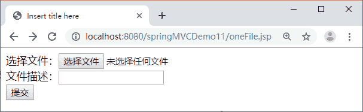
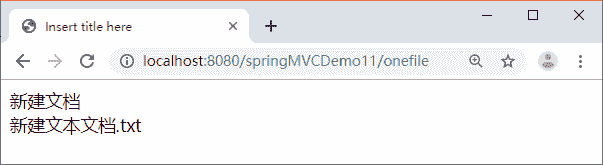

# Spring MVC 单文件上传（附带实例）

> 原文：[`c.biancheng.net/view/4477.html`](http://c.biancheng.net/view/4477.html)

本节通过一个应用案例 springMVCDemo11 讲解 Spring MVC 框架如何实现单文件上传，具体步骤如下：

#### 1）创建应用并导入 JAR 包

创建应用 springMVCDemo11，将 Spring MVC 相关的 JAR 包、commons-fileupload 组件相关的 JAR 包以及 JSTL 相关的 JAR 包导入应用的 lib 目录中，如图 1 所示。


图 1  springMVCDemo11

#### 
2）创建 web.xml 文件

在 WEB-INF 目录下创建 web.xml 文件。为防止中文乱码，需要在 web.xml 文件中添加字符编码过滤器，这里不再赘述。

#### 3）创建文件选择页面

在 WebContent 目录下创建 JSP 页面 oneFile.jsp，在该页面中使用表单上传单个文件，具体代码如下：

```

<%@ page language="java" contentType="text/html; charset=UTF-8"
    pageEncoding="UTF-8"%>
<!DOCTYPE html PUBLIC "-//W3C//DTD HTML 4.01 Transitional//EN" "http://www.w3.org/TR/html4/loose.dtd">
<html>
<head>
<meta http-equiv="Content-Type" content="text/html; charset=UTF-8">
<title>Insert title here</title>
</head>
<body>
    <form action="${pageContext.request.contextPath }/onefile"
        method="post" enctype="multipart/form-data">
        选择文件：<input type="file" name="myfile"><br>
        文件描述：<input type="text" name="description"><br>
        <input type="submit" value="提交">
    </form>
</body>
</html>
```

#### 4）创建 POJO 类

在 src 目录下创建 pojo 包，在该包中创建 POJO 类 FileDomain。然后在该 POJO 类中声明一个 MultipartFile 类型的属性封装被上传的文件信息，属性名与文件选择页面 oneFile.jsp 中的 file 类型的表单参数名 myfile 相同。具体代码如下：

```

package pojo;
import org.springframework.web.multipart.MultipartFile;
public class FileDomain {
    private String description;
    private MultipartFile myfile;

    public String getDescription() {
        return description;
    }

    public void setDescription(String description) {
        this.description = description;
    }

    public MultipartFile getMyfile() {
        return myfile;
    }

    public void setMyfile(MultipartFile myfile) {
        this.myfile = myfile;
    }
}
```

#### 5）创建控制器类

在 src 目录下创建 controller 包，并在该包中创建 FileUploadController 控制器类。具体代码如下：

```

package controller;

import java.io.File;

import javax.servlet.http.HttpServletRequest;

import org.apache.commons.logging.Log;
import org.apache.commons.logging.LogFactory;
import org.springframework.stereotype.Controller;
import org.springframework.web.bind.annotation.ModelAttribute;
import org.springframework.web.bind.annotation.RequestMapping;

import pojo.FileDomain;

@Controller
public class FileUploadController {
    // 得到一个用来记录日志的对象，这样在打印信息时能够标记打印的是哪个类的信息
    private static final Log logger = LogFactory.getLog(FileUploadController.class);
    /**
     * 单文件上传
     */
    @RequestMapping("/onefile")
    public String oneFileUpload(@ModelAttribute FileDomain fileDomain,
            HttpServletRequest request) {
        /*
         * 文件上传到服务器的位置“/uploadfiles”,该位置是指
         * workspace\.metadata\.plugins\org.eclipse
         * .wst.server.core\tmp0\wtpwebapps, 发布后使用
         */
        String realpath = request.getServletContext()
                .getRealPath("uploadfiles");
        String fileName = fileDomain.getMyfile().getOriginalFilename();
        File targetFile = new File(realpath, fileName);
        if (!targetFile.exists()) {
            targetFile.mkdirs();
        }
        // 上传
        try {
            fileDomain.getMyfile().transferTo(targetFile);
            logger.info("成功");
        } catch (Exception e) {
            e.printStackTrace();
        }
        return "showOne";
    }
}
```

#### 6）创建 Spring MVC 的配置文件

在上传文件时需要在配置文件中使用 Spring 的 CommonsMultipartResolver 类配置 MultipartResolver 用于文件上传，应用的配置文件 springmvc-servlet.xml 的代码如下：

```

<?xml version="1.0" encoding="UTF-8"?>
<beans xmlns="http://www.springframework.org/schema/beans"
    xmlns:xsi="http://www.w3.org/2001/XMLSchema-instance"
    xmlns:mvc="http://www.springframework.org/schema/mvc"
    xmlns:p="http://www.springframework.org/schema/p"
    xmlns:context="http://www.springframework.org/schema/context"
    xsi:schemaLocation="
        http://www.springframework.org/schema/beans
        http://www.springframework.org/schema/beans/spring-beans.xsd
        http://www.springframework.org/schema/context
        http://www.springframework.org/schema/context/spring-context.xsd
        http://www.springframework.org/schema/mvc
        http://www.springframework.org/schema/mvc/spring-mvc.xsd">
    <!-- 使用扫描机制扫描包 -->
    <context:component-scan base-package="controller" />
    <!-- 完成视图的对应 -->
    <!-- 对转向页面的路径解析。prefix：前缀， suffix：后缀 -->
    <bean
        class="org.springframework.web.servlet.view.InternalResourceViewResolver">
        <property name="prefix" value="/WEB-INF/jsp/" />
        <property name="suffix" value=".jsp" />
    </bean>

    <!-- 配置 MultipartResolver，用于上传文件，使用 spring 的 CommonsMultipartResolver -->
    <bean id="multipartResolver"
        class="org.springframework.web.multipart.commons.CommonsMultipartResolver">
        <property name="maxUploadSize" value="5000000" />
        <property name="defaultEncoding" value="UTF-8" />
    </bean>
</beans>
```

#### 7）创建成功显示页面

在 WEB-INF 目录下创建 JSP 文件夹，并在该文件夹中创建单文件上传成功显示页面 showOne.jsp。具体代码如下：

```

<%@ page language="java" contentType="text/html; charset=UTF-8"
    pageEncoding="UTF-8"%>
<!DOCTYPE html PUBLIC "-//W3C//DTD HTML 4.01 Transitional//EN" "http://www.w3.org/TR/html4/loose.dtd">
<html>
<head>
<meta http-equiv="Content-Type" content="text/html; charset=UTF-8">
<title>Insert title here</title>
</head>
<body>
    ${fileDomain.description }
    <br>
    <!-- fileDomain.getMyFile().getOriginalFilename()-->
    ${fileDomain.myfile.originalFilename }
</body>
</html>
```

#### 8）测试文件上传

发布 springMVCDemo11 应用到 Tomcat 服务器并启动 Tomcat 服务器，然后通过地址“http://localhost:8080/springMVCDemo11/oneFile.jsp”运行文件选择页面，运行结果如图 2 所示。


图 2  单文件选择页面
在图 2 中选择文件并输入文件描述，然后单击“提交”按钮上传文件，若成功则显示如图 3 所示的结果。


图 3  单文件成功上传结果