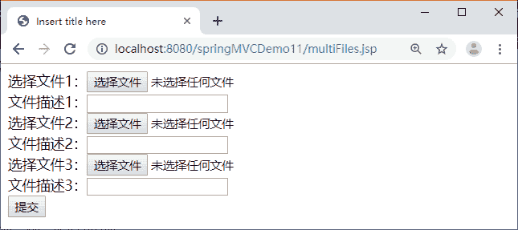
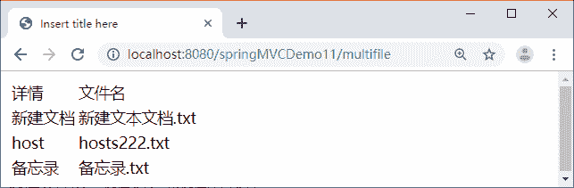

# Spring MVC 多文件上传（附带实例）

> 原文：[`c.biancheng.net/view/4481.html`](http://c.biancheng.net/view/4481.html)

本小节继续通过 springMVCDemo11 应用案例讲解 Spring MVC 框架如何实现多文件上传，具体步骤如下：

#### 1）创建多文件选择页面

在 WebContent 目录下创建 JSP 页面 multiFiles.jsp，在该页面中使用表单上传多个文件，具体代码如下：

```

<%@ page language="java" contentType="text/html; charset=UTF-8"
    pageEncoding="UTF-8"%>
<!DOCTYPE html PUBLIC "-//W3C//DTD HTML 4.01 Transitional//EN" "http://www.w3.org/TR/html4/loose.dtd">
<html>
<head>
<meta http-equiv="Content-Type" content="text/html; charset=UTF-8">
<title>Insert title here</title>
</head>
<body>
    <form action="${pageContext.request.contextPath }/multifile"
        method="post" enctype="multipart/form-data">
        选择文件 1：<input type="file" name="myfile"><br>
        文件描述 1：<input type="text" name="description"><br />
        选择文件 2：<input type="file" name="myfile"><br>
        文件描述 2：<input type="text" name="description"><br />
        选择文件 3：<input type="file" name="myfile"><br>
        文件描述 3：<input type="text" name="description"><br />
        <input type="submit" value="提交">
    </form>
</body>
</html>
```

#### 2）创建 POJO 类

在上传多文件时需要 POJO 类 MultiFileDomain 封装文件信息，MultiFileDomain 类的具体代码如下：

```

package pojo;
import java.util.List;
import org.springframework.web.multipart.MultipartFile;
public class MultiFileDomain {
    private List<String> description;
    private List<MultipartFile> myFile;
    // 省略 setter 和 getter 方法
}
```

#### 3）添加多文件上传处理方法

在控制器类 FileUploadController 中添加多文件上传的处理方法 multiFileUpload，具体代码如下：

```

/**
* 多文件上传
*/
@RequestMapping("/multifile")
public String multiFileUpload(@ModelAttribute MultiFileDomain multiFileDomain,HttpServletRequest request) {
    String realpath = request.getServletContext().getRealPath("uploadfiles");
    File targetDir = new File(realpath);
    if (!targetDir.exists()) {
        targetDir.mkdirs();
    }
    List<MultipartFile> files = multiFileDomain.getMyFile();
    for (int i = 0; i < files.size(); i++) {
        MultipartFile file = files.get(i);
        String fileName = file.getOriginalFilename();
        File targetFile = new File(realpath, fileName);
        // 上传
        try {
            file.transferTo(targetFile);
        } catch (Exception e) {
            e.printStackTrace();
        }
    }
    logger.info("成功");
    return "showMulti";
}
```

#### 4）创建成功显示页面

在 JSP 文件夹中创建多文件上传成功显示页面 showMulti.jsp，具体代码如下：

```

<%@ page language="java" contentType="text/html; charset=UTF-8"
    pageEncoding="UTF-8"%>
<%@taglib uri="http://java.sun.com/jsp/jstl/core" prefix="c"%>
<!DOCTYPE html PUBLIC "-//W3C//DTD HTML 4.01 Transitional//EN" "http://www.w3.org/TR/html4/loose.dtd">
<html>
<head>
<meta http-equiv="Content-Type" content="text/html; charset=UTF-8">
<title>Insert title here</title>
</head>
<body>
    <table>
        <tr>
            <td>详情</td>
            <td>文件名</td>
        </tr>
        <!-- 同时取两个数组的元素 -->
        <c:forEach items="${multiFileDomain.description}" var="description"
            varStatus="loop">
            <tr>
                <td>${description}</td>
                <td>${multiFileDomain.myfile[loop.count-1].originalFilename}</td>
            </tr>
        </c:forEach>
        <!-- fileDomain.getMyfile().getOriginalFilename() -->
    </table>
</body>
</html>
```

#### 5）测试文件上传

发布 springMVCDemo11 应用到 Tomcat 服务器并启动 Tomcat 服务器，然后通过地址“http://localhost:8080/springMVCDemo11/multiFiles.jsp”运行多文件选择页面，运行结果如图 1 所示。


图 1  多文件选择页面
在图 1 中选择文件并输入文件描述，然后单击“提交”按钮上传多个文件，若成功则显示如图 2 所示的结果。


图 2  多文件成功上传结果