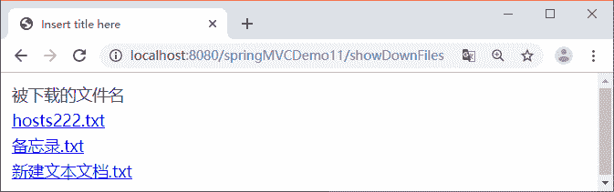

# Spring MVC 文件下载

> 原文：[`c.biancheng.net/view/4484.html`](http://c.biancheng.net/view/4484.html)

本节主要讲解 Spring MVC 文件下载的实现方法和实现过程。

## 文件下载的实现方法

实现文件下载有以下两种方法：

*   通过超链接实现下载。
*   利用程序编码实现下载。

通过超链接实现下载固然简单，但暴露了下载文件的真实位置，并且只能下载存放在 Web 应用程序所在的目录下的文件。

利用程序编码实现下载可以增加安全访问控制，还可以从任意位置提供下载的数据，可以将文件存放到 Web 应用程序以外的目录中，也可以将文件保存到数据库中。

利用程序实现下载需要设置两个报头：

1）Web 服务器需要告诉浏览器其所输出内容的类型不是普通文本文件或 HTML 文件，而是一个要保存到本地的下载文件，这需要设置 Content-Type 的值为 application/x-msdownload。

2）Web 服务器希望浏览器不直接处理相应的实体内容，而是由用户选择将相应的实体内容保存到一个文件中，这需要设置 Content-Disposition 报头。

该报头指定了接收程序处理数据内容的方式，在 HTTP 应用中只有 attachment 是标准方式，attachment 表示要求用户干预。在 attachment 后面还可以指定 filename 参数，该参数是服务器建议浏览器将实体内容保存到文件中的文件名称。

设置报头的示例如下：

response.setHeader("Content-Type", "application/x-msdownload");
response.setHeader("Content-Disposition", "attachment;filename="+filename);

## 文件下载的过程

下面继续通过 springMVCDemo11 应用讲述利用程序实现下载的过程，要求从《Spring MVC 单文件上传》上传文件的目录（workspace\.metadata\.plugins\org.eclipse.wst.server.core\tmp0\wtpwebapps\springMVCDemo11\uploadfiles）中下载文件，具体开发步骤如下：

#### 1）编写控制器类

首先编写控制器类 FileDownController，在该类中有 3 个方法，即 show、down 和 toUTF8String。其中，show 方法获取被下载的文件名称；down 方法执行下载功能；toUTF8String 方法是下载保存时中文文件名的字符编码转换方法。

FileDownController 类的代码如下：

```

package controller;

import java.io.File;
import java.io.FileInputStream;
import java.io.UnsupportedEncodingException;
import java.util.ArrayList;
import javax.servlet.ServletOutputStream;
import javax.servlet.http.HttpServletRequest;
import javax.servlet.http.HttpServletResponse;
import org.apache.commons.logging.Log;
import org.apache.commons.logging.LogFactory;
import org.springframework.stereotype.Controller;
import org.springframework.ui.Model;
import org.springframework.web.bind.annotation.RequestMapping;
import org.springframework.web.bind.annotation.RequestParam;

@Controller
public class FileDownController {
    // 得到一个用来记录日志的对象，在打印时标记打印的是哪个类的信息
    private static final Log logger = LogFactory
            .getLog(FileDownController.class);

    /**
     * 显示要下载的文件
     */
    @RequestMapping("showDownFiles")
    public String show(HttpServletRequest request, Model model) {
        // 从 workspace\.metadata\.plugins\org.eclipse.wst.server.core\
        // tmp0\wtpwebapps\springMVCDemo11\下载
        String realpath = request.getServletContext()
                .getRealPath("uploadfiles");
        File dir = new File(realpath);
        File files[] = dir.listFiles();
        // 获取该目录下的所有文件名
        ArrayList<String> fileName = new ArrayList<String>();
        for (int i = 0; i < files.length; i++) {
            fileName.add(files[i].getName());
        }
        model.addAttribute("files", fileName);
        return "showDownFiles";
    }

    /**
     * 执行下载
     */
    @RequestMapping("down")
    public String down(@RequestParam String filename,
            HttpServletRequest request, HttpServletResponse response) {
        String aFilePath = null; // 要下载的文件路径
        FileInputStream in = null; // 输入流
        ServletOutputStream out = null; // 输出流
        try {
            // 从 workspace\.metadata\.plugins\org.eclipse.wst.server.core\
            // tmp0\wtpwebapps 下载
            aFilePath = request.getServletContext().getRealPath("uploadfiles");
            // 设置下载文件使用的报头
            response.setHeader("Content-Type", "application/x-msdownload");
            response.setHeader("Content-Disposition", "attachment; filename="
                    + toUTF8String(filename));
            // 读入文件
            in = new FileInputStream(aFilePath + "\\" + filename);
            // 得到响应对象的输出流，用于向客户端输出二进制数据
            out = response.getOutputStream();
            out.flush();
            int aRead = 0;
            byte b[] = new byte[1024];
            while ((aRead = in.read(b)) != -1 & in != null) {
                out.write(b, 0, aRead);
            }
            out.flush();
            in.close();
            out.close();
        } catch (Throwable e) {
            e.printStackTrace();
        }
        logger.info("下载成功");
        return null;
    }

    /**
     * 下载保存时中文文件名的字符编码转换方法
     */
    public String toUTF8String(String str) {
        StringBuffer sb = new StringBuffer();
        int len = str.length();
        for (int i = 0; i < len; i++) {
            // 取出字符中的每个字符
            char c = str.charAt(i);
            // Unicode 码值为 0~255 时，不做处理
            if (c >= 0 && c <= 255) {
                sb.append(c);
            } else { // 转换 UTF-8 编码
                byte b[];
                try {
                    b = Character.toString(c).getBytes("UTF-8");
                } catch (UnsupportedEncodingException e) {
                    e.printStackTrace();
                    b = null;
                }
                // 转换为%HH 的字符串形式
                for (int j = 0; j < b.length; j++) {
                    int k = b[j];
                    if (k < 0) {
                        k &= 255;
                    }
                    sb.append("%" + Integer.toHexString(k).toUpperCase());
                }
            }
        }
        return sb.toString();
    }
}
```

#### 2）创建文件列表页面

下载文件示例需要一个显示被下载文件的 JSP 页面 showDownFiles.jsp，代码如下：

```

<%@ page language="java" contentType="text/html; charset=UTF-8"
    pageEncoding="UTF-8"%>
<%@ taglib uri="http://java.sun.com/jsp/jstl/core" prefix="c"%>
<head>
<meta http-equiv="Content-Type" content="text/html; charset=UTF-8">
<title>Insert title here</title>
</head>
<body>
    <table>
        <tr>
            <td>被下载的文件名</td>
        </tr>
        <!--遍历 model 中的 files-->
        <c:forEach items="${files}" var="filename">
            <tr>
                <td>
                    <a href="${pageContext.request.contextPath }/down?filename=${filename}">${filename}</a>
                </td>
            </tr>
        </c:forEach>
    </table>
</body>
</html>
```

#### 3）测试下载功能

发布 springMVCDemo11 应用到 Tomcat 服务器并启动 Tomcat 服务器，然后通过地址“http://localhost:8080/springMVCDemo11/showDownFiles”测试下载示例，运行结果如图 1 所示。


图 1  被下载文件列表页面
单击图 1 中的超链接下载文件，需要注意的是，使用浏览器演示该案例，不能在 MyEclipse 中演示下载案例。