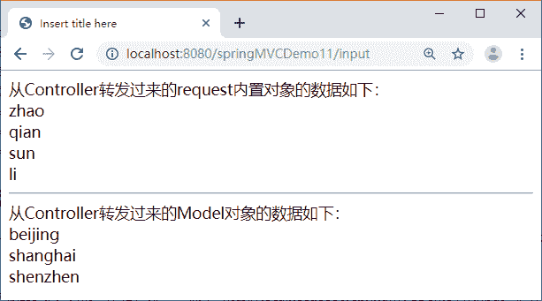

# JSP EL 表达式常用隐含对象详解

> 原文：[`c.biancheng.net/view/4501.html`](http://c.biancheng.net/view/4501.html)

EL 隐含对象共有 11 个，本节只介绍几个常用的 EL 隐含对象，即 pageScope、requestScope、sessionScope、applicationScope、param 以及 paramValues。

#### 1）与作用范围相关的隐含对象

与作用范围相关的 EL 隐含对象有 pageScope、requestScope、sessionScope 和 applicationScope，分别可以获取 JSP 隐含对象 pageContext、request、session 和 application 中的数据。

如果在 EL 中没有使用隐含对象指定作用范围，则会依次从 page、request、session、application 范围查找，若找到就直接返回，不再继续找下去；如果所有范围都没有找到，就返回空字符串。获取数据的格式如下：

${EL 隐含对象.关键字对象.属性}

或

${EL 隐含对象.关键字对象}

例如：

<jsp:useBean id="user" class="bean.UserBean" scope="page"/><!--bean 标签-->
<jsp:setProperty name="user" property="name" value="EL 隐含对象"/>
name：${pageScope.user.name}

再如，在 Controller 或 Servlet 中有这样一段话：

```

ArrayList<UserBean> users = new ArrayList<UserBean>();
UserBean ub1 = new UserBean("zhang",20);
UserBean ub2 = new UserBean("zhao",50);
users.add(ub1);
users.add(ub2);
request.setAttribute("array",users);
```

其中，UserBean 有两个属性 name 和 age，那么在对应视图 JSP 中 request 有效的范围内可以使用 EL 取出 UserBean 的属性，代码如下：

${array[0].name} ${array[0].age}
${array[1].name} ${array[1].age}

#### 2）与请求参数相关的隐含对象

与请求参数相关的 EL 隐含对象有 param 和 paramValues。获取数据的格式如下：

${EL 隐含对象.参数名}

例如，input.jsp 的代码如下：

```

<form method="post" action="param.jsp">
    <p>
        姓名：<input type="text" name="username" size=" 15" />
    </p>
    <p>
        兴趣：
        <input type="checkbox" name="habit" value="看书" />看书
        <input type="checkbox" name="habit" value="玩游戏"/>玩游戏
        <input type="checkbox" name="habit" value="旅游"/>旅游
    </P>
        <input type="submit" value="提交" />
</form>
```

那么在 param.jsp 页面中可以使用 EL 获取参数值，代码如下：

<%request.setCharacterEncoding("GBK");%>
<body>
<h2>EL 隐含对象 param、paramValues</h2>
姓名：${param.username}</br>
兴趣：
${paramValues.habit[0]}
${paramValues.habit[1]}
${paramValues.habit[2]}

## 示例

编写一个 Controller，在该控制器类处理方法中使用 request 对象和 Model 对象存储数据，然后从处理方法转发到 show.jsp 页面，在 show.jsp 页面中显示 request 对象的数据。

运行控制器的处理方法，在 IE 地址栏中输入“http://localhost:8080/springMVCDemo11/input”。程序运行结果如图 1 所示。


图 1  使用 EL 获取数据
实现具体步骤如下：

#### 1）创建控制器类

在 src 目录下创建一个名为 controller 的包，并在该包下创建一个名为 InputController 的控制器类。代码如下：

```

package controller;

import javax.servlet.http.HttpServletRequest;
import org.springframework.stereotype.Controller;
import org.springframework.ui.Model;
import org.springframework.web.bind.annotation.RequestMapping;

@Controller
public class InputController {

    @RequestMapping("/input")
    public String input(HttpServletRequest request, Model model) {
        String names[] = { "zhao", "qian", "sun", "li" };
        request.setAttribute("name", names);
        String address[] = { "beijing", "shanghai", "shenzhen" };
        model.addAttribute("address", address);
        return "show";
    }
}
```

#### 2）创建 show.jsp 页面

在 WEB-INF 目录下创建 jsp 文件夹，在该文件夹中创建 show.jsp 页面。代码如下：

```

<%@ page language="java" contentType="text/html; charset=UTF-8"
    pageEncoding="UTF-8"%>
<!DOCTYPE html PUBLIC "-//W3C//DTD HTML 4.01 Transitional//EN" "http://www.w3.org/TR/html4/loose.dtd">
<html>
<head>
<meta http-equiv="Content-Type" content="text/html; charset=UTF-8">
<title>Insert title here</title>
</head>
<body>
    从 Controller 转发过来的 request 内置对象的数据如下：
    <br> ${requestScope.name[0]}
    <br> ${requestScope.name[1]}
    <br> ${requestScope.name[2]}
    <br> ${requestScope.name[3]}
    <br>
    <hr>
    从 Controller 转发过来的 Model 对象的数据如下：
    <br> ${address[0]}
    <br> ${address[1]}
    <br> ${address[2]}
    <br>
</body>
</html>
```