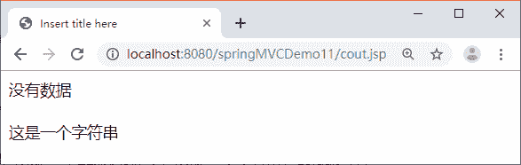
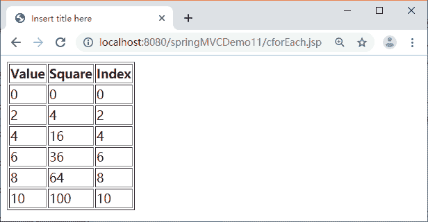
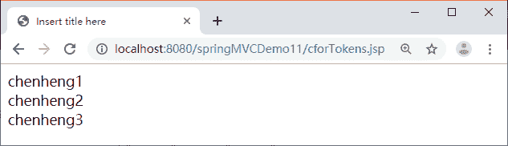

# JSP 标准标签库（JSTL）

> 原文：[`c.biancheng.net/view/4490.html`](http://c.biancheng.net/view/4490.html)

JSTL 规范由 Sun 公司制定，由 Apache 的 Jakarta 小组负责实现。JSTL 由 5 个不同功能的标签库组成，包括 Core、I18N、XML、SQL 以及 Functions，本节只简要介绍 JSTL 的 Core 和 Functions 标签库中几个常用的标签。

## 配置 JSTL

JSTL 现在已经是 Java EE5 的一个组成部分，如果采用支持 Java EE5 或以上版本的集成开发环境开发 Web 应用程序，就不需要再配置 JSTL 了。

如果你再用的是 Eclipse 平台，则需要配置 JSTL。配置 JSTL 的步骤如下：

#### 1）复制 JSTL 的标准实现

在 Tomcat 的 \webapps\examples\WEB-INF\lib 目录下找到 taglibs-standard-impl-1.2.5.jar 和 taglibs-standard-spec-1.2.5.ja r 文件，然后复制到 Web 工程的 WEB-INF\lib 目录下。

#### 2）使用 taglib 标记定义前缀与 uri 引用

如果使用 Core 标签库，首先需要在 JSP 页面中使用 taglib 标记定义前缀与 uri 引用，代码如下：

<%@taglib prefix="c" uri="http://java.sun.com/jsp/jstl/core" %>

如果使用 Functions 标签库，首先需要在 JSP 页面中使用 taglib 标记定义前缀与 uri 引用，代码如下：

<%@taglib prefix="fn" uri="http://java.sun.com/jsp/jstl/functions"%>

## 核心标签库之通用标签

#### 1\. <c：out> 标签

<c：out> 标签用来显示数据的内容，与 <%=表达式%> 或 ${表达式} 类似。格式如下：

<c:out value="输出的内容" [default="defaultValue"]/>

或

<c:out value="输出的内容">
    defaultValue
</c:out>

其中，value 值可以是一个 EL 表达式，也可以是一个字符串；default 可有可无，当 value 值不存在时输出 defaultValue。例如：

<c:out value="${param.data}" default="没有数据"/>
<br>
<c:out value="${param.nothing}"/>
<br>
<c:out value="这是一个字符串"/>

程序输出的结果如图 1 所示。


图 1  <c:out>标签

#### 2\. <c：set>标签

#### 1）设置作用域变量

用户可以使用 <c：set> 在 page、request、session、application 等范围内设置一个变量。格式如下：

<c:set value="value" var="varName"[scope="page|request|session|application"]/>

该代码将 value 值赋给变量 varName。

<c:set value="zhao" var="userName" scope="session"/>

相当于

<%session.setAttribute("userName","zhao");%>

#### 2）设置 JavaBean 的属性

在使用 <c：set> 设置 JavaBean 的属性时必须使用 target 属性进行设置。格式如下：

<c:set value="value" target="target" property="propertyName"/>

该代码将 value 值赋给 target 对象（JaveBean 对象）的 propertyName 属性。如果 target 为 null 或没有 set 方法则抛出异常。

#### 3\. <c：remove>标签

如果要删除某个变量，可以使用 <c：remove> 标签。例如：

<c:remove var="userName" scope="session"/>

相当于

<%session.removeAttribute("userName")%>

## 核心标签库之流程控制标签

#### 1\. <c：if> 标签

<c：if> 标签实现 if 语句的作用，具体语法格式如下：

<c:if test="条件表达式">
    主体内容
</c:if>

其中，条件表达式可以是 EL 表达式，也可以是 JSP 表达式。如果表达式的值为 true，则会执行 <c：if> 的主体内容，但是没有相对应的 <c：else> 标签。如果想在条件成立时执行一块内容，不成立时执行另一块内容，可以使用 <c：choose>、<c：when> 及 <c：otherwise> 标签。

#### 2\. <c：choose>、<c：when>及<c：otherw ise>标签

<c：choose>、<c：when> 及 <c：otherwise> 标签实现 if/elseif/else 语句的作用，具体语法格式如下：

```

<c:choose>
    <c:when test="条件表达式 1">
        主体内容 1
    </c:when>
    <c:when test="条件表达式 2">
        主体内容 2
    </c:when>
    <c:otherwise>
        表达式都不正确时执行的主体内容
    </c:otherwise>
</c:choose>
```

## 核心标签库之迭代标签

#### 1\. <c：forEach> 标签

<c：forEach> 标签可以实现程序中的 for 循环。语法格式如下：

<c:forEach var="变量名" items="数组或 Collection 对象">
    循环体
</c:forEach>

其中，items 属性可以是数组或 Collection 对象，每次循环读取对象中的一个元素，并赋值给 var 属性指定的变量，之后就可以在循环体中使用 var 指定的变量获取对象的元素。例如，在 Controller 或 Servlet 中有这样一段代码：

```

ArrayList<UserBean> users=new ArrayList<UserBean>();
UserBean ub1=new UserBean("zhao",20);
UserBean ub2=new UserBean("qian",40);
UserBean ub3=new UserBean("sun",60);
UserBean ub4=new UserBean("li",80);
users.add(ub1);
users.add(ub2);
users.add(ub3);
users.add(ub4);
request.setAttribute("usersKey", users);
```

那么在对应 JSP 页面中可以使用 <c：forEach> 循环遍历出数组中的元素。代码如下：

```

<table>
    <tr>
        <th>姓名</th>
        <th>年龄</th>
    </tr>
    <c:forEach var="user" items="${requestScope.usersKey}">
        <tr>
            <td>${user.name}</td>
            <td>${user.age}</td>
        </tr>
    </c:forEach>
</table>
```

在有些情况下需要为 <c：forEach> 标签指定 begin、end、step 和 varStatus 属性。begin 为迭代时的开始位置，默认值为 0。

*   end 为迭代时的结束位置，默认值是最后一个元素。
*   step 为迭代步长，默认值为 1。
*   varStatus 代表迭代变量的状态，包括 count（迭代的次数）、index（当前迭代的索引，第一个索引为 0）、first（是否为第一个迭代对象）和 last（是否为最后一个迭代对象）。

例如：

```

<%@ page language="java" contentType="text/html; charset=UTF-8"
    pageEncoding="UTF-8"%>
<%@taglib prefix="c" uri="http://java.sun.com/jsp/jstl/core"%>
<!DOCTYPE html PUBLIC "-//W3C//DTD HTML 4.01 Transitional//EN" "http://www.w3.org/TR/html4/loose.dtd">
<html>
<head>
<meta http-equiv="Content-Type" content="text/html; charset=UTF-8">
<title>Insert title here</title>
</head>
<body>
    <table border=1>
        <tr>
            <th>Value</th>
            <th>Square</th>
            <th>Index</th>
        </tr>
        <c:forEach var="x" varStatus="status" begin="0" end="10" step="2">
            <tr>
                <td>${x }</td>
                <td>${x*x }</td>
                <td>${status.index }</td>
            </tr>
        </c:forEach>
    </table>
</body>
</html>
```

上述程序的运行结果如图 2 所示。


图 2  <c:forEach>标签

#### 2\. <c：forTokens> 标签

<c：forTokens> 用于迭代字符串中由分隔符分隔的各成员，它通过 java.util.StringTokenizer 实例来完成字符串的分隔，属性 items 和 delims 作为构造 StringTokenizer 实例的参数。语法格式如下：

<c:forTokens var="变量名" items="要迭代的 String 对象" delims="指定分隔字符串的分隔符">
    循环体
</c:forTokens>

例如：

<c:forTokens var="name" items="chenheng1:chenheng2:chenheng3" delims=":">
    ${name}<br>
</c:forTokens>

上述程序的运行结果如图 3 所示。


图 3  <c:forTokens>标签
<c：forTokens> 标签与 <c：forEach> 标签一样，也有 begin、end、step 和 varStatus 属性，并且用法相同，这里不再赘述。