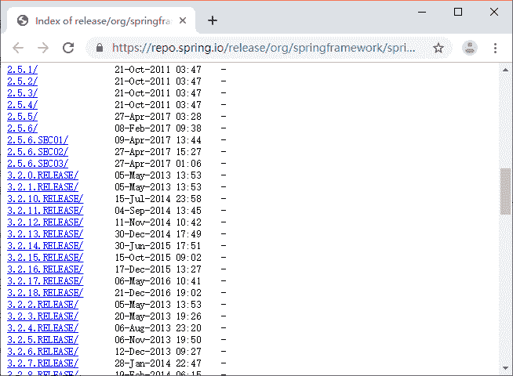
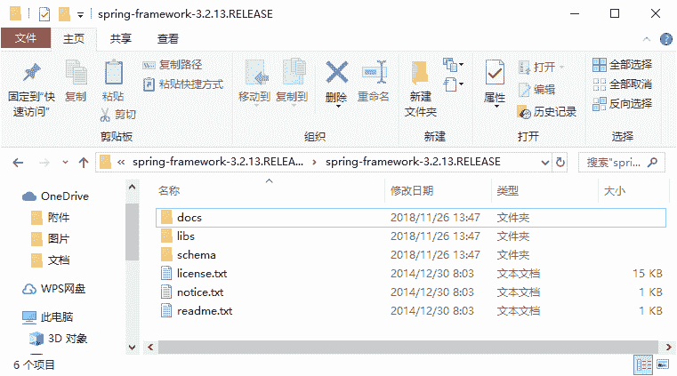

# Spring 目录结构和基础 JAR 包介绍

> 原文：[`c.biancheng.net/view/4244.html`](http://c.biancheng.net/view/4244.html)

目前 Spring 框架的最新版本是 5.1.8，本教程是基于 Spring 的稳定版本 3.2.13 进行讲解的。读者可以通过网址 [`repo.spring.io/simple/libs-release-local/org/springframework/spring/`](http://repo.spring.io/simple/libs-release-local/org/springframework/spring/3.2.2.RELEASE/) 下载名称为 springframework-3.2.13.RELEASE-dist.zip 的压缩包。在浏览器的地址栏中输入此下载地址后，浏览器的访问结果如图 1 所示。

图 1  访问结果
从图 1 中找到所需要的 Spring 框架压缩包。单击此链接下载，下载完成后，解压文件的目录结构如图 2 所示。

图 2  解压后目录
下面对图 2 所示的目录进行简单介绍，具体如表 1 所示。

表 1 Spring 的目录介绍

| 名称 | 作用 |
| --- | --- |
| docs | 包含 Spring 的 API 文档和开发规范 |
| libs | 包含开发需要的 JAR 包和源码包 |
| schema | 包含开发所需要的 schema 文件，在这些文件中定义了 Spring 相关配置文件的约束 |

在 libs 目录中，包含了 Spring 框架提供的所有 JAR 文件，其中有四个 JAR 文件是 Spring 框架的基础包，分别对应 Spring 容器的四个模块，具体如表 2 所示。

表 2 Spring 依赖 JAR 包介绍

| 名称 | 作用 |
| --- | --- |
| spring-core-3.2.13.RELEASE.jar | 包含 Spring 框架基本的核心工具类，Spring 其他组件都要用到这个包中的类，是其他组件的基本核心。 |
| spring-beans-3.2.13.RELEASE.jar | 所有应用都要用到的，它包含访问配置文件、创建和管理 bean 以及进行 Inversion of Control（IoC）或者 Dependency Injection（DI）操作相关的所有类。 |
| spring-context-3.2.13.RELEASE.jar | Spring 提供在基础 IoC 功能上的扩展服务，此外还提供许多企业级服务的支持，如邮件服务、任务调度、JNDI 定位、EJB 集成、远程访问、缓存以及各种视图层框架的封装等 |
| spring-expression-3.2.13.RELEASE.jar | 定义了 Spring 的表达式语言。 需要注意的是，在使用 Spring 开发时，除了 Spring 自带的 JAR 包以外，还需要一个第三方 JAR 包 commons.logging 处理日志信息 |

读者可以通过网址 [`commons.apache.org/proper/commons-logging/download_logging.cgi`](http://commons.apache.org/proper/commons-logging/download_logging.cgi) 下载。该 JAR 包现在最新版本为 commons-logging.1.2，下载完成后，解压即可找到。

使用 Spring 框架时，只需将 Spring 的四个基础包以及 commons-logging-1.2.jar 包复制到项目的 lib 目录，并发布到类路径中即可。