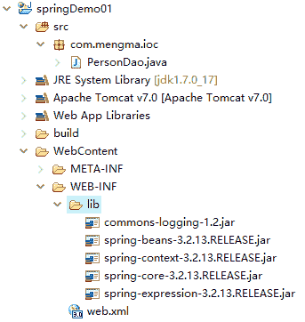
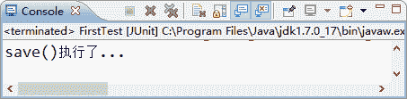

# 第一个 Spring 程序

> 原文：[`c.biancheng.net/view/4251.html`](http://c.biancheng.net/view/4251.html)

通过《Spring IoC 容器》的学习，读者对 Spring 的 IoC 容器已经有了一个初步的了解。下面通过具体的案例演示 IoC 容器的使用。

#### 1\. 创建项目

在 MyEclipse 中创建 Web 项目 springDemo01，将 Spring 框架所需的 JAR 包复制到项目的 lib 目录中，并将添加到类路径下，添加后的项目如图 1 所示。


图 1  Spring 所需的 JAR 包

#### 2\. 创建 PersonDao 接口

在项目的 src 目录下创建一个名为 com.mengma.ioc 的包，然后在该包中创建一个名为 PersonDao 的接口，并在接口中添加一个 add() 方法，如下所示。

```

package com.mengma.ioc;
public interface PersonDao {
    public void add();
}
```

#### 3\. 创建接口实现类 PersonDaoImpl

在 com.mengma.ioc 包下创建 PersonDao 的实现类 PersonDaoImpl，编辑后如下所示。

```

package com.mengma.ioc;
public class PersonDaoImpl implements PersonDao {
    @Override
    public void add() {
        System.out.println("save()执行了...");
    }
}
```

上述代码中，PersonDaoImpl 类实现了 PersonDao 接口中的 add() 方法，并且在方法调用时会执行输出语句。

#### 4\. 创建 Spring 配置文件

在 src 目录下创建 Spring 的核心配置文件 applicationContext.xml，编辑后如下所示。

```

<?xml version="1.0" encoding="UTF-8"?>
<beans xmlns="http://www.springframework.org/schema/beans"
    xmlns:xsi="http://www.w3.org/2001/XMLSchema-instance" xmlns:p="http://www.springframework.org/schema/p"
    xsi:schemaLocation="http://www.springframework.org/schema/beans
    http://www.springframework.org/schema/beans/spring-beans-3.2.xsd">
    <!-- 由 Spring 容器创建该类的实例对象 -->
    <bean id="personDao" class="com.mengma.ioc.PersonDaoImpl" />
</beans>
```

上述代码中，第 2～5 行代码是 Spring 的约束配置，第 7 行代码表示在 Spring 容器中创建一个 id 为 personDao 的 bean 实例，其中 id 表示文件中的唯一标识符，class 属性表示指定需要实例化 Bean 的实全限定类名（包名+类名）。

需要注意的是，Spring 的配置文件名称是可以自定义的，通常情况下，都会将配置文件命名为 applicationContext.xml（或 bean.xml）。

#### 5\. 编写测试类

在 com.mengma.ioc 包下创建测试类 FirstTest，并在该类中添加一个名为 test1() 的方法，编辑后如下所示。

```

package com.mengma.ioc;

import org.junit.Test;
import org.springframework.context.ApplicationContext;
import org.springframework.context.support.ClassPathXmlApplicationContext;

public class FirstTest {
    @Test
    public void testl() {
        // 定义 Spring 配置文件的路径
        String xmlPath = "applicationContext.xml";
        // 初始化 Spring 容器，加载配置文件
        ApplicationContext applicationContext = new ClassPathXmlApplicationContext(
                xmlPath);
        // 通过容器获取 personDao 实例
        PersonDao personDao = (PersonDao) applicationContext
                .getBean("personDao");
        // 调用 personDao 的 add ()方法
        personDao.add();
    }

}
```

上述代码中，首先定义了 Spring 配置文件的路径，然后创建 Spring 容器，接下来通过 Spring 容器获取了 personDao 实例，最后调用实例的 save() 方法。

#### 6\. 运行项目并查看结果

使用 JUnit 测试运行 test1() 方法，运行成功后，控制台的输出结果如图 2 所示。

从图 2 的输出结果中可以看出，程序已经成功输出了“save()执行了...”语句。在程序执行时，对象的创建并不是通过 new 一个类完成的，而是由 Spring 容器管理实现的。这就是 Spring IoC 容器思想的工作机制。


图 2  输出结果