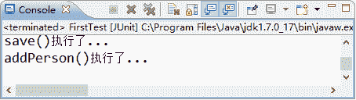

# Spring DI（依赖注入）的实现方式：属性注入和构造注入

> 原文：[`c.biancheng.net/view/4253.html`](http://c.biancheng.net/view/4253.html)

依赖注入（Dependency Injection，DI）和控制反转含义相同，它们是从两个角度描述的同一个概念。

当某个 Java 实例需要另一个 Java 实例时，传统的方法是由调用者创建被调用者的实例（例如，使用 new 关键字获得被调用者实例），而使用 Spring 框架后，被调用者的实例不再由调用者创建，而是由 Spring 容器创建，这称为控制反转。

Spring 容器在创建被调用者的实例时，会自动将调用者需要的对象实例注入给调用者，这样，调用者通过 Spring 容器获得被调用者实例，这称为依赖注入。

依赖注入主要有两种实现方式，分别是属性 setter 注入和构造方法注入。具体介绍如下。

#### 1）属性 setter 注入

指 IoC 容器使用 setter 方法注入被依赖的实例。通过调用无参构造器或无参 static 工厂方法实例化 bean 后，调用该 bean 的 setter 方法，即可实现基于 setter 的 DI。

#### 2）构造方法注入

指 IoC 容器使用构造方法注入被依赖的实例。基于构造器的 DI 通过调用带参数的构造方法实现，每个参数代表一个依赖。

下面通过属性 setter 注入的案例演示 Spring 容器是如何实现依赖注入的。具体步骤如下。

#### 1\. 创建 PersonService 接口

在 springDemo01 项目的 com.mengma.ioc 包下创建一个名为 PersonService 的接口，该接口中包含一个 addPerson() 方法，如下所示。

```

package com.mengma.ioc;

public interface PersonService {
    public void addPerson();
}
```

#### 2\. 创建接口实现类 PersonServiceImpl

在 com.mengma.ioc 包下创建一个名为 PersonServiceImpl 的类，该类实现了 PersonService 接口，如下所示。

```

package com.mengma.ioc;

public class PersonServiceImpl implements PersonService {

    // 定义接口声明
    private PersonDao personDao;

    // 提供 set()方法，用于依赖注入
    public void setPersonDao(PersonDao personDao) {
        this.personDao = personDao;
    }

    // 实现 PersonService 接口的方法
    @Override
    public void addPerson() {
        personDao.add(); // 调用 PersonDao 中的 add()方法
        System.out.println("addPerson()执行了...");
    }

}
```

上述代码中，首先声明了 personDao 对象，并为其添加 setter 方法，用于依赖注入，然后实现了 PersonDao 接口的 addPerson() 方法，并在方法中调用 save() 方法和输出一条语句。

#### 3\. 在 applicationContext.xml 中添加配置信息

在 applicationContext.xml 配置文件中添加一个 <bean> 元素，用于实例化 PersonServiceImpl 类，并将 personDao 的实例注入到 personService 中，其实现代码如下所示：

```

<bean id="personService" class="com.mengma.ioc.PersonServiceImpl">
    <!-- 将 personDao 实例注入 personService 实例中 -->
    <property name="personDao" ref="personDao"/>
</bean>
```

#### 4\. 编写测试方法

在 FirstTest 类中创建一个名为 test2() 的方法，编辑后如下所示：

```

@Test
public void test2() {
    // 定义 Spring 配置文件的路径
    String xmlPath = "applicationContext.xml";
    // 初始化 Spring 容器，加载配置文件
    ApplicationContext applicationContext = new ClassPathXmlApplicationContext(
            xmlPath);
    // 通过容器获取 personService 实例
    PersonService personService = (PersonService) applicationContext
            .getBean("personService");
    // 调用 personService 的 addPerson()方法
    personService.addPerson();
}
```

#### 5\. 运行项目并查看结果

使用 JUnit 测试运行 test2() 方法，运行成功后，控制台的输出结果如图 1 所示。


图 1  运行结果
从图 1 的输出结果中可以看出，使用 Spring 容器获取 userService 的实例后，调用了该实例的 addPerson() 方法，在该方法中又调用了 PersonDao 实现类中的 add() 方法，并输出了结果。这就是 Spring 容器属性 setter 注入的方式，也是实际开发中较为常用的一种方式。