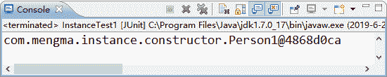
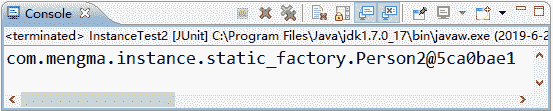
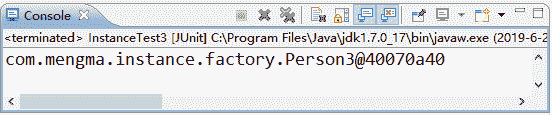

# Spring 实例化 Bean 的三种方法

> 原文：[`c.biancheng.net/view/4256.html`](http://c.biancheng.net/view/4256.html)

在面向对象的程序中，要想调用某个类的成员方法，就需要先实例化该类的对象。在 Spring 中，实例化 Bean 有三种方式，分别是构造器实例化、静态工厂方式实例化和实例工厂方式实例化。本节将针对这三种方式分别进行讲解。

## 构造器实例化

构造器实例化是指 Spring 容器通过 Bean 对应的类中默认的构造函数实例化 Bean。下面通过案例演示如何使用构造器实例化 Bean。

#### 1\. 创建项目并导入 JAR 包

在 MyEclipse 中创建一个名称为 springDemo02 的 Web 项目，然后将 Spring 支持和依赖的 JAR 包复制到项目的 lib 目录中，并发布到类路径下。

#### 2\. 创建实体类

在项目的 src 目录下创建一个名为 com.mengma.instance.constructor 的包，在该包下创建一个实体类 Person1，如下所示。

```

package com.mengma.instance.constructor;
public class Person1 {
}
```

#### 3\. 创建 Spring 配置文件

在 com.mengma.instance.constructor 包下创建 Spring 的配置文件 applicationContext.xml，编辑后如下所示。

```

<?xml version="1.0" encoding="UTF-8"?>
<beans xmlns="http://www.springframework.org/schema/beans"
    xmlns:xsi="http://www.w3.org/2001/XMLSchema-instance" xmlns:p="http://www.springframework.org/schema/p"
    xsi:schemaLocation="http://www.springframework.org/schema/beans
    http://www.springframework.org/schema/beans/spring-beans-3.2.xsd">
    <bean id="person1" class="com.mengma.instance.constructor.Person1" />
</beans>
```

在上述配置中，定义了一个 id 为 person1 的 Bean，其中 class 属性指定了其对应的类为 Person1。

#### 4\. 创建测试类

在 com.mengma.instance.constructor 包下创建一个名为 InstanceTest1 的测试类，编辑后如下所示。

```

package com.mengma.instance.constructor;

import org.junit.Test;
import org.springframework.context.ApplicationContext;
import org.springframework.context.support.ClassPathXmlApplicationContext;

public class InstanceTest1 {
    @Test
    public void test() {
        // 定义 Spring 配置文件的路径
        String xmlPath = "com/mengma/instance/constructor/ApplicationContext.xml";
        // 初始化 Spring 容器，加载配置文件，并对 bean 进行实例化
        ApplicationContext applicationContext = new ClassPathXmlApplicationContext(
                xmlPath);
        // 通过容器获取 id 为 person1 的实例
        System.out.println(applicationContext.getBean("person1"));
    }
}
```

上述文件中，首先在 test() 方法中定义了 Spring 配置文件的路径，然后 Spring 容器会加载配置文件。在加载的同时，Spring 容器会通过实现类 Person1 中默认的无参构造函数对 Bean 进行实例化。

#### 5\. 运行程序并查看结果

使用 JUnit 测试运行 test() 方法，运行成功后，控制台的输出结果如图 1 所示。


图 1  输出结果
从图 1 的输出结果中可以看出，Spring 容器已经成功对 Bean 进行了实例化，并输出了结果。

注意：为了方便读者的学习，本节中的所有配置文件和 Java 文件都根据知识点放置在同一个包中。在实际开发中，为了方便管理和维护，建议将这些文件根据类别放置在不同目录中。

## 静态工厂方式实例化

在 Spring 中，也可以使用静态工厂的方式实例化 Bean。此种方式需要提供一个静态工厂方法创建 Bean 的实例。下面通过案例演示如何使用静态工厂方式实例化 Bean。

#### 1\. 创建实体类

在项目的 src 目录下创建一个名为 com.mengma.instance.static_factory 的包，并在该包下创建一个实体类 Person2，该类与 Person1 相同，不需要添加任何成员。

#### 2\. 创建静态工厂类

在 com.mengma.instance.static_factory 包下创建一个名为 MyBeanFactory 的类，并在该类中创建一个名为 createBean() 的静态方法，用于创建 Bean 的实例，如下所示。

```

package com.mengma.instance.static_factory;

public class MyBeanFactory {
    // 创建 Bean 实例的静态工厂方法
    public static Person2 createBean() {
        return new Person2();
    }
}
```

#### 3\. 创建 Spring 配置文件

在 com.mengma.instance.static_factory 包下创建 Spring 的配置文件 applicationContext.xml，编辑后如下所示。

```

<?xml version="1.0" encoding="UTF-8"?>
<beans xmlns="http://www.springframework.org/schema/beans"
    xmlns:xsi="http://www.w3.org/2001/XMLSchema-instance" xmlns:p="http://www.springframework.org/schema/p"
    xsi:schemaLocation="http://www.springframework.org/schema/beans
    http://www.springframework.org/schema/beans/spring-beans-3.2.xsd">
    <bean id="person2" class="com.mengma.instance.static_factory.MyBeanFactory"
        factory-method="createBean" />
</beans>
```

上述代码中，定义了一个 id 为 person2 的 Bean，其中 class 属性指定了其对应的工厂实现类为 MyBeanFactory，而 factory-method 属性用于告诉 Spring 容器调用工厂类中的 createBean() 方法获取 Bean 的实例。

#### 4\. 创建测试类

在 com.mengma.instance.static_factory 包下创建一个名为 InstanceTest2 的测试类，编辑后如下所示。

```

package com.mengma.instance.static_factory;

import org.junit.Test;
import org.springframework.context.ApplicationContext;
import org.springframework.context.support.ClassPathXmlApplicationContext;

public class InstanceTest2 {
    @Test
    public void test() {
        // 定义 Spring 配置文件的路径
        String xmlPath = "com/mengma/instance/static_factory/applicationContext.xml"; // 初始化 Spring 容器，加载配置文件，并对 bean 进行实例化
        ApplicationContext applicationContext = new ClassPathXmlApplicationContext(
                xmlPath);
        // 通过容器获取 id 为 person2 实例
        System.out.println(applicationContext.getBean("person2"));
    }
}
```

#### 5\. 运行程序并查看结果

使用 JUnit 测试运行 test() 方法，运行成功后，控制台的输出结果如图 2 所示。

从图 2 的输出结果中可以看出，使用静态工厂的方式也成功对 Bean 进行了实例化。


图 2  输出结果

## 实例工厂方式实例化

在 Spring 中，还有一种实例化 Bean 的方式就是采用实例工厂。在这种方式中，工厂类不再使用静态方法创建 Bean 的实例，而是直接在成员方法中创建 Bean 的实例。

同时，在配置文件中，需要实例化的 Bean 也不是通过 class 属性直接指向其实例化的类，而是通过 factory-bean 属性配置一个实例工厂，然后使用 factory-method 属性确定使用工厂中的哪个方法。下面通过案例演示实例工厂方式的使用。

#### 1\. 创建实体类

在项目的 src 目录下创建一个名为 com.mengma.instance.factory 的包，在该包下创建一个 Person3 类，该类与 Person1 类相同，不需要添加任何成员。

#### 2\. 创建实例工厂类

在 com.mengma.instance.factory 包下创建一个名为 MyBeanFactory 的类，编辑后如下所示。

```

package com.mengma.instance.factory;

public class MyBeanFactory {
    public MyBeanFactory() {
        System.out.println("person3 工厂实例化中");
    }

    // 创建 Bean 的方法
    public Person3 createBean() {
        return new Person3();
    }
}
```

上述代码中，使用默认无参的构造方法输出 person3 工厂实例化中语句，使用 createBean 成员方法创建 Bean 的实例。

#### 3\. 创建 Spring 配置文件

在 com.mengma.instance.factory 包下创建 Spring 的配置文件 applicationContext.xml，如下所示。

```

<?xml version="1.0" encoding="UTF-8"?>
<beans xmlns="http://www.springframework.org/schema/beans"
    xmlns:xsi="http://www.w3.org/2001/XMLSchema-instance" xmlns:p="http://www.springframework.org/schema/p"
    xsi:schemaLocation="http://www.springframework.org/schema/beans
    http://www.springframework.org/schema/beans/spring-beans-3.2.xsd">
    <!-- 配置实例工厂 -->
    <bean id="myBeanFactory" class="com.mengma.instance.factory.MyBeanFactory" />
    <!-- factory-bean 属性指定一个实例工厂，factory-method 属性确定使用工厂中的哪个方法 -->
    <bean id="person3" factory-bean="myBeanFactory" factory-method="createBean" />
</beans>
```

上述代码中，首先配置了一个实例工厂 Bean，然后配置了需要实例化的 Bean。在 id 为 person3 的 Bean 中，使用 factory-bean 属性指定一个实例工厂，该属性值就是实例工厂的 id 属性值。使用 factory-method 属性确定使用工厂中的 createBean() 方法。

#### 4\. 创建测试类

在 com.mengma.instance.factory 包下创建一个名为 InstanceTest3 的测试类，编辑后如下所示。

```

package com.mengma.instance.factory;

import org.junit.Test;
import org.springframework.context.ApplicationContext;
import org.springframework.context.support.ClassPathXmlApplicationContext;

public class InstanceTest3 {
    @Test
    public void test() {
        // 定义 Spring 配置文件的路径
        String xmlPath = "com/mengma/instance/factory/applicationContext.xml"; // 初始化 Spring 容器，加载配置文件，并对 bean 进行实例化
        // 初始化 Spring 容器，加载配置文件，并对 bean 进行实例化
        ApplicationContext applicationContext = new ClassPathXmlApplicationContext(
                xmlPath);
        // 通过容器获取 id 为 person3 实例
        System.out.println(applicationContext.getBean("person3"));
    }
}
```

#### 5\. 运行程序并查看结果

使用 JUnit 测试运行 test() 方法，运行成功后，控制台的输出结果如图 3 所示。


图 3  输出结果
从图 3 的输出结果中可以看出，使用实例工厂的方式也同样对 Bean 进行了实例化。