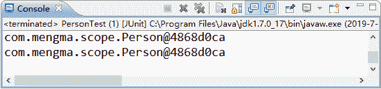
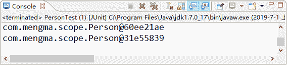

# Spring 中 Bean 的作用域

> 原文：[`c.biancheng.net/view/4260.html`](http://c.biancheng.net/view/4260.html)

本节先简单介绍了 Spring 中 bean 的 5 种作用域，然后详细介绍 singleton 和 prototype 这两种最常用的作用域。

## 作用域的种类

Spring 容器在初始化一个 Bean 的实例时，同时会指定该实例的作用域。Spring3 为 Bean 定义了五种作用域，具体如下。

#### 1）singleton

单例模式，使用 singleton 定义的 Bean 在 Spring 容器中只有一个实例，这也是 Bean 默认的作用域。

#### 2）prototype

原型模式，每次通过 Spring 容器获取 prototype 定义的 Bean 时，容器都将创建一个新的 Bean 实例。

#### 3）request

在一次 HTTP 请求中，容器会返回该 Bean 的同一个实例。而对不同的 HTTP 请求，会返回不同的实例，该作用域仅在当前 HTTP Request 内有效。

#### 4）session

在一次 HTTP Session 中，容器会返回该 Bean 的同一个实例。而对不同的 HTTP 请求，会返回不同的实例，该作用域仅在当前 HTTP Session 内有效。

#### 5）global Session

在一个全局的 HTTP Session 中，容器会返回该 Bean 的同一个实例。该作用域仅在使用 portlet context 时有效。

在上述五种作用域中，singleton 和 prototype 是最常用的两种，接下来将对这两种作用域进行详细讲解。

## singleton 作用域

singleton 是 Spring 容器默认的作用域，当一个 Bean 的作用域为 singleton 时，Spring 容器中只会存在一个共享的 Bean 实例，并且所有对 Bean 的请求，只要 id 与该 Bean 定义相匹配，就只会返回 Bean 的同一个实例。

通常情况下，这种单例模式对于无会话状态的 Bean（如 DAO 层、Service 层）来说，是最理想的选择。

在 Spring 配置文件中，可以使用 <bean> 元素的 scope 属性，将 Bean 的作用域定义成 singleton，其配置方式如下所示：

<bean id="person" class="com.mengma.scope.Person" scope="singleton"/>

在项目的 src 目录下创建一个名为 com.mengma.scope 的包，在该包下创建 Person 类，类中不需要添加任何成员，然后创建 Spring 的配置文件 applicationContext.xml，将上述 Bean 的定义方式写入配置文件中，最后创建一个名为 PersonTest 的测试类，编辑后如下所示。

```

package com.mengma.scope;

import org.junit.Test;
import org.springframework.context.ApplicationContext;
import org.springframework.context.support.ClassPathXmlApplicationContext;

public class PersonTest {
    @Test
    public void test() {
        // 定义 Spring 配置文件路径
        String xmlPath = "com/mengma/scope/applicationContext.xml";
        // 初始化 Spring 容器，加载配置文件，并对 bean 进行实例化
        ApplicationContext applicationContext = new ClassPathXmlApplicationContext(
                xmlPath);
        // 输出获得实例
        System.out.println(applicationContext.getBean("person"));
        System.out.println(applicationContext.getBean("person"));
    }
}
```

使用 JUnit 测试运行 test() 方法，运行成功后，控制台的输出结果如图 1 所示。


图 1  输出结果
从图 1 中可以看到，两次输出的结果相同，这说明 Spring 容器只创建了一个 Person 类的实例。由于 Spring 容器默认作用域是 singleton，如果不设置 scope="singleton"，则其输出结果也将是一个实例。

## prototype 作用域

使用 prototype 作用域的 Bean 会在每次请求该 Bean 时都会创建一个新的 Bean 实例。因此对需要保持会话状态的 Bean（如 Struts2 的 Action 类）应该使用 prototype 作用域。

在 Spring 配置文件中，要将 Bean 定义为 prototype 作用域，只需将 <bean> 元素的 scope 属性值定义成 prototype，其示例代码如下所示：

<bean id="person" class="com.mengma.scope.Person" scope="prototype"/>

将《singleton 作用域》部分中的配置文件更改成上述代码形式后，再次运行 test() 方法，控制台的输出结果如图 2 所示。


图 2  输出结果
从图 2 的输出结果中可以看到，两次输出的结果并不相同，这说明在 prototype 作用域下，Spring 容器创建了两个不同的 Person 实例。