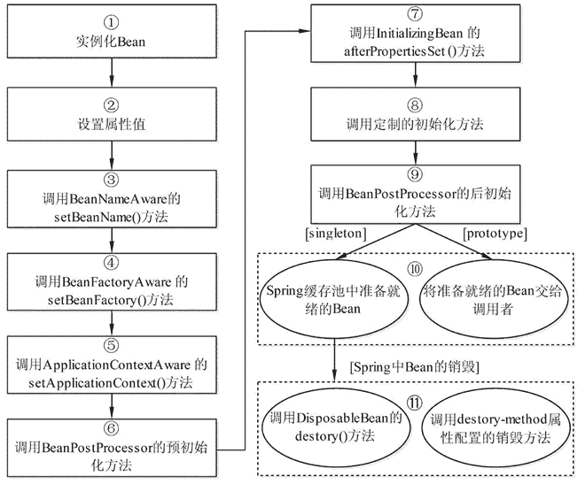

# Spring Bean 的生命周期

> 原文：[`c.biancheng.net/view/4261.html`](http://c.biancheng.net/view/4261.html)

Spring 容器可以管理 singleton 作用域 Bean 的生命周期，在此作用域下，Spring 能够精确地知道该 Bean 何时被创建，何时初始化完成，以及何时被销毁。

而对于 prototype 作用域的 Bean，Spring 只负责创建，当容器创建了 Bean 的实例后，Bean 的实例就交给客户端代码管理，Spring 容器将不再跟踪其生命周期。每次客户端请求 prototype 作用域的 Bean 时，Spring 容器都会创建一个新的实例，并且不会管那些被配置成 prototype 作用域的 Bean 的生命周期。

了解 Spring 生命周期的意义就在于，可以利用 Bean 在其存活期间的指定时刻完成一些相关操作。这种时刻可能有很多，但一般情况下，会在 Bean 被初始化后和被销毁前执行一些相关操作。

在 Spring 中，Bean 的生命周期是一个很复杂的执行过程，我们可以利用 Spring 提供的方法定制 Bean 的创建过程。

当一个 Bean 被加载到 Spring 容器时，它就具有了生命，而 Spring 容器在保证一个 Bean 能够使用之前，会进行很多工作。Spring 容器中 Bean 的生命周期流程如图 1 所示。

图 1  Bean 的生命周期 Bean 生命周期的整个执行过程描述如下。

1）根据配置情况调用 Bean 构造方法或工厂方法实例化 Bean。

2）利用依赖注入完成 Bean 中所有属性值的配置注入。

3）如果 Bean 实现了 BeanNameAware 接口，则 Spring 调用 Bean 的 setBeanName() 方法传入当前 Bean 的 id 值。

4）如果 Bean 实现了 BeanFactoryAware 接口，则 Spring 调用 setBeanFactory() 方法传入当前工厂实例的引用。

5）如果 Bean 实现了 ApplicationContextAware 接口，则 Spring 调用 setApplicationContext() 方法传入当前 ApplicationContext 实例的引用。

6）如果 BeanPostProcessor 和 Bean 关联，则 Spring 将调用该接口的预初始化方法 postProcessBeforeInitialzation() 对 Bean 进行加工操作，此处非常重要，Spring 的 AOP 就是利用它实现的。

7）如果 Bean 实现了 InitializingBean 接口，则 Spring 将调用 afterPropertiesSet() 方法。

8）如果在配置文件中通过 init-method 属性指定了初始化方法，则调用该初始化方法。

9）如果 BeanPostProcessor 和 Bean 关联，则 Spring 将调用该接口的初始化方法 postProcessAfterInitialization()。此时，Bean 已经可以被应用系统使用了。

10）如果在 <bean> 中指定了该 Bean 的作用范围为 scope="singleton"，则将该 Bean 放入 Spring IoC 的缓存池中，将触发 Spring 对该 Bean 的生命周期管理；如果在 <bean> 中指定了该 Bean 的作用范围为 scope="prototype"，则将该 Bean 交给调用者，调用者管理该 Bean 的生命周期，Spring 不再管理该 Bean。

11）如果 Bean 实现了 DisposableBean 接口，则 Spring 会调用 destory() 方法将 Spring 中的 Bean 销毁；如果在配置文件中通过 destory-method 属性指定了 Bean 的销毁方法，则 Spring 将调用该方法对 Bean 进行销毁。

Spring 为 Bean 提供了细致全面的生命周期过程，通过实现特定的接口或 <bean> 的属性设置，都可以对 Bean 的生命周期过程产生影响。虽然可以随意配置 <bean> 的属性，但是建议不要过多地使用 Bean 实现接口，因为这样会导致代码和 Spring 的聚合过于紧密。