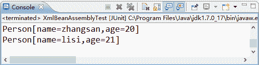

# Spring 基于 XML 装配 Bean

> 原文：[`c.biancheng.net/view/4264.html`](http://c.biancheng.net/view/4264.html)

Bean 的装配可以理解为依赖关系注入，Bean 的装配方式也就是 Bean 的依赖注入方式。Spring 容器支持多种形式的 Bean 的装配方式，如基于 XML 的 Bean 装配、基于 Annotation 的 Bean 装配和自动装配等。

Spring 基于 XML 的装配通常采用两种实现方式，即设值注入（Setter Injection）和构造注入（Constructor Injection）。本节将讲解如何在 XML 配置文件中使用这两种注入方式。

在 Spring 实例化 Bean 的过程中，首先会调用默认的构造方法实例化 Bean 对象，然后通过 Java 的反射机制调用 setXxx() 方法进行属性的注入。因此，设值注入要求一个 Bean 的对应类必须满足以下两点要求。

*   必须提供一个默认的无参构造方法。
*   必须为需要注入的属性提供对应的 setter 方法。

使用设值注入时，在 Spring 配置文件中，需要使用 <bean> 元素的子元素 <property> 元素为每个属性注入值。而使用构造注入时，在配置文件中，主要使用 <constructor-arg> 标签定义构造方法的参数，可以使用其 value 属性（或子元素）设置该参数的值。下面通过案例演示基于 XML 方式的 Bean 的装配。

#### 1\. 创建 Person 类

在项目 springDemo02 中的 src 目录下，创建一个名称为 com.mengma.assembly 的包，在该包下创建一个 Person 类，如下所示。

```

package com.mengma.assembly;

public class Person {
    private String name;
    private int age;

    public String getName() {
        return name;
    }

    public void setName(String name) {
        this.name = name;
    }

    public int getAge() {
        return age;
    }

    public void setAge(int age) {
        this.age = age;
    }

    // 重写 toString()方法
    public String toString() {
        return "Person[name=" + name + ",age=" + age + "]";
    }

    // 默认无参的构造方法
    public Person() {
        super();
    }

    // 有参的构造方法
    public Person(String name, int age) {
        super();
        this.name = name;
        this.age = age;
    }
}
```

上述代码中，定义了 name 和 age 两个属性，并为其提供了 getter 和 setter 方法，由于要使用构造注入，所以需要提供有参的构造方法。为了能更清楚地看到输出结果，这里还重写了 toString() 方法。

#### 2\. 创建 Spring 配置文件

在 com.mengma.assembly 包下创建一个名为 applicationContext.xml 的配置文件，如下所示。

```

<?xml version="1.0" encoding="UTF-8"?>
<beans xmlns="http://www.springframework.org/schema/beans"
    xmlns:xsi="http://www.w3.org/2001/XMLSchema-instance" xmlns:p="http://www.springframework.org/schema/p"
    xsi:schemaLocation="http://www.springframework.org/schema/beans
    http://www.springframework.org/schema/beans/spring-beans-3.2.xsd">
    <!-- 使用设值注入方式装配 Person 实例 -->
    <bean id="person1" class="com.mengma.assembly.Person">
        <property name="name" value="zhangsan" />
        <property name="age" value="20" />
    </bean>
    <!-- 使用构造方法装配 Person 实例 -->
    <bean id="person2" class="com.mengma.assembly.Person">
        <constructor-arg index="0" value="lisi" />
        <constructor-arg index="1" value="21" />
    </bean>
</beans>
```

上述代码中，首先使用了设值注入方式装配 Person 类的实例，其中 <property> 子元素用于调用 Bean 实例中的 setXxx() 方法完成属性赋值。然后使用了构造方式装配了 Person 类的实例，其中 <constructor-arg> 元素用于定义构造方法的参数，其属性 index 表示其索引（从 0 开始），value 属性用于设置注入的值。

#### 3\. 创建测试类

在 com.mengma.assembly 包下创建一个名称为 XmlBeanAssemblyTest 的测试类，编辑后如下所示。

```

package com.mengma.assembly;

import org.junit.Test;
import org.springframework.context.ApplicationContext;
import org.springframework.context.support.ClassPathXmlApplicationContext;

public class XmlBeanAssemblyTest {
    @Test
    public void test() {
        // 定义 Spring 配置文件路径
        String xmlPath = "com/mengma/assembly/applicationContext.xml";
        // 初始化 Spring 容器，加载配置文件，并对 bean 进行实例化
        ApplicationContext applicationContext = new ClassPathXmlApplicationContext(
                xmlPath);
        // 设值方式输出结果
        System.out.println(applicationContext.getBean("person1"));
        // 构造方式输出结果
        System.out.println(applicationContext.getBean("person2"));
    }
}
```

上述代码中，分别获取并输出了 id 为 person1 和 person2 的实例。

#### 4\. 运行项目并查看结果

使用 JUnit 测试运行 test() 方法，运行成功后，控制台的输出结果如图 1 所示。


图 1  输出结果
从图 1 的输出结果中可以看出，使用设值注入和构造注入两种方式都成功装配了 Person 实例。