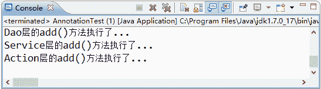

# Spring 基于 Annotation 装配 Bean

> 原文：[`c.biancheng.net/view/4265.html`](http://c.biancheng.net/view/4265.html)

在 Spring 中，尽管使用 XML 配置文件可以实现 Bean 的装配工作，但如果应用中 Bean 的数量较多，会导致 XML 配置文件过于臃肿，从而给维护和升级带来一定的困难。

Java 从 JDK 5.0 以后，提供了 Annotation（注解）功能，Spring 也提供了对 Annotation 技术的全面支持。Spring3 中定义了一系列的 Annotation（注解），常用的注解如下。

#### 1）@Component

可以使用此注解描述 Spring 中的 Bean，但它是一个泛化的概念，仅仅表示一个组件（Bean），并且可以作用在任何层次。使用时只需将该注解标注在相应类上即可。

#### 2）@Repository

用于将数据访问层（DAO 层）的类标识为 Spring 中的 Bean，其功能与 @Component 相同。

#### 3）@Service

通常作用在业务层（Service 层），用于将业务层的类标识为 Spring 中的 Bean，其功能与 @Component 相同。

#### 4）@Controller

通常作用在控制层（如 Struts2 的 Action），用于将控制层的类标识为 Spring 中的 Bean，其功能与 @Component 相同。

#### 5）@Autowired

用于对 Bean 的属性变量、属性的 Set 方法及构造函数进行标注，配合对应的注解处理器完成 Bean 的自动配置工作。默认按照 Bean 的类型进行装配。

#### 6）@Resource

其作用与 Autowired 一样。其区别在于 @Autowired 默认按照 Bean 类型装配，而 @Resource 默认按照 Bean 实例名称进行装配。

@Resource 中有两个重要属性：name 和 type。

Spring 将 name 属性解析为 Bean 实例名称，type 属性解析为 Bean 实例类型。如果指定 name 属性，则按实例名称进行装配；如果指定 type 属性，则按 Bean 类型进行装配。

如果都不指定，则先按 Bean 实例名称装配，如果不能匹配，则再按照 Bean 类型进行装配；如果都无法匹配，则抛出 NoSuchBeanDefinitionException 异常。

#### 7）@Qualifier

与 @Autowired 注解配合使用，会将默认的按 Bean 类型装配修改为按 Bean 的实例名称装配，Bean 的实例名称由 @Qualifier 注解的参数指定。

#### 1\. 创建 DAO 层接口

在 src 目录下创建一个名为 com.mengma.annotation 的包，在该包下创建一个名为 PersonDao 的接口，并添加一个 add() 方法，如下所示。

```

package com.mengma.annotation;
public interface PersonDao {
    public void add();
}
```

#### 2\. 创建 DAO 层接口的实现类

在 com.mengma.annotation 包下创建 PersonDao 接口的实现类 PersonDaoImpl，编辑后如下所示。

```

package com.mengma.annotation;
import org.springframework.stereotype.Repository;

@Repository("personDao")
public class PersonDaoImpl implements PersonDao {
    @Override
    public void add() {
        System.out.println("Dao 层的 add()方法执行了...");
    }
}
```

上述代码中，首先使用 @Repository 注解将 PersonDaoImpl 类标识为 Spring 中的 Bean，其写法相当于配置文件中 <bean id="personDao"class="com.mengma.annotation.PersonDaoImpl"/> 的书写。然后在 add() 方法中输出一句话，用于验证是否成功调用了该方法。

#### 3\. 创建 Service 层接口

在 com.mengma.annotation 包下创建一个名为 PersonService 的接口，并添加一个 add() 方法，如下所示。

```

package com.mengma.annotation;

public interface PersonService {
    public void add();
}
```

#### 4\. 创建 Service 层接口的实现类

在 com.mengma.annotation 包下创建 PersonService 接口的实现类 PersonServiceImpl，编辑后如下所示。

```

package com.mengma.annotation;

import javax.annotation.Resource;
import org.springframework.stereotype.Service;

@Service("personService")
public class PersonServiceImpl implements PersonService {
    @Resource(name = "personDao")
    private PersonDao personDao;

    public PersonDao getPersonDao() {
        return personDao;
    }

    @Override
    public void add() {
        personDao.add();// 调用 personDao 中的 add()方法
        System.out.println("Service 层的 add()方法执行了...");
    }
}
```

上述代码中，首先使用 @Service 注解将 PersonServiceImpl 类标识为 Spring 中的 Bean，其写法相当于配置文件中 <bean id="personService"class="com.mengma.annotation.PersonServiceImpl"/> 的书写。

然后使用 @Resource 注解标注在属性 personDao 上（也可标注在 personDao 的 setPersonDao() 方法上），这相当于配置文件中 <property name="personDao"ref="personDao"/> 的写法。最后在该类的 add() 方法中调用 personDao 中的 add() 方法，并输出一句话。

#### 5\. 创建 Action

在 com.mengma.annotation 包下创建一个名为 PersonAction 的类，编辑后如下所示。

```

package com.mengma.annotation;

import javax.annotation.Resource;
import org.springframework.stereotype.Controller;

@Controller("personAction")
public class PersonAction {
    @Resource(name = "personService")
    private PersonService personService;

    public PersonService getPersonService() {
        return personService;
    }

    public void add() {
        personService.add(); // 调用 personService 中的 add()方法
        System.out.println("Action 层的 add()方法执行了...");
    }
}
```

上述代码中，首先使用 @Controller 注解标注 PersonAction 类，其写法相当于在配置文件中编写 <bean id="personAction"class="com.mengma.annotation.PersonAction"/>。

然后使用了 @Resource 注解标注在 personService 上，这相当于在配置文件内编写 <property name="personService"ref="personService"/>。

最后在其 add() 方法中调用了 personService 中的 add() 方法，并输出一句话。

#### 6\. 创建 Spring 配置文件

在 com.mengma.annotation 包下创建一个名为 applicationContext.xml 的配置文件，如下所示。

```

<?xml version="1.0" encoding="UTF-8"?>
<beans xmlns="http://www.springframework.org/schema/beans"
    xmlns:xsi="http://www.w3.org/2001/XMLSchema-instance"
    xmlns:aop="http://www.springframework.org/schema/aop"
    xmlns:p="http://www.springframework.org/schema/p"
    xmlns:tx="http://www.springframework.org/schema/tx"
    xmlns:context="http://www.springframework.org/schema/context"
    xsi:schemaLocation="
            http://www.springframework.org/schema/beans
            http://www.springframework.org/schema/beans/spring-beans-2.5.xsd
            http://www.springframework.org/schema/aop
            http://www.springframework.org/schema/aop/spring-aop-2.5.xsd
            http://www.springframework.org/schema/tx
            http://www.springframework.org/schema/tx/spring-tx-2.5.xsd
            http://www.springframework.org/schema/context
            http://www.springframework.org/schema/context/spring-context.xsd">
    <!--使用 context 命名空间，通知 spring 扫描指定目录，进行注解的解析-->
    <context:component-scan base-package="com.mengma.annotation"/>
</beans>
```

与之前的配置文件相比，上述代码的<beans>元素中增加了第 7 行、第 15 行和第 16 行中包含有 context 的代码，然后在第 18 行代码中，使用 context 命名空间的 component-scan 元素进行注解的扫描，其 base-package 属性用于通知 spring 所需要扫描的目录。

#### 7\. 创建测试类

在 com.mengma.annotation 包下创建一个名为 AnnotationTest 的测试类，编辑后如下所示。

```

package com.mengma.annotation;

import org.junit.Test;
import org.springframework.context.ApplicationContext;
import org.springframework.context.support.ClassPathXmlApplicationContext;

public class AnnotationTest {
    @Test
    public void test() {
        // 定义 Spring 配置文件路径
        String xmlPath = "com/mengma/annotation/applicationContext.xml";
        // 初始化 Spring 容器，加载配置文件，并对 bean 进行实例化
        ApplicationContext applicationContext = new ClassPathXmlApplicationContext(
                xmlPath);
        // 获得 personAction 实例
        PersonAction personAction = (PersonAction) applicationContext
                .getBean("personAction");
        // 调用 personAction 中的 add()方法
        personAction.add();
    }
}
```

上述代码中，首先通过加载配置文件并获取 personAction 的实例，然后调用该实例的 add() 方法。

#### 8\. 运行程序并查看结果

使用 JUnit 测试运行 test() 方法，运行成功后，输出结果如图 1 所示。


图 1  输出结果
从图 1 的输出结果中可以看出，DAO 层、Service 层和 Action 层的 add() 方法都成功输出了结果。由此可知，使用 Annotation 装配 Bean 的方式已经成功实现了。