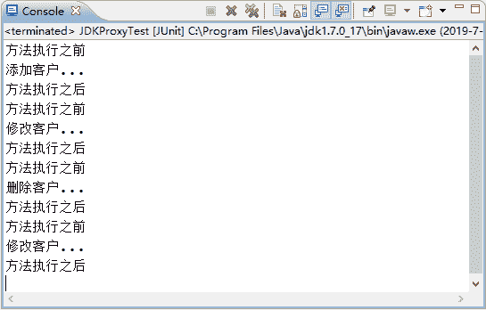

# Spring JDK 动态代理（附带实例）

> 原文：[`c.biancheng.net/view/4269.html`](http://c.biancheng.net/view/4269.html)

JDK 动态代理是通过 JDK 中的 java.lang.reflect.Proxy 类实现的。下面通过具体的案例演示 JDK 动态代理的使用。

#### 1\. 创建项目

在 MyEclipse 中创建一个名称为 springDemo03 的 Web 项目，将 Spring 支持和依赖的 JAR 包复制到 Web 项目的 WEB-INF/lib 目录中，并发布到类路径下。

#### 2\. 创建接口 CustomerDao

在项目的 src 目录下创建一个名为 com.mengma.dao 的包，在该包下创建一个 CustomerDao 接口，编辑后如下所示。

```

package com.mengma.dao;

public interface CustomerDao {
    public void add(); // 添加

    public void update(); // 修改

    public void delete(); // 删除

    public void find(); // 查询
}
```

#### 3\. 创建实现类 CustomerDaoImpl

在 com.mengma.dao 包下创建 CustomerDao 接口的实现类 CustomerDaoImpl，并实现该接口中的所有方法，如下所示。

```

package com.mengma.dao;

public class CustomerDaoImpl implements CustomerDao {

    @Override
    public void add() {
        System.out.println("添加客户...");
    }

    @Override
    public void update() {
        System.out.println("修改客户...");
    }

    @Override
    public void delete() {
        System.out.println("删除客户...");
    }

    @Override
    public void find() {
        System.out.println("修改客户...");
    }
}
```

#### 4\. 创建切面类 MyAspect

在 src 目录下，创建一个名为 com.mengma.jdk 的包，在该包下创建一个切面类 MyAspect，编辑后如下所示。

```

package com.mengma.jdk;

public class MyAspect {
    public void myBefore() {
        System.out.println("方法执行之前");
    }

    public void myAfter() {
        System.out.println("方法执行之后");
    }
}
```

上述代码中，在切面中定义了两个增强的方法，分别为 myBefore() 方法和 myAfter() 方法，用于对目标类（CustomerDaoImpl）进行增强。

#### 5\. 创建代理类 MyBeanFactory

在 com.mengma.jdk 包下创建一个名为 MyBeanFactory 的类，在该类中使用 java.lang.reflect.Proxy 实现 JDK 动态代理，如下所示。

```

package com.mengma.jdk;

import java.lang.reflect.InvocationHandler;
import java.lang.reflect.Method;
import java.lang.reflect.Proxy;

import com.mengma.dao.CustomerDao;
import com.mengma.dao.CustomerDaoImpl;

public class MyBeanFactory {

    public static CustomerDao getBean() {
        // 准备目标类
        final CustomerDao customerDao = new CustomerDaoImpl();
        // 创建切面类实例
        final MyAspect myAspect = new MyAspect();
        // 使用代理类，进行增强
        return (CustomerDao) Proxy.newProxyInstance(
                MyBeanFactory.class.getClassLoader(),
                new Class[] { CustomerDao.class }, new InvocationHandler() {
                    public Object invoke(Object proxy, Method method,
                            Object[] args) throws Throwable {
                        myAspect.myBefore(); // 前增强
                        Object obj = method.invoke(customerDao, args);
                        myAspect.myAfter(); // 后增强
                        return obj;
                    }
                });
    }
}
```

上述代码中，定义了一个静态的 getBean() 方法，这里模拟 Spring 框架的 IoC 思想，通过调用 getBean() 方法创建实例，第 14 行代码创建了 customerDao 实例。

第 16 行代码创建的切面类实例用于调用切面类中相应的方法；第 18～26 行就是使用代理类对创建的实例 customerDao 中的方法进行增强的代码，其中 Proxy 的 newProxyInstance() 方法的第一个参数是当前类的类加载器，第二参数是所创建实例的实现类的接口，第三个参数就是需要增强的方法。

在目标类方法执行的前后，分别执行切面类中的 myBefore() 方法和 myAfter() 方法。

#### 6\. 创建测试类 JDKProxyTest

在 com.mengma.jdk 包下创建一个名为 JDKProxyTest 的测试类，如下所示。

```

package com.mengma.jdk;

import org.junit.Test;
import com.mengma.dao.CustomerDao;

public class JDKProxyTest {
    @Test
    public void test() {
        // 从工厂获得指定的内容（相当于 spring 获得，但此内容时代理对象）
        CustomerDao customerDao = MyBeanFactory.getBean();
        // 执行方法
        customerDao.add();
        customerDao.update();
        customerDao.delete();
        customerDao.find();
    }
}
```

上述代码中，在调用 getBean() 方法时，获取的是 CustomerDao 类的代理对象，然后调用了该对象中的方法。

#### 7\. 运行项目并查看结果

使用 JUnit 测试运行 test() 方法，运行成功后，控制台的输出结果如图 1 所示。

从图 1 的输出结果中可以看出，在调用目标类的方法前后，成功调用了增强的代码，由此说明，JDK 动态代理已经实现。


图 1  运行结果