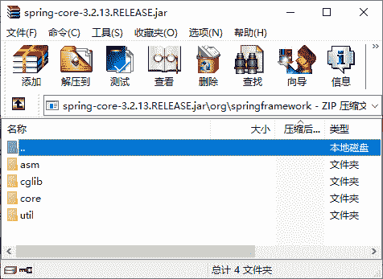
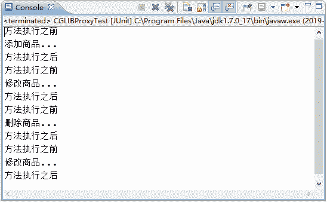

# Spring CGLlB 动态代理（附带实例）

> 原文：[`c.biancheng.net/view/4271.html`](http://c.biancheng.net/view/4271.html)

通过《Spring JDK 动态代理》教程的学习可以知道，JDK 动态代理使用起来非常简单，但是它也有一定的局限性，这是因为 JDK 动态代理必须要实现一个或多个接口，如果不希望实现接口，则可以使用 CGLIB 代理。

CGLIB（Code Generation Library）是一个高性能开源的代码生成包，它被许多 AOP 框架所使用，其底层是通过使用一个小而快的字节码处理框架 ASM（Java 字节码操控框架）转换字节码并生成新的类。因此 CGLIB 要依赖于 ASM 的包，解压 Spring 的核心包 spring-core-3.2.2.RELEASE.jar，文件目录如图 1 所示。


图 1  spring-core-3.2.2.RELEASE.jar 文件
在图 1 中可以看出，解压的核心包中包含 cglib 和 asm，也就是说 Spring3.2.13 版本的核心包已经集成了 CGLIB 所需要的包，所以在开发中不需要另外导入 ASM 的 JAR 包了。下面通过案例演示实现 CGLIB 的代理过程。

#### 1\. 创建目标类 GoodsDao

在 com.mengma.dao 包下创建目标类 GoodsDao，在类中定义增、删、改、查方法，并在每个方法编写输出语句，如下所示。

```

package com.mengma.dao;

public class GoodsDao {
    public void add() {
        System.out.println("添加商品...");
    }

    public void update() {
        System.out.println("修改商品...");
    }

    public void delete() {
        System.out.println("删除商品...");
    }

    public void find() {
        System.out.println("修改商品...");
    }
}
```

#### 2\. 创建代理类 MyBeanFactory

在 src 目录下创建一个名为 com.mengma.cglib 的包，该包下创建类 MyBeanFactory，如下所示。

```

package com.mengma.cglib;

import java.lang.reflect.Method;
import org.springframework.cglib.proxy.Enhancer;
import org.springframework.cglib.proxy.MethodInterceptor;
import org.springframework.cglib.proxy.MethodProxy;
import com.mengma.dao.GoodsDao;
import com.mengma.jdk.MyAspect;

public class MyBeanFactory {
    public static GoodsDao getBean() {
        // 准备目标类
        final GoodsDao goodsDao = new GoodsDao();
        // 创建切面类实例
        final MyAspect myAspect = new MyAspect();
        // 生成代理类，CGLIB 在运行时，生成指定对象的子类，增强
        Enhancer enhancer = new Enhancer();
        // 确定需要增强的类
        enhancer.setSuperclass(goodsDao.getClass());
        // 添加回调函数
        enhancer.setCallback(new MethodInterceptor() {
            // intercept 相当于 jdk invoke，前三个参数与 jdk invoke—致
            @Override
            public Object intercept(Object proxy, Method method, Object[] args,
                    MethodProxy methodProxy) throws Throwable {
                myAspect.myBefore(); // 前增强
                Object obj = method.invoke(goodsDao, args); // 目标方法执行
                myAspect.myAfter(); // 后增强
                return obj;
            }
        });
        // 创建代理类
        GoodsDao goodsDaoProxy = (GoodsDao) enhancer.create();
        return goodsDaoProxy;
    }
}
```

上述代码中，应用了 CGLIB 的核心类 Enhancer。在第 19 行代码调用了 Enhancer 类的 setSuperclass() 方法，确定目标对象。

第 21 行代码调用 setCallback() 方法添加回调函数；第 24 行代码的 intercept() 方法相当于 JDK 动态代理方式中的 invoke() 方法，该方法会在目标方法执行的前后，对切面类中的方法进行增强；第 33～34 行代码调用 Enhancer 类的 create() 方法创建代理类，最后将代理类返回。

#### 3\. 创建测试类

在 com.mengma.cglib 包下创建测试类 CGLIBProxyTest，编辑后如下所示。

```

package com.mengma.cglib;

import org.junit.Test;
import com.mengma.dao.GoodsDao;

public class CGLIBProxyTest {
    @Test
    public void test() {
        // 从工厂获得指定的内容（相当于 spring 获得，但此内容时代理对象）
        GoodsDao goodsDao = MyBeanFactory.getBean();
        // 执行方法
        goodsDao.add();
        goodsDao.update();
        goodsDao.delete();
        goodsDao.find();
    }
}
```

上述代码中，调用 getBean() 方法时，依然获取的是 goodsDao 的代理对象，然后调用该对象的方法。使用 JUnit 测试运行 test() 方法，运行成功后，控制台的输出结果如图 2 所示。


图 2  输出结果
从图 2 的输出结果中可以看出，在调用目标类的方法前后，也成功调用了增强的代码，由此说明，使用 CGLIB 代理的方式同样实现了手动代理。