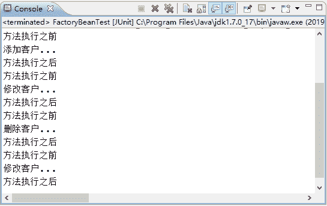

# Spring 通知类型及使用 ProxyFactoryBean 创建 AOP 代理

> 原文：[`c.biancheng.net/view/4274.html`](http://c.biancheng.net/view/4274.html)

在《Spring JDK 动态代理》和《Spring CGLlB 动态代理》中，讲解了 AOP 手动代理的两种方式，下面通过讲解 Spring 的通知介绍 Spring 是如何创建 AOP 代理的。

## Spring 通知类型

通过前面的学习可以知道，通知（Advice）其实就是对目标切入点进行增强的内容，Spring AOP 为通知（Advice）提供了 org.aopalliance.aop.Advice 接口。

Spring 通知按照在目标类方法的连接点位置，可以分为以下五种类型，如表 1 所示。

表 1 Spring 通知的 5 种类型

| 名称 | 说明 |
| --- | --- |
| org.springframework.aop.MethodBeforeAdvice（前置通知） | 在方法之前自动执行的通知称为前置通知，可以应用于权限管理等功能。 |
| org.springframework.aop.AfterReturningAdvice（后置通知） | 在方法之后自动执行的通知称为后置通知，可以应用于关闭流、上传文件、删除临时文件等功能。 |
| org.aopalliance.intercept.MethodInterceptor（环绕通知） | 在方法前后自动执行的通知称为环绕通知，可以应用于日志、事务管理等功能。 |
| org.springframework.aop.ThrowsAdvice（异常通知） | 在方法抛出异常时自动执行的通知称为异常通知，可以应用于处理异常记录日志等功能。 |
| org.springframework.aop.IntroductionInterceptor（引介通知） | 在目标类中添加一些新的方法和属性，可以应用于修改旧版本程序（增强类）。 |

## 声明式 Spring AOP

Spring 创建一个 AOP 代理的基本方法是使用 org.springframework.aop.framework.ProxyFactoryBean，这个类对应的切入点和通知提供了完整的控制能力，并可以生成指定的内容。

ProxyFactoryBean 类中的常用可配置属性如表 2 所示。

表 2 ProxyFactoryBean 的常用属性

| 属性名称 | 描  述 |
| --- | --- |
| target | 代理的目标对象 |
| proxyInterfaces | 代理要实现的接口，如果有多个接口，则可以使用以下格式赋值： <list>
    <value ></value>
    ...
</list> |
| proxyTargetClass | 是否对类代理而不是接口，设置为 true 时，使用 CGLIB 代理 |
| interceptorNames | 需要植入目标的 Advice |
| singleton | 返回的代理是否为单例，默认为 true（返回单实例） |
| optimize | 当设置为 true 时，强制使用 CGLIB |

在 Spring 通知中，环绕通知是一个非常典型的应用。下面通过环绕通知的案例演示 Spring 创建 AOP 代理的过程。

#### 1\. 导入 JAR 包

在核心 JAR 包的基础上，再向 springDemo03 项目的 lib 目录中导入 AOP 的 JAR 包，具体如下。

*   spring-aop-3.2.13.RELEASE.jar：是 Spring 为 AOP 提供的实现，在 Spring 的包中已经提供。
*   com.springsource.org.aopalliance-1.0.0.jar：是 AOP 提供的规范，可以在 Spring 的官网网址 [`repo.spring.io/webapp/#/search/quick/`](https://repo.spring.io/webapp/#/search/quick/) 中进行搜索并下载。

#### 2\. 创建切面类 MyAspect

在 src 目录下创建一个名为 com.mengma.factorybean 的包，在该包下创建切面类 MyAspect，如下所示。

```

package com.mengma.factorybean;

import org.aopalliance.intercept.MethodInterceptor;
import org.aopalliance.intercept.MethodInvocation;

//需要实现接口，确定哪个通知，及告诉 Spring 应该执行哪个方法
public class MyAspect implements MethodInterceptor {
    public Object invoke(MethodInvocation mi) throws Throwable {
        System.out.println("方法执行之前");
        // 执行目标方法
        Object obj = mi.proceed();
        System.out.println("方法执行之后");
        return obj;
    }
}
```

上述代码中，MyAspect 类实现了 MethodInterceptor 接口，并实现了接口的 invoke() 方法。MethodInterceptor 接口是 Spring AOP 的 JAR 包提供的，而 invoke() 方法用于确定目标方法 mi，并告诉 Spring 要在目标方法前后执行哪些方法，这里为了演示效果在目标方法前后分别向控制台输出了相应语句。

#### 3\. 创建 Spring 配置文件

在 com.mengma.factorybean 包下创建配置文件 applicationContext.xml，如下所示。

```

<?xml version="1.0" encoding="UTF-8"?>
<beans xmlns="http://www.springframework.org/schema/beans"
    xmlns:xsi="http:/www.w3.org/2001/XMLSchema-instance"
    xsi:schemaLocation="http://www.springframework.org/schema/beans
    http://www.springframework.org/schema/beans/spring-beans.xsd">
    <!--目标类 -->
    <bean id="customerDao" class="com.mengma.dao.CustomerDaoImpl" />
    <!-- 通知 advice -->
    <bean id="myAspect" class="com.mengma.factorybean.MyAspect" />
    <!--生成代理对象 -->
    <bean id="customerDaoProxy"
     class="org.springframework.aop.framework.ProxyFactoryBean">
     <!--代理实现的接口 -->
        <property name="proxyInterfaces" value="com.mengma.dao.CustomerDao" />
        <!--代理的目标对象 -->
        <property name="target" ref="customerDao" />
        <!--用通知增强目标 -->
        <property name="interceptorNames" value="myAspect" />
        <!-- 如何生成代理，true:使用 cglib; false :使用 jdk 动态代理 -->
        <property name="proxyTargetClass" value="true" />
    </bean>
</beans>
```

上述代码中，首先配置目标类和通知，然后使用 ProxyFactoryBean 类生成代理对象；第 14 行代码配置了代理实现的接口；第 16 行代码配置了代理的目标对象；第 18 行代码配置了需要植入目标的通知；当第 20 行代码中的 value 属性值为 true 时，表示使用 CGLIB 代理，属性值为 false 时，表示使用 JDK 动态代理。

#### 4\. 创建测试类

在 com.mengma.factorybean 包下创建一个名为 FactoryBeanTest 的测试类，编辑后如下所示。

```

package com.mengma.factorybean;
import org.junit.Test;
import org.springframework.context.ApplicationContext;
import org.springframework.context.support.ClassPathXmlApplicationContext;
import com.mengma.dao.CustomerDao;
public class FactoryBeanTest {
    @Test
    public void test() {
        String xmlPath = "com/mengma/factorybean/applicationContext.xml";
        ApplicationContext applicationContext = new ClassPathXmlApplicationContext(
                xmlPath);
        CustomerDao customerDao = (CustomerDao) applicationContext
                .getBean("customerDaoProxy");
        customerDao.add();
        customerDao.update();
        customerDao.delete();
        customerDao.find();
    }
}
```

#### 5\. 运行项目并查看结果

使用 JUnit 测试运行 test() 方法，运行成功后，控制台的输出结果如图 1 所示。


图 1  运行结果